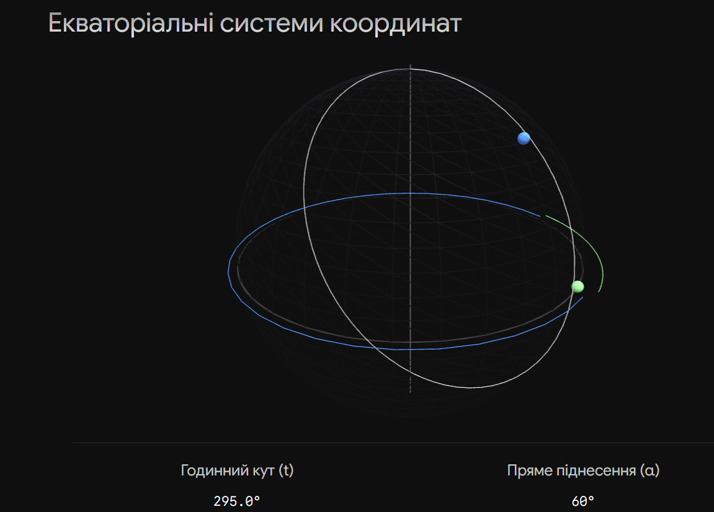

**Небесна сфера** — це уявна сфера довільного (як правило, нескінченного) радіуса, центр якої збігається з оком спостерігача або центром Землі, на яку проектуються положення космічних об'єктів. В астрофізиці вона слугує суворою математичною моделлю, що дозволяє абстрагуватися від реальних відстаней і досліджувати виключно кутові координати та напрямки видимих рухів світил за допомогою методів сферичної тригонометрії.

## Основні точки, лінії та площини небесної сфери

- **Висковиста (прямовисна) лінія:** Проходить через центр сфери, перетинаючи її поверхню в точках **Зеніту** (найвища точка) та **Надіру** (найнижча).
- **Математичний (істинний) горизонт:** Велике коло небесної сфери, площина якого строго перпендикулярна до прямовисної лінії.
- **Вісь світу:** Вісь видимого добового обертання небесної сфери, паралельна осі обертання Землі. Перетинає сферу в **Північному** та **Південному полюсах світу**.
- **Небесний екватор:** Велике коло, площина якого перпендикулярна до осі світу.
- **Небесний меридіан:** Велике коло, що проходить через полюси світу, зеніт і надір.
- **Екліптика:** Велике коло, по якому відбувається видимий річний рух Сонця. Площина екліптики нахилена до екватора на кут $\varepsilon\approx23^\circ26'$. Точки їх перетину — точки **весняного** ($\Upsilon$) та **осіннього** ($\Omega$) рівнодень.

## Астрофізичні системи небесних координат

Залежно від задачі (наведення телескопа, складання каталогів, вивчення орбіт планет чи кінематики Галактики) в астрофізиці використовують п'ять основних систем сферичних координат.

| Система координат       | Основна площина       | Точка відліку на площині                | Координата 1 (поздовжня)                                         | Координата 2 (широтна)                                          | Астрофізичне застосування                                                                                |
| ----------------------- | --------------------- | --------------------------------------- | ---------------------------------------------------------------- | --------------------------------------------------------------- | -------------------------------------------------------------------------------------------------------- |
| **Горизонтальна**       | Математичний горизонт | Точка Півдня                            | **Азимут ($A$)**: від $0^\circ$ до $360^\circ$                   | **Висота ($h$)**: від $-90^\circ$ до $+90^\circ$                | Наведення альт-азимутальних телескопів, поточні вимірювання на станції.                                  |
| **Перша екваторіальна** | Небесний екватор      | Найвища точка екватора (на меридіані)   | **Годинний кут ($t$)**: від $0^h$ до $24^h$                      | **Схилення ($\delta$)**: від $-90^\circ$ до $+90^\circ$         | Вимірювання зоряного часу, керування телескопами на екваторіальному монтуванні.                          |
| **Друга екваторіальна** | Небесний екватор      | Точка весняного рівнодення ($\Upsilon$) | **Пряме піднесення ($\alpha$)**: від $0^h$ до $24^h$             | **Схилення ($\delta$)**: від $-90^\circ$ до $+90^\circ$         | Складання зоряних каталогів, ефемерид. Координати світил у ній не залежать від добового обертання Землі. |
| **Екліптична**          | Площина екліптики     | Точка весняного рівнодення ($\Upsilon$) | **Екліптична довгота ($\lambda$)**: від $0^\circ$ до $360^\circ$ | **Екліптична широта ($\beta$)**: від $-90^\circ$ до $+90^\circ$ | Небесна механіка, розрахунок орбіт планет та тіл Сонячної системи.                                       |
| **Галактична**          | Галактичний екватор   | Напрямок на центр Галактики             | **Галактична довгота ($l$)**: від $0^\circ$ до $360^\circ$       | **Галактична широта ($b$)**: від $-90^\circ$ до $+90^\circ$     | Зоряна статистика, вивчення структури, кінематики та динаміки Чумацького Шляху.                          |

## Сферична тригонометрія та перетворення координат

Зв'язок між першою та другою екваторіальними системами здійснюється через місцевий зоряний час ($s$), що дозволяє враховувати обертання Землі:

$$s=\alpha+t$$

Перехід від екварторіальної до горизонтальної системи базується на розв'язанні паралактичного трикутника. Якщо відома географічна широта обсерваторії ($\varphi$), а також координати світила ($\delta$, $t$), горизонтальні координати ($A$, $h$) обчислюються за формулами:

$$\sin h=\sin\varphi\sin\delta+\cos\varphi\cos\delta\cos t$$

$$\cos h\sin A=\cos\delta\sin t$$

$$\cos h\cos A=-\cos\varphi\sin\delta+\sin\varphi\cos\delta\cos t$$

## Підсумок

Астрофізика вимагає використання одразу кількох систем координат, оскільки жодна з них не є універсальною для всіх задач. Горизонтальна система прив'язана до спостерігача, перша екваторіальна пов'язує положення об'єкта з поточним часом, друга екваторіальна є надійною базою для каталогів, а екліптична та галактична дозволяють описувати фізичні процеси в масштабах Сонячної системи та Чумацького Шляху відповідно.

