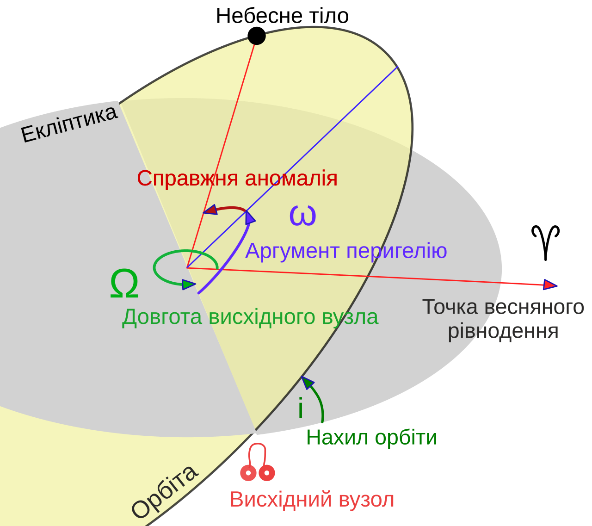
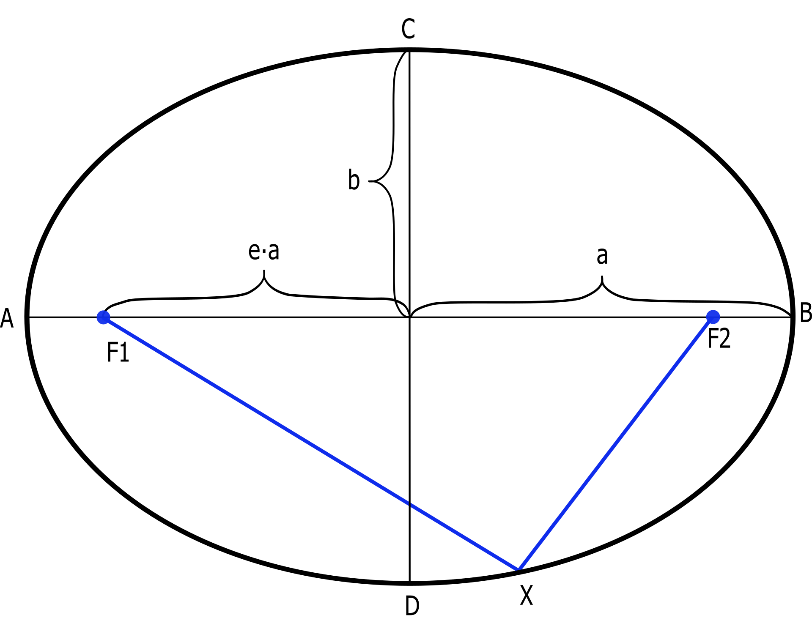

# Кеплерівські елементи орбіт

**Кеплерівські елементи орбіти** — це набір із шести математичних параметрів, які повністю визначають розмір, форму та орієнтацію орбіти небесного тіла в просторі, а також його поточне положення на ній. Завдяки цим числам астрономи можуть побудувати точну 3D-модель траєкторії будь-якої планети, комети чи штучного супутника і передбачити, де воно перебуватиме в будь-який момент часу.

## Класифікація елементів орбіти

Для опису траєкторії у тривимірному просторі відносно базової площини (зазвичай це площина екліптики) традиційно використовують шість величин.

| Група                     | Назва елемента           | Позначення | Зміст                                                                                                                             |
| ------------------------- | ------------------------ | ---------- | --------------------------------------------------------------------------------------------------------------------------------- |
| **Розмір і форма**        | Велика піввісь           | $a$        | Визначає розмір орбіти. Дорівнює середній відстані від фокуса (Сонця) до об'єкта.                                                 |
|                           | Ексцентриситет           | $e$        | Вказує на ступінь "сплюснутості" орбіти. ($e=0$ — ідеальне коло, $0 < e < 1$ — еліпс, $e \ge 1$ — розімкнута парабола/гіпербола). |
| **Орієнтація у просторі** | Нахил                    | $i$        | Кут між площиною орбіти тіла та базовою площиною (екліптикою).                                                                    |
|                           | Довгота висхідного вузла | $\Omega$   | Кут від точки весняного рівнодення до лінії перетину площин (лінії вузлів), де тіло підіймається над екліптикою.                  |
|                           | Аргумент перицентру      | $\omega$   | Кут у площині орбіти від висхідного вузла до перицентру (точки максимального зближення із Сонцем).                                |
| **Положення на орбіті**   | Істинна аномалія         | $\nu$      | Кут між напрямком на перицентр та поточним напрямком на саме тіло (змінюється з часом).                                           |

## Головні рівняння орбітального руху

Математично форма кеплерівської орбіти описується рівнянням конічного перерізу в полярних координатах, де початок координат лежить у головному фокусі (центрі мас системи):

$$r = \frac{p}{1 + e \cos \nu}$$

_Де:_

- $r$ — радіус-вектор (поточна відстань від фокуса до небесного тіла).
- $p$ — фокальний параметр орбіти, що обчислюється через велику піввісь та ексцентриситет як $p = a(1 - e^2)$.
- $e$ — ексцентриситет.
- $\nu$ — істинна аномалія.

За допомогою великої півосі ($a$) та ексцентриситету ($e$) можна легко знайти екстремальні відстані тіла до Сонця:

- Відстань у перигелії (найближча точка):
  $$r_p = a(1 - e)$$

- Відстань в афелії (найдальша точка):
  $$r_a = a(1 + e)$$

## Підсумок

Кеплерівські елементи слугують універсальним математичним "паспортом" космічного об'єкта. Три параметри ($i, \Omega, \omega$) задають жорсткий каркас орбіти у тривимірному просторі, два ($a, e$) викреслюють її еліптичний контур, а шостий ($\nu$ або момент проходження перицентру) вказує на поточну позицію тіла на цьому шляху.

