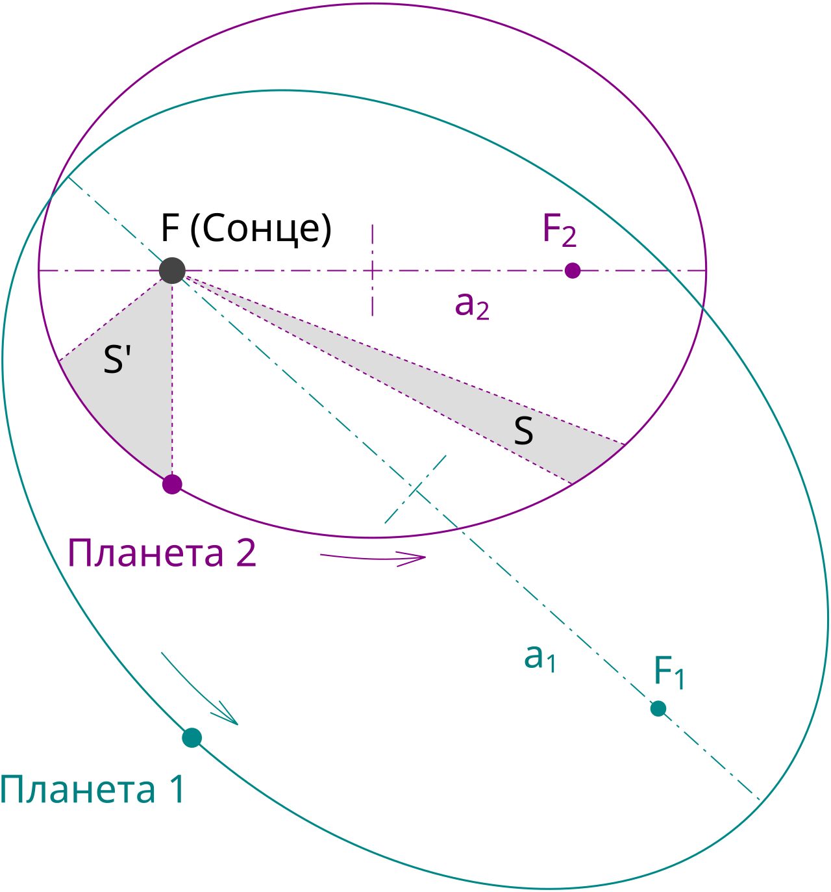
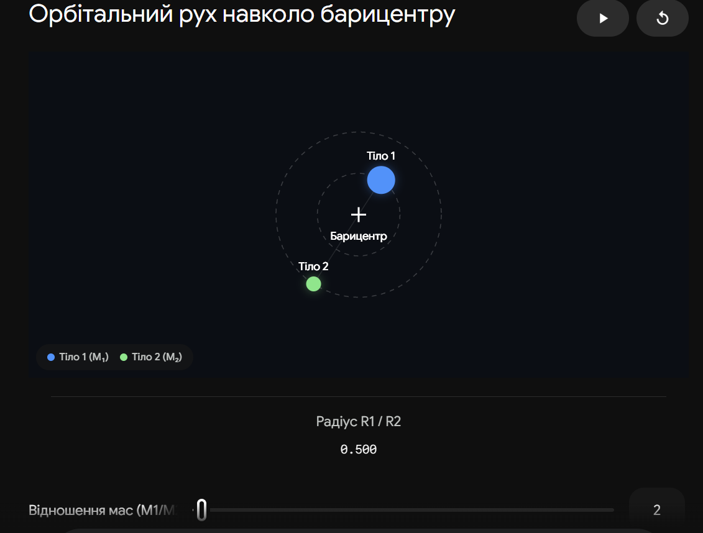

# Узагальнені закони Кеплера

**Узагальнені закони Кеплера** — це класичні закони руху небесних тіл, які Ісаак Ньютон доповнив і розширив на основі свого закону всесвітнього тяжіння. Якщо оригінальні закони Кеплера описували виключно рух планет навколо Сонця, то узагальнені закони діють для будь-якої системи взаємодіючих тіл у Всесвіті (супутників, подвійних зір, галактик) і враховують їхні маси.

## Перший узагальнений закон (Форма орбіт та центр мас)

Під дією сили взаємного тяжіння два тіла описують криві другого порядку (конічні перерізи), у спільному фокусі яких знаходиться не центр більшого тіла, а **спільний центр мас** системи.

Залежно від початкової швидкості об'єкта, форма його орбіти може бути замкненою (тіло залишається в системі) або розімкненою (тіло покидає систему назавжди).

| Форма орбіти  | Ексцентриситет ($e$) | Фізична умова (швидкість $v$) | Приклад об'єктів                                            |
| ------------- | -------------------- | ----------------------------- | ----------------------------------------------------------- |
| **Коло**      | $e = 0$              | $v = v_1$ (Перша космічна)    | Штучні супутники Землі на низьких орбітах                   |
| **Еліпс**     | $0 < e < 1$          | $v_1 < v < v_2$               | Планети, більшість комет та астероїдів                      |
| **Парабола**  | $e = 1$              | $v = v_2$ (Друга космічна)    | Комети, що прилітають з меж Сонячної системи і летять назад |
| **Гіпербола** | $e > 1$              | $v > v_2$                     | Міжзоряні об'єкти (наприклад, астероїд Оумуамуа)            |

## Другий узагальнений закон (Збереження моменту імпульсу)

Радіус-вектор, проведений від центру мас системи до тіла, за рівні проміжки часу описує рівні площі.
У фізичному сенсі цей закон є наслідком закону збереження моменту імпульсу: чим ближче тіло до центру мас (у перицентрі), тим більша його лінійна та кутова швидкість, і навпаки (в апоцентрі рух найповільніший).

## Третій узагальнений закон (Рівняння мас)

Квадрати сидеричних періодів обертання двох тіл навколо центру мас, помножені на суму мас системи, відносяться як куби великих півосей їхніх орбіт. Це найважливіший закон в астрофізиці, який слугує "космічними вагами".

Формула Ньютона:

$$\frac{T_1^2 (M_1 + m_1)}{T_2^2 (M_2 + m_2)} = \frac{a_1^3}{a_2^3}$$

_Де:_

- $T_1, T_2$ — періоди обертання двох різних систем (наприклад, система Сонце-Земля та система Юпітер-Іо).
- $a_1, a_2$ — великі півосі їхніх орбіт.
- $M, m$ — маси центрального тіла та його супутника.

**Спрощена практична форма:**
Якщо порівнювати будь-яку систему із системою "Сонце-Земля" (масою Землі $m_2$ можна знехтувати порівняно з масою Сонця $M_2 = 1$), то для розрахунку маси далекої системи ($M_1 + m_1$) використовують формулу:

$$M + m = \frac{a^3}{T^2}$$

_(Тут маса виражена в масах Сонця, велика піввісь $a$ — в астрономічних одиницях, а період $T$ — у земних роках)._

## Підсумок

Узагальнення Ньютона перетворило закони Кеплера з простого опису кінематики Сонячної системи на фундаментальний інструмент вивчення Всесвіту. Саме завдяки урахуванню центру мас (перший закон) та можливості розраховувати маси через параметри орбіт (третій закон), людство навчилося зважувати зорі, чорні діри та відкривати невидимі екзопланети.

