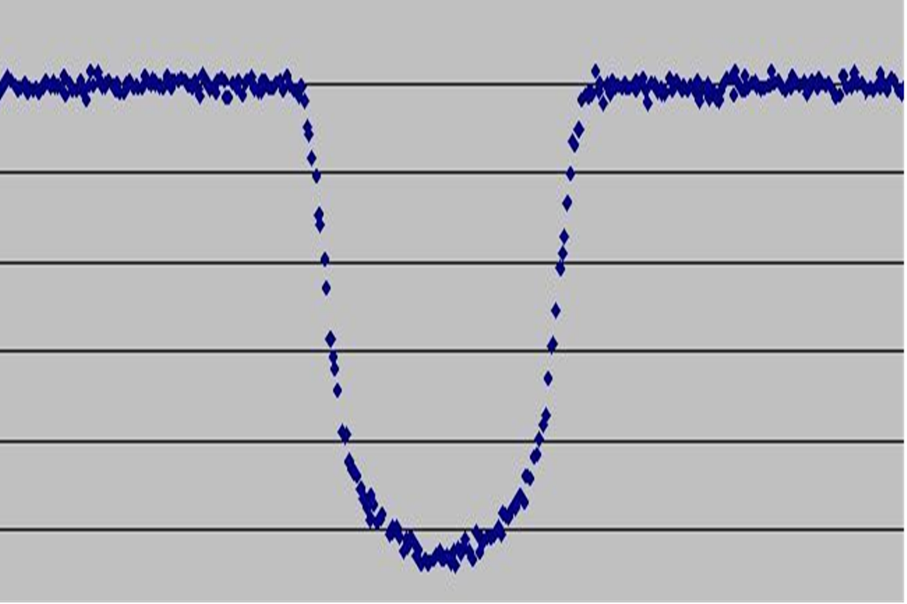

# Транзитний метод пошуку та відкриття екзопланет

**Транзитний метод** — це фотометричний спосіб виявлення екзопланет, який ґрунтується на спостереженні за періодичним падінням світності зорі. Це відбувається, коли невидима для нас планета проходить на тлі зоряного диска, тимчасово блокуючи частину його випромінювання. На сьогодні це найрезультативніший метод, за допомогою якого відкрито переважну більшість (понад 70%) відомих екзопланет.

## Принцип дії та умови спостереження

Для успішного застосування методу площина орбіти екзопланети має бути розташована майже точно на промені зору земного спостерігача (кут нахилу орбіти $i \approx 90^\circ$). Космічні телескопи (такі як Kepler або TESS) безперервно фіксують світло від десятків тисяч зір одночасно, будуючи графіки їхньої світності — **криві блиску**. Регулярні U-подібні "провали" на цій кривій є головним індикатором наявності планети.

## Характеристика методу

| Критерій                   | Транзитний метод                                                                                                                       |
| -------------------------- | -------------------------------------------------------------------------------------------------------------------------------------- |
| **Що дозволяє визначити?** | Точний радіус планети, період обертання, нахил орбіти.                                                                                 |
| **Головні переваги**       | Ефективний для масового пошуку; дозволяє досліджувати склад атмосфери планети (світло зорі "просвічує" атмосферу під час транзиту).    |
| **Головні недоліки**       | Працює лише для систем із вдалим (ребровим) нахилом орбіти; високий ризик хибних спрацьовувань (через зоряні плями або подвійні зорі). |
| **Що не може визначити?**  | Масу планети (її доводиться вимірювати додатково методом променевих швидкостей).                                                       |

## Головні формули

**1. Глибина транзиту (визначення розміру планети):**
Відносне падіння яскравості зорі прямо пропорційне відношенню площі темного диска планети до площі світлого диска зорі:

$$\frac{\Delta F}{F} = \left(\frac{R_p}{R_*}\right)^2$$

_Де:_

- $\Delta F$ — зміна потоку світла (наскільки потьмяніла зоря).
- $F$ — номінальний потік світла від зорі (поза транзитом).
- $R_p$ — радіус екзопланети.
- $R_*$ — радіус материнської зорі.

**2. Геометрична ймовірність транзиту:**
Шанс того, що орбіта випадкової екзопланети буде орієнтована так, що ми побачимо затемнення, залежить від її відстані до зорі:

$$P \approx \frac{R_*}{a}$$

_Де $a$ — велика піввісь орбіти планети. (Звідси випливає, що метод найлегше знаходить планети, які розташовані дуже близько до своїх зір)._

## Підсумок

Транзитний метод є основним інструментом сучасної екзопланетної астрономії. Хоча він діє лише для обмеженої кількості зоряних систем зі сприятливим кутом нахилу орбіти, він залишається єдиним масовим способом виміряти фізичний розмір далекої планети та отримати дані для аналізу її атмосфери.

Першою екзопланетою, для якої спостерігалися транзити, була відкрита методом радіальних швидкостей HD 209458 b. Транзити для цієї системи спостерігали в 1999 році дві групи під керівництвом Девіда Шарбоне та Грегорі В. Генрі. Першою екзопланетою, відкритою транзитним методом, була задетектована у 2002 році проектом OGLE система OGLE-TR-56b.
