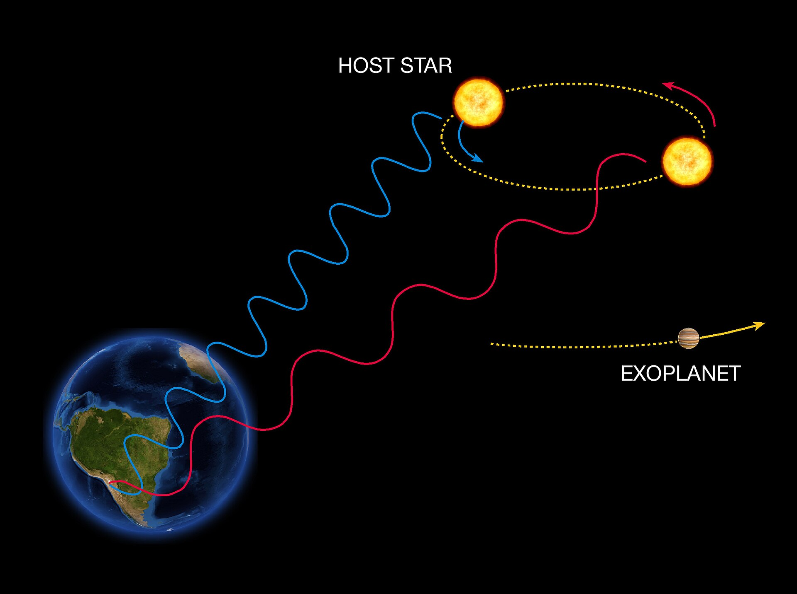
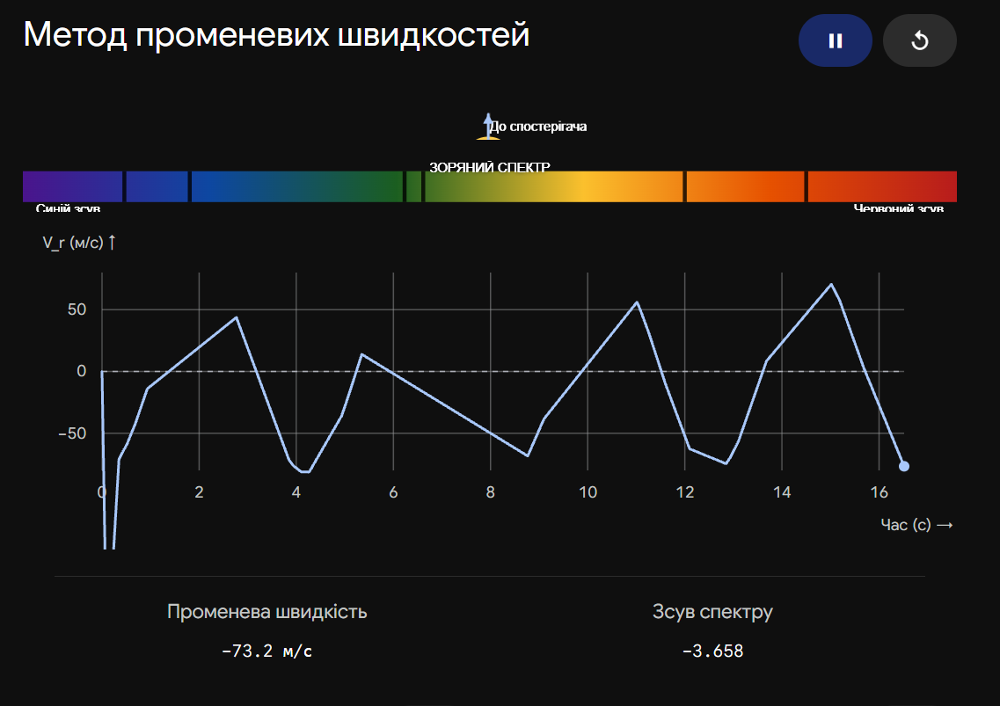

# Допплерівський метод пошуку та відкриття екзопланет

**Допплерівський метод** (або метод променевих швидкостей) — це спосіб виявлення екзопланет, який базується на вимірюванні періодичного "хитання" зорі під дією гравітації її невидимого супутника. Зоря і планета обертаються навколо спільного центру мас, і коли зоря періодично наближається до нас або віддаляється, лінії в її спектрі зміщуються через ефект Допплера.

## Принцип дії ефекту Допплера

Світло від зорі розкладається у спектр (веселку) за допомогою надточних спектрографів, у якому видно темні лінії поглинання хімічних елементів.

- **Синє зміщення:** Коли зоря наближається до Землі, світлові хвилі "стискаються", і всі спектральні лінії зсуваються в синю (короткохвильову) частину спектра.
- **Червоне зміщення:** Коли зоря віддаляється, хвилі "розтягуються", і лінії зсуваються в червону (довгохвильову) частину.
  Астрономи безперервно фіксують ці мікроскопічні коливання і будують графік швидкості зорі, який має вигляд періодичної кривої (зазвичай синусоїди).

## Характеристика методу

| Характеристика              | Допплерівський метод (Променеві швидкості)                                                                                                                                                      |
| --------------------------- | ----------------------------------------------------------------------------------------------------------------------------------------------------------------------------------------------- |
| **Що дозволяє визначити?**  | Мінімальну масу планети, період її обертання та ексцентриситет (витягнутість) орбіти.                                                                                                           |
| **Головні переваги**        | Не вимагає, щоб орбіта планети лежала точно на промені нашого зору (не потрібне ідеальне затемнення, як у транзитному методі); дуже ефективний для пошуку масивних планет ("гарячих юпітерів"). |
| **Головні недоліки**        | Не дозволяє дізнатися фізичний розмір (радіус) планети; погано підходить для пошуку легких планет земного типу (оскільки вони викликають надто слабке "хитання" зорі).                          |
| **Особливість вимірювання** | Дає лише _нижню межу маси_, оскільки реальна швидкість хитання залежить від того, під яким кутом до нас нахилена орбіта системи.                                                                |

## Головні формули

**1. Променева швидкість (Ефект Допплера):**
Швидкість руху зорі вздовж променя зору спостерігача ($v_r$) розраховується через зміщення довжини хвилі:

$$v_r = c \frac{\Delta \lambda}{\lambda_0}$$

_Де:_

- $c$ — швидкість світла ($\approx 3 \cdot 10^5$ км/с).
- $\Delta \lambda$ — виміряне зміщення спектральної лінії ($\Delta \lambda = \lambda_{вимір} - \lambda_0$).
- $\lambda_0$ — лабораторна (незміщена) довжина хвилі цієї лінії.

**2. Мінімальна маса планети:**
Через те, що астрономи рідко знають точний кут нахилу площини орбіти до променя зору ($i$), закон тяжіння дозволяє вирахувати не повну масу планети ($M_p$), а лише її проекцію:

$$M_{min} = M_p \sin i$$

_(Якщо орбіта нахилена під кутом $i = 90^\circ$, ми бачимо систему з ребра і вимірюємо істинну масу. Якщо $i = 0^\circ$, ми дивимось на систему згори: зоря хитається у площині неба, променева швидкість дорівнює нулю, і цей метод не працює)._

## Підсумок

Допплерівський метод є фундаментальним інструментом "зважування" екзопланет. Його найбільша наукова цінність розкривається у комбінації з транзитним методом: транзит дає точний радіус, а метод променевих швидкостей — масу. Маючи ці два параметри, можна легко обчислити середню густину планети і з'ясувати її природу (кам'яниста поверхня, суцільний океан чи газовий гігант).

