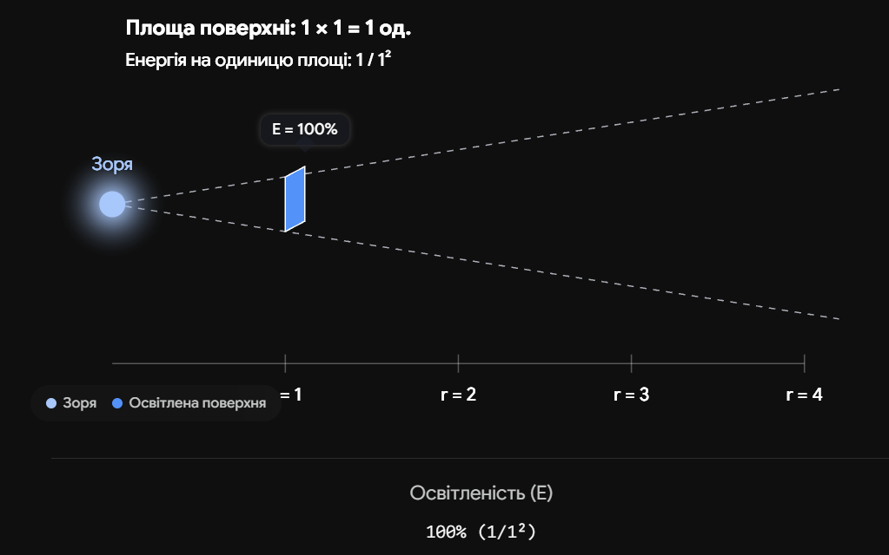
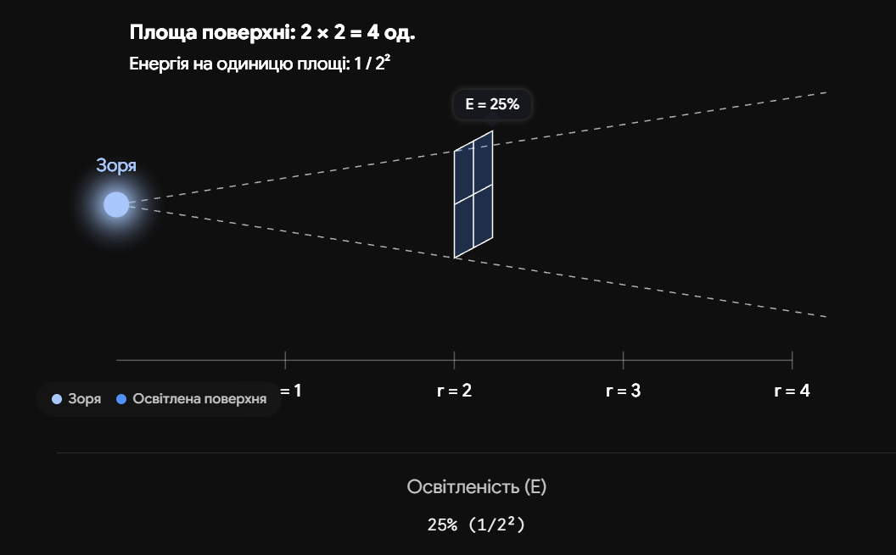
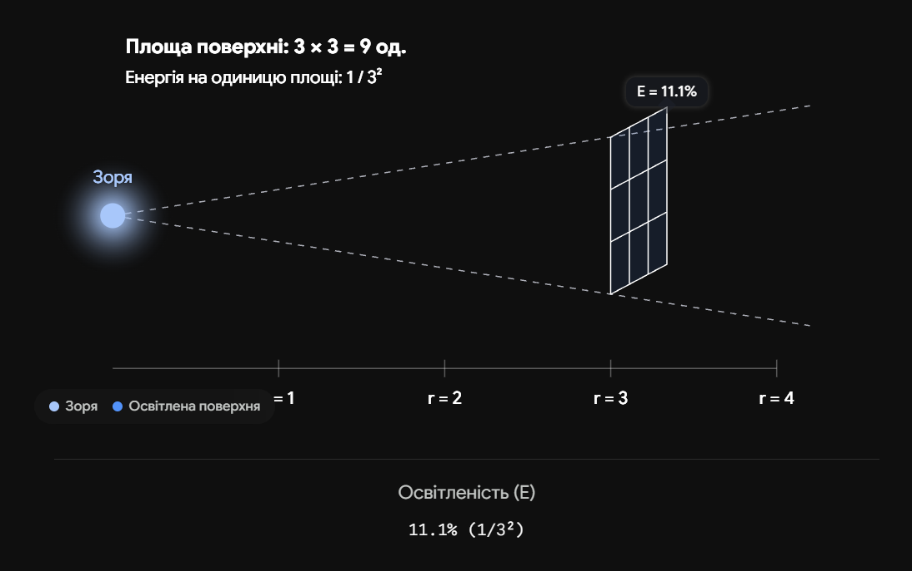

# Основи фотометрії. Фотометричні величини

**Фотометрія** в астрономії — це розділ науки, який вивчає методи вимірювання кількості світла, що надходить від космічних об'єктів. Оскільки зорі знаходяться на різних відстанях і випромінюють різну кількість енергії, фотометрія дозволяє математично відокремити їхню справжню фізичну потужність від того, якими яскравими вони здаються нам на земному небі.

## Основні фотометричні величини

Для опису випромінювання зір використовують спеціальну систему одиниць, яка пов'язує фізичну енергію зі сприйняттям людського ока або телескопа.

| Величина                      | Позначення | Фізичний зміст                                                                                                                    | Одиниця виміру                         |
| ----------------------------- | ---------- | --------------------------------------------------------------------------------------------------------------------------------- | -------------------------------------- |
| **Світність**                 | $L$        | Повна кількість енергії, яку зоря випромінює в усіх напрямках за одну секунду (справжня потужність зорі).                         | Вати (Вт) або маси Сонця ($L_{\odot}$) |
| **Освітленість**              | $E$        | Кількість енергії (світловий потік), що падає на одиницю площі за одну секунду (визначає, наскільки яскраво зоря освітлює Землю). | Вт/м²                                  |
| **Видима зоряна величина**    | $m$        | Безрозмірна міра освітленості, яку створює зоря на Землі. Чим яскравіша зоря, тим _менше_ (або від'ємне) це число.                | Зоряна величина ($^m$)                 |
| **Абсолютна зоряна величина** | $M$        | Видима зоряна величина, яку мала б зоря, якби знаходилася від нас на стандартній відстані рівно $10$ парсеків.                    | Зоряна величина ($^m$)                 |

## Закон обернених квадратів

Це фундаментальний закон фотометрії, який пояснює, чому далекі зорі здаються тьмяними. Світло від зорі поширюється у просторі у вигляді сфери, площа якої зростає пропорційно квадрату відстані. Тому освітленість ($E$) падає обернено пропорційно квадрату відстані ($r$) до об'єкта:

$$E = \frac{L}{4\pi r^2}$$

_Де $L$ — світність зорі, $r$ — відстань до неї, $4\pi r^2$ — площа сфери, по якій "розмазується" світло._

## Формула Погсона

Історично склалося так, що видимі зоряні величини ($m$) вимірюються в логарифмічній шкалі. Англійський астроном Норман Погсон встановив, що різниця в $5$ зоряних величин відповідає рівно $100$-кратній різниці в освітленості.

Формула Погсона пов'язує освітленості ($E_1, E_2$) від двох зір з їхніми видимими зоряними величинами ($m_1, m_2$):

$$\frac{E_1}{E_2} = 100^{\frac{m_2 - m_1}{5}} \approx 2.512^{m_2 - m_1}$$

_Це означає, що зоря $1$-ї величини рівно в $2.512$ раза яскравіша за зорю $2$-ї величини._

## Модуль відстані

Якщо астрономам відома справжня потужність зорі (її абсолютна зоряна величина $M$) та її видимий блиск на небі ($m$), вони можуть обчислити відстань до неї ($D$). Рівняння, що їх пов'язує, називається модулем відстані:

$$m - M = 5 \lg D - 5$$

_Де $D$ — відстань до зорі, виражена у парсеках (пк). Величина $(m - M)$ називається модулем відстані._

## Підсумок

Фотометрія є ключем до розуміння фізичної природи зір та масштабів Всесвіту. Знаючи закон обернених квадратів та використовуючи формулу Погсона, астрономи здатні конвертувати видиму яскравість крихітної крапки на небі у реальну потужність термоядерного реактора зорі, а також визначати колосальні космічні відстані.

