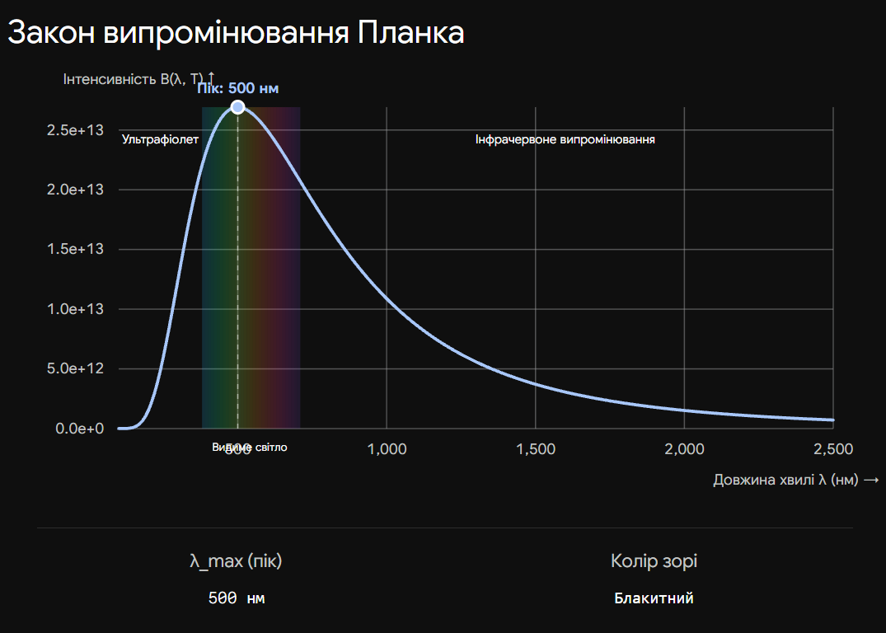
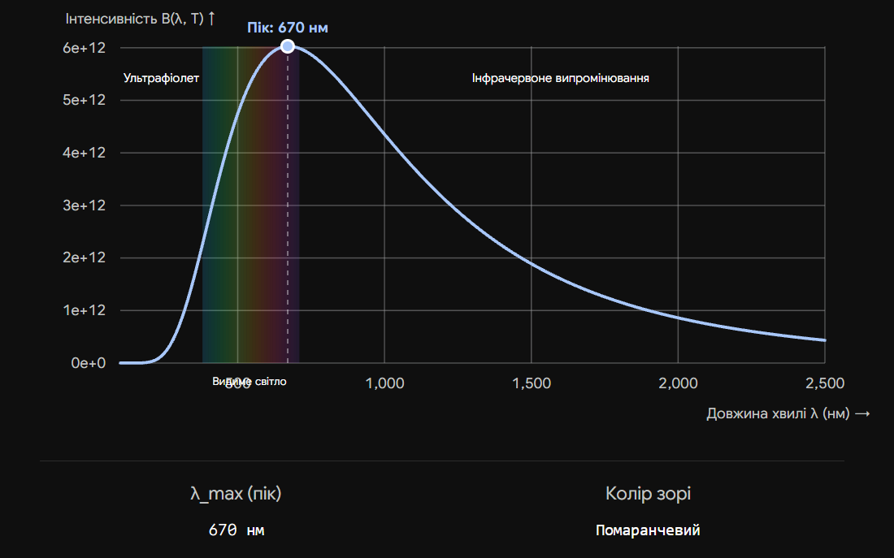
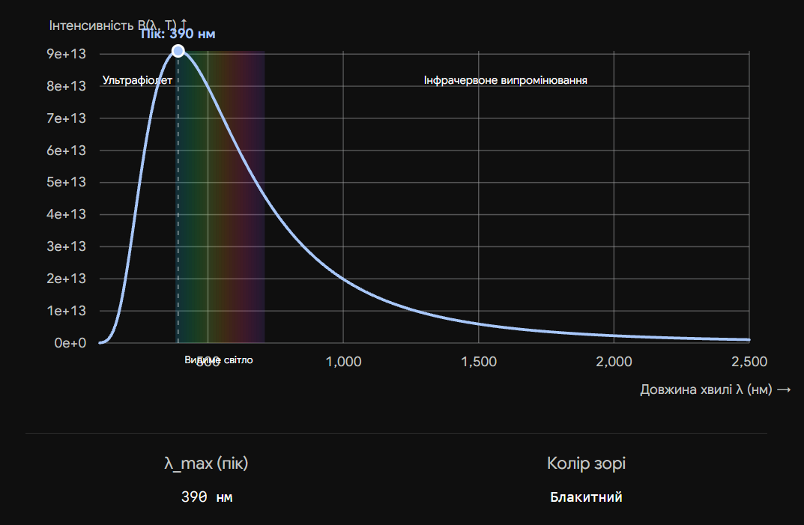

# Формула Планка для випромінювання АЧТ

**Випромінювання абсолютно чорного тіла (АЧТ)** — це еталонна фізична модель об'єкта, який повністю поглинає все випромінювання, що на нього падає, нічого не відбиваючи, і при цьому сам випромінює енергію за рахунок свого нагрівання. Формула Планка математично описує, як саме ця енергія розподіляється за довжинами хвиль залежно виключно від температури тіла. В астрономії зорі вважаються дуже близькими до АЧТ, тому цей закон дозволяє безпомилково визначати їхню температуру на основі аналізу кольору.

## Розв'язання "Ультрафіолетової катастрофи"

До Макса Планка фізики намагалися описати спектр теплового випромінювання методами класичної фізики, але їхні формули працювали лише для крайніх ділянок спектра і суперечили реальним експериментам.

| Підхід                   | Суть теорії                                                                         | Проблема / Обмеження                                                                                                                                |
| ------------------------ | ----------------------------------------------------------------------------------- | --------------------------------------------------------------------------------------------------------------------------------------------------- |
| **Закон Релея — Джинса** | Світло випромінюється безперервними хвилями різної довжини.                         | Працює для довгих (інфрачервоних) хвиль, але для ультрафіолету теоретично передбачає виділення нескінченної енергії ("ультрафіолетова катастрофа"). |
| **Закон Віна**           | Емпіричний опис випромінювання на основі термодинаміки.                             | Добре описує короткохвильове випромінювання, але дає величезну похибку в інфрачервоному (довгохвильовому) діапазоні.                                |
| **Закон Планка**         | Енергія випромінюється не суцільним потоком, а дискретними порціями — **квантами**. | **Немає обмежень**. Ідеально узгоджується з експериментами і описує весь спектр за будь-якої температури.                                           |

## Головні формули (Закон Планка)

Функція Планка визначає спектральну густину випромінювання ($B_\lambda$) на конкретній довжині хвилі ($\lambda$) при абсолютній температурі ($T$):

$$B_\lambda(T) = \frac{2hc^2}{\lambda^5} \frac{1}{e^{\frac{hc}{\lambda kT}} - 1}$$

_Де:_

- $B_\lambda(T)$ — потужність випромінювання з одиниці площі на заданій довжині хвилі.
- $h$ — стала Планка ($6.626 \cdot 10^{-34}$ Дж·с).
- $c$ — швидкість світла у вакуумі ($3 \cdot 10^8$ м/с).
- $k$ — стала Больцмана ($1.38 \cdot 10^{-23}$ Дж/К).
- $\lambda$ — довжина хвилі випромінювання.
- $T$ — абсолютна температура тіла в Кельвінах (К).

**Наслідки з формули Планка:**
Формула Планка є фундаментальною, і з неї математично виводяться два простіші практичні закони:

1. **Закон зміщення Віна:** Показує, на яку довжину хвилі припадає максимум випромінювання. Чим гарячіша зоря, тим коротша хвиля (тому гарячі зорі — блакитні, а холодні — червоні).

$$\lambda_{max} = \frac{b}{T}$$

_(де $b \approx 0.0029$ м·К)_ 2. **Закон Стефана-Больцмана:** Описує загальну потужність, яку випромінює одиниця площі тіла на всіх довжинах хвиль разом узятій.

$$E = \sigma T^4$$

_(де $\sigma$ — стала Стефана-Больцмана. Енергія зростає пропорційно четвертому степеню температури)._

## Підсумок

Формула Планка не лише започаткувала епоху квантової фізики, але й стала головним "термометром" Всесвіту. Побудувавши спектр будь-якої зорі за допомогою телескопа, астрономи знаходять пік кривої Планка і за ним точно обчислюють температуру поверхні об'єкта, що знаходиться за тисячі світлових років від Землі.

