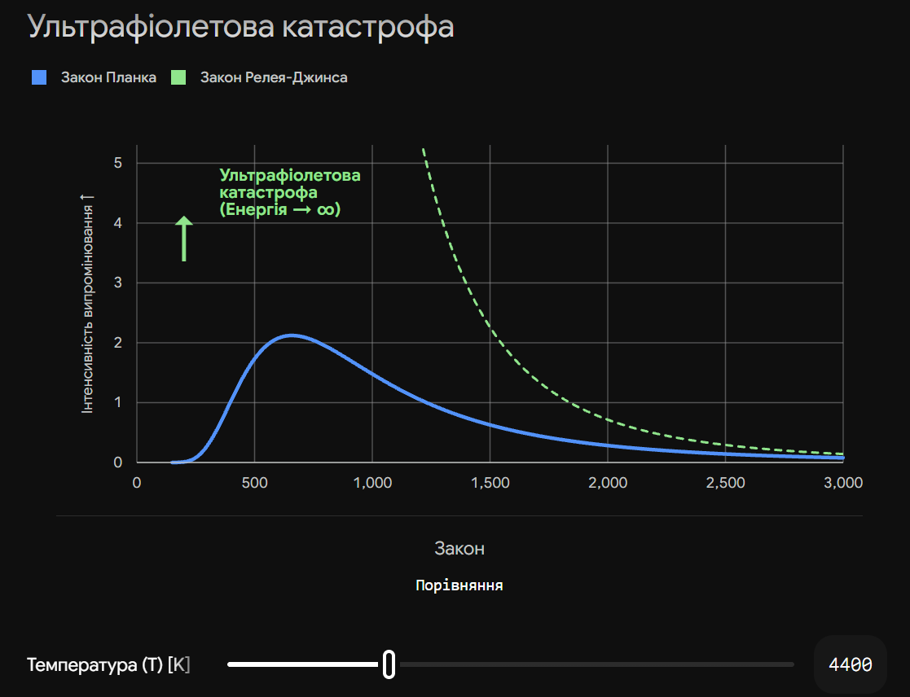

# Закон Релея-Джинса

**Закон Релея — Джинса** — це історична спроба класичної фізики описати спектр теплового випромінювання абсолютно чорного тіла (АЧТ). Цей закон спирається на класичну електродинаміку і ґрунтується на хибному припущенні, що електромагнітна енергія випромінюється тілом безперервно, у вигляді звичайних хвиль.

## Суть закону та "Ультрафіолетова катастрофа"

Згідно з класичною теорією, на яку спиралися Релей та Джинс, кількість хвиль, що можуть поміститися всередині порожнини (чорного тіла), нескінченно зростає зі зменшенням їхньої довжини. Оскільки на кожну хвилю мала б припадати однакова частка теплової енергії, закон призводив до парадоксу:

- Для довгих хвиль (інфрачервоних та радіохвиль) теоретичні розрахунки ідеально збігалися з експериментами.
- Для коротких хвиль (видиме світло, ультрафіолет, рентген) формула показувала, що тіло має випромінювати **нескінченну кількість енергії**.

Цей абсурдний висновок, який порушував закон збереження енергії (адже будь-яке нагріте тіло миттєво втрачало б усю енергію і охолоджувалося до абсолютного нуля), отримав назву **"ультрафіолетова катастрофа"**.

## Головна формула

Спектральна випромінювальна здатність чорного тіла ($B_\lambda$) за законом Релея — Джинса обчислюється як:

$$B_\lambda(T) = \frac{2 c k T}{\lambda^4}$$

_Де:_

- $B_\lambda(T)$ — інтенсивність випромінювання на певній довжині хвилі.
- $c$ — швидкість світла у вакуумі.
- $k$ — стала Больцмана ($1.38 \cdot 10^{-23}$ Дж/К).
- $T$ — абсолютна температура тіла у Кельвінах.
- $\lambda$ — довжина хвилі.

_(Як видно з формули, коли $\lambda$ наближається до нуля, знаменник стає крихітним, а загальне значення випромінювання $B_\lambda$ прямує до нескінченності).\_

## Порівняння законів випромінювання

Щоб вирішити проблему цього закону, Макс Планк висунув революційну гіпотезу про те, що світло випромінюється не безперервно, а порціями (квантами).

| Закон                  | Теоретична основа        | Де працює добре                                  | Головна проблема                                                                                  |
| ---------------------- | ------------------------ | ------------------------------------------------ | ------------------------------------------------------------------------------------------------- |
| **Закон Віна**         | Термодинаміка            | Короткі хвилі (ультрафіолет, видиме світло)      | Дає велику похибку для довгих хвиль (інфрачервоних).                                              |
| **Закон Релея-Джинса** | Класична електродинаміка | Довгі хвилі (інфрачервоне випромінювання, радіо) | Призводить до "ультрафіолетової катастрофи" на коротких хвилях.                                   |
| **Закон Планка**       | Квантова фізика          | **Весь спектр**                                  | Проблем немає. Закон Релея-Джинса є просто наслідком закону Планка для великих значень $\lambda$. |

## Підсумок

Закон Релея — Джинса відіграв фундаментальну роль в історії науки, але не тому, що був правильним, а тому, що його нищівний провал (ультрафіолетова катастрофа) довів неспроможність класичної фізики описати мікросвіт. Саме неможливість пояснити спектр чорного тіла безперервними хвилями змусила вчених запровадити поняття кванта, давши старт квантовій механіці.

