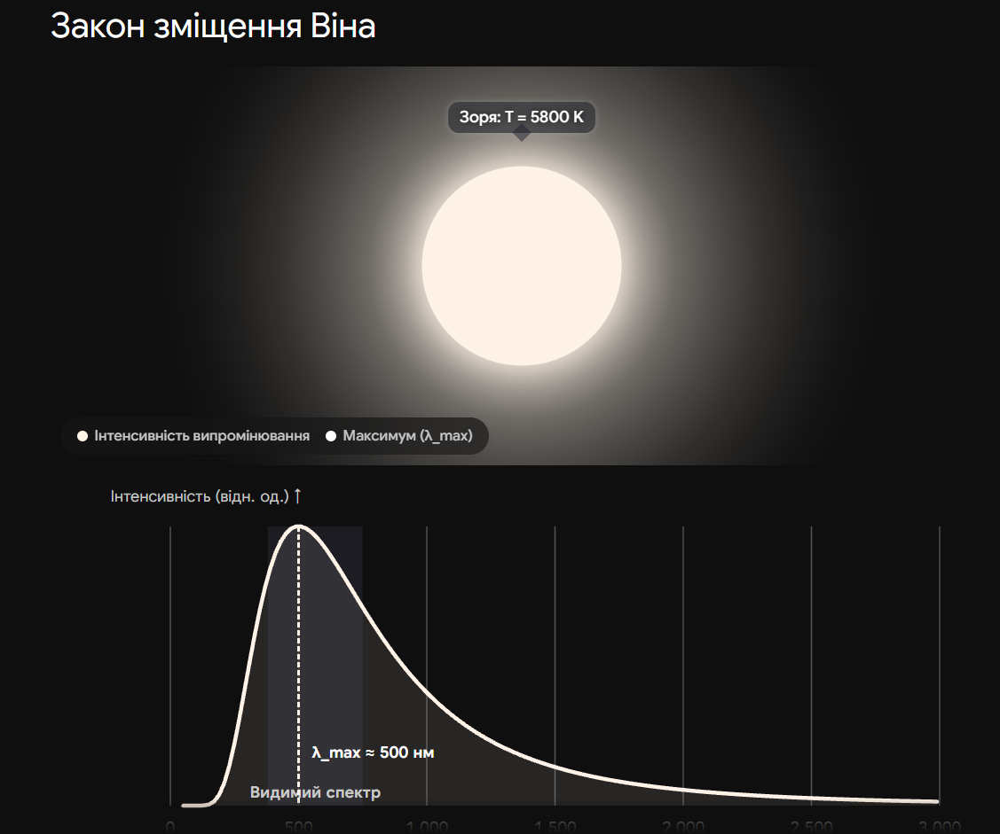

# Закон зміщення Віна

**Закон зміщення Віна** встановлює зворотну пропорційну залежність між температурою абсолютно чорного тіла (яким наближено є зорі) та довжиною хвилі, на яку припадає максимум його випромінювання. Простими словами, цей закон математично доводить і пояснює, чому при нагріванні колір об'єкта змінюється від інфрачервоного (невидимого) до червоного, потім жовтого, білого і, зрештою, блакитного.

## Зв'язок між кольором і температурою

Оскільки зорі випромінюють енергію нерівномірно по всьому спектру, їхній видимий колір визначається саме тією довжиною хвилі, де графік інтенсивності випромінювання досягає свого піку.

| Температура поверхні ($T$) | Пікова довжина хвилі ($\lambda_{max}$)      | Видимий колір зорі | Типовий приклад |
| -------------------------- | ------------------------------------------- | ------------------ | --------------- |
| $\approx 3000$ К           | $\approx 960$ нм (Ближня інфрачервона зона) | Червоний           | Бетельгейзе     |
| $\approx 5800$ К           | $\approx 500$ нм (Зелено-жовта зона)        | Жовтий / Білий     | Сонце           |
| $\approx 10000$ К          | $\approx 290$ нм (Ближній ультрафіолет)     | Блакитно-білий     | Сіріус          |
| $\approx 25000+$ К         | $< 120$ нм (Далекий ультрафіолет)           | Насичений синій    | Спіка           |

## Головна формула

Закон зміщення Віна записується як:

$$\lambda_{max} = \frac{b}{T}$$

_Де:_

- $\lambda_{max}$ — довжина хвилі, на яку припадає максимальна інтенсивність випромінювання (вимірюється в метрах).
- $b$ — стала Віна ($b \approx 2.898 \cdot 10^{-3}$ м·К).
- $T$ — абсолютна температура поверхні тіла (у Кельвінах, К).

_Для практичних розрахунків у нанометрах (нм), які є зручними для оптичного діапазону, формулу зазвичай подають у вигляді:_

$$\lambda_{max} \approx \frac{2.9 \cdot 10^6}{T}$$

## Підсумок

Закон Віна виконує роль головного "безконтактного термометра" в астрофізиці. Проаналізувавши спектр зорі за допомогою телескопа та знайшовши довжину хвилі з найвищою інтенсивністю випромінювання, астрономи можуть миттєво і дуже точно розрахувати температуру її поверхні, навіть якщо об'єкт знаходиться за мільйони світлових років від Землі.

