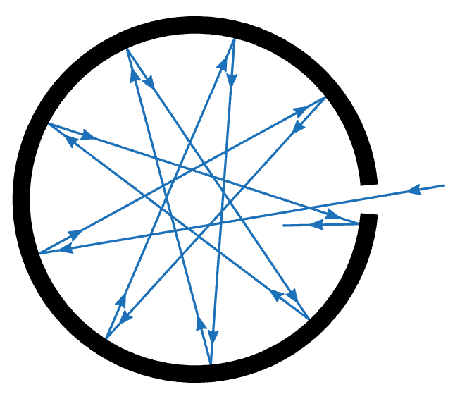
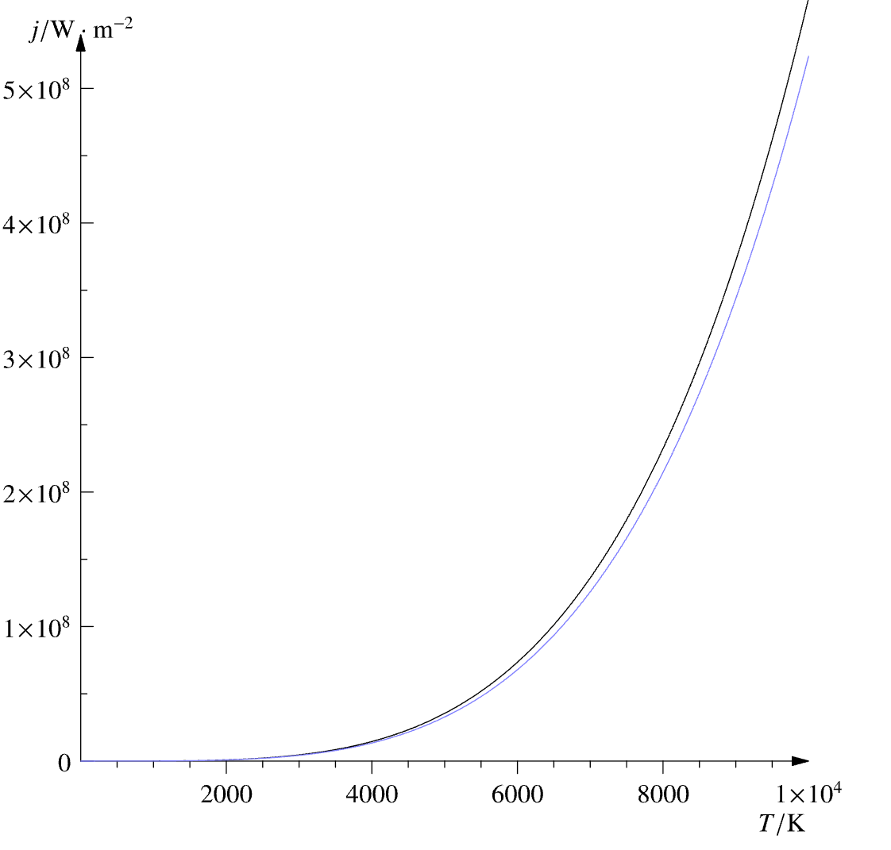

# Закон Стефана-Больцмана

**Закон Стефана-Больцмана** — це один із фундаментальних законів теплового випромінювання, який пов'язує абсолютну температуру тіла із загальною кількістю енергії, яку воно випромінює. Він стверджує, що потужність випромінювання стрімко зростає зі збільшенням температури. Простими словами: чим гарячіша зоря, тим більше світла і тепла вона випромінює з кожного квадратного метра своєї поверхні.

## Головні формули

**1. Випромінювання з одиниці площі:**
Енергія, яку випромінює $1 \text{ м}^2$ поверхні абсолютно чорного тіла (енергетична світність), прямо пропорційна четвертому степеню його абсолютної температури:

$$E = \sigma T^4$$

_Де:_

- $E$ — енергетична світність (потужність випромінювання з одиниці площі, Вт/м²).
- $\sigma$ — стала Стефана-Больцмана ($\sigma \approx 5.67 \cdot 10^{-8} \text{ Вт}/(\text{м}^2\cdot\text{К}^4)$).
- $T$ — абсолютна температура поверхні в Кельвінах (К).

_(Фізичний наслідок: якщо температура зорі зросте всього у $2$ рази, випромінювання з кожного квадратного метра її поверхні збільшиться у $2^4 = 16$ разів)._

**2. Загальна світність зорі:**
Оскільки зоря має форму кулі, її загальна потужність (світність, $L$) залежить не лише від температури, а й від загальної площі поверхні ($S = 4\pi R^2$). Тому повна формула світності має вигляд:

$$L = 4\pi R^2 \sigma T^4$$

_Де:_

- $L$ — загальна світність зорі (повна енергія, випромінена в усіх напрямках, Вт).
- $R$ — радіус зорі (м).

## Порівняння впливу радіуса та температури на світність

Завдяки закону Стефана-Больцмана астрономи розуміють, чому зорі з різними фізичними характеристиками можуть мати однакову чи кардинально різну світність.

| Тип зорі                             | Температура ($T$)               | Радіус ($R$)                                 | Загальна світність ($L$)               | Фізичне пояснення                                                                                           |
| ------------------------------------ | ------------------------------- | -------------------------------------------- | -------------------------------------- | ----------------------------------------------------------------------------------------------------------- |
| **Сонце (Жовтий карлик)**            | Середня ($\approx 5800$ К)      | Середній                                     | $1 L_{\odot}$ (еталон)                 | Баланс між помірною температурою та розміром.                                                               |
| **Червоний надгігант (Бетельгейзе)** | Низька ($\approx 3500$ К)       | Величезний (у $1000$ разів більший за Сонце) | Дуже висока (до $100000 L_{\odot}$)    | Незважаючи на холодну поверхню, колосальна площа забезпечує надзвичайно високу загальну світність.          |
| **Білий карлик (Сіріус В)**          | Дуже висока ($\approx 25000$ К) | Мізерний (розміром із Землю)                 | Дуже низька ($\approx 0.03 L_{\odot}$) | Кожен квадратний метр світиться неймовірно яскраво (через $T^4$), але загальна площа поверхні занадто мала. |

## Підсумок

Закон Стефана-Больцмана є ключем до розуміння енергетики Всесвіту. Він доводить, що загальна яскравість (світність) космічного об'єкта залежить лише від двох його фізичних параметрів: розміру (радіуса) та температури поверхні, причому температура відіграє значно потужнішу роль завдяки залежності у четвертому степені.

