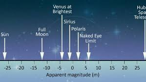
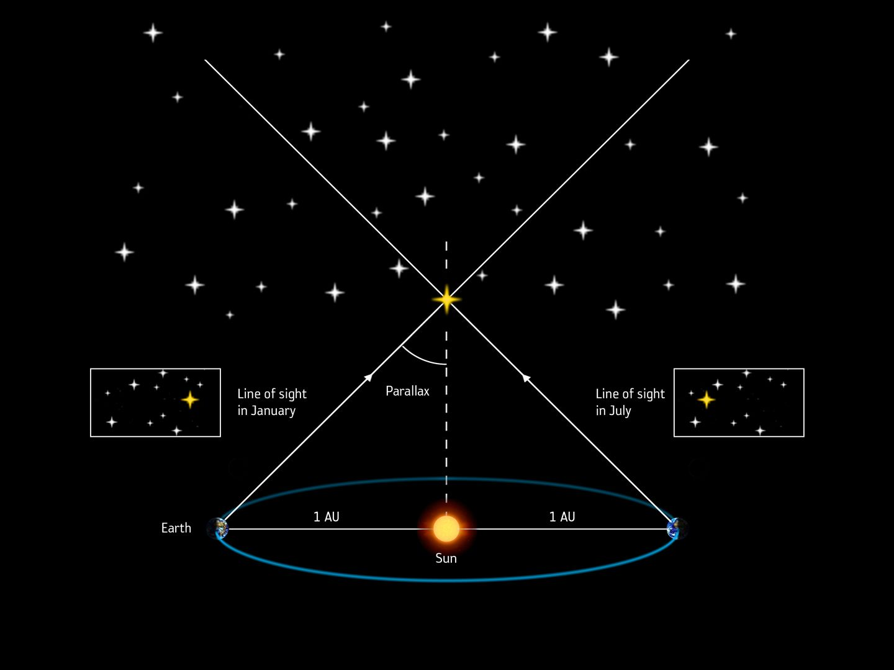

# Формула Погсона. Зв’язок видимої зоряної величини з відстанню та паралаксом

**Видима зоряна величина** показує, наскільки яскравою зоря здається спостерігачеві на Землі, а не її справжню потужність. Формула Погсона математично пов'язує цю суб'єктивну видиму яскравість із реальними фізичними потоками світла. Водночас, знаючи справжню (абсолютну) яскравість зорі, можна обчислити точну відстань до неї або її річний паралакс.

## Порівняння зоряних величин

Щоб знайти відстань до зорі, астрономи порівнюють те, як ми її бачимо, з тим, якою вона є насправді.

| Характеристика              | Видима зоряна величина ($m$)                                                             | Абсолютна зоряна величина ($M$)                           |
| --------------------------- | ---------------------------------------------------------------------------------------- | --------------------------------------------------------- |
| **Що описує?**              | Яскравість зорі на нашому небі.                                                          | Справжню фізичну світність зорі.                          |
| **Залежність від відстані** | Залежить напряму (чим далі зоря, тим більшим є значення $m$, і зоря здається тьмянішою). | Не залежить (це постійна фізична характеристика об'єкта). |
| **Стандартна відстань**     | Вимірюється з Землі (реальна поточна відстань).                                          | Вимірюється з умовної відстані рівно 10 парсеків.         |

## Головні формули

**1. Формула Погсона:**
Різниця зоряних величин двох об'єктів логарифмічно пов'язана з відношенням їхніх освітленостей (світлових потоків). Якщо освітленість відхиляється у 100 разів, зоряна величина змінюється рівно на 5 одиниць.

$$m_1 - m_2 = -2.5 \lg \left( \frac{E_1}{E_2} \right)$$

Або в експоненційному вигляді:

$$\frac{E_1}{E_2} = 100^{\frac{m_2 - m_1}{5}} \approx 2.512^{m_2 - m_1}$$

_Де:_

- $m_1, m_2$ — видимі зоряні величини порівнюваних зір.
- $E_1, E_2$ — освітленості, які ці зорі створюють на поверхні Землі.

**2. Модуль відстані (Зв'язок із відстанню):**
Рівняння, яке пов'язує видиму та абсолютну зоряні величини з відстанню до об'єкта.

$$m - M = 5 \lg r - 5$$

_Де:_

- $r$ — відстань до зорі у парсеках (пк).
- $(m - M)$ — ця різниця називається модулем відстані.

**3. Зв'язок із річним паралаксом:**
Оскільки відстань у парсеках є обернено пропорційною до річного паралаксу ($r = \frac{1}{p}$), формулу модуля відстані можна записати безпосередньо через паралакс, підставивши цей дріб під логарифм:

$$m - M = -5 \lg p - 5$$

_Де:_

- $p$ — річний паралакс зорі в секундах дуги ($''$).

## Підсумок

Формула Погсона стала мостом між давньою шкалою Гіппарха та сучасною фізикою, перетворивши зоряні величини на точні індикатори енергії. Використовуючи модуль відстані, астрономи змогли поєднати видимий блиск зорі з її справжньою потужністю, що перетворило фотометрію на один із найточніших методів вимірювання колосальних відстаней у Всесвіті.

Шкала видимої зоряної величини (apparent magnitude) від найяскравіших об’єктів (Сонце −26,7) до найслабших, які бачить Hubble. Допомагає зрозуміти, наскільки сильно відрізняється те, як ми бачимо зорю, від її реальної світності:

Чітка схема паралаксу: положення зорі на фоні далеких зірок змінюється залежно від положення Землі на орбіті (січень vs липень). Це і є той «тригонометричний важіль», за допомогою якого астрономи вимірюють відстань.

