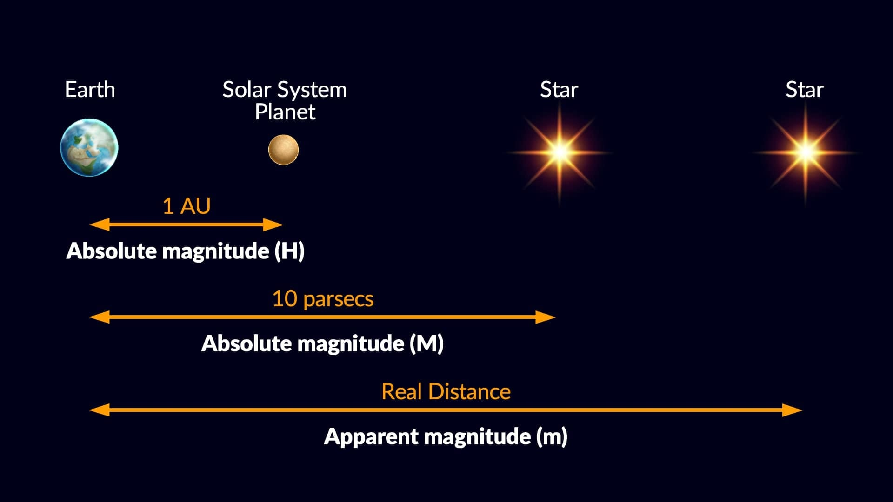
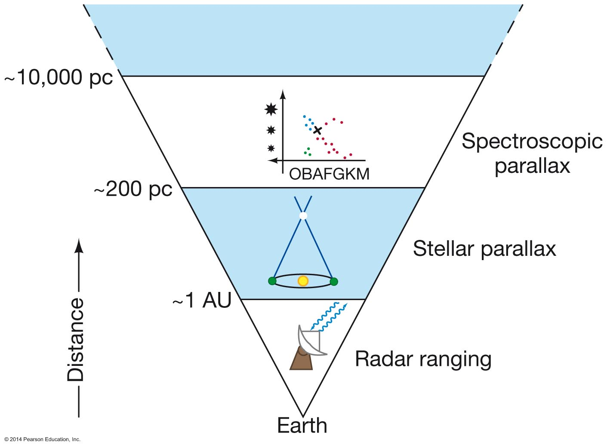

# Абсолютна зоряна величина. Модуль відстані

**Абсолютна зоряна величина** — це справжня фізична світність зорі, виражена у зоряних величинах. Оскільки зорі знаходяться на кардинально різних відстанях від Землі, для їх об'єктивного порівняння астрономи застосовують математичний прийом: подумки "переносять" усі космічні об'єкти на однакову еталонну відстань — рівно $10$ парсеків. **Модуль відстані** — це математична різниця між видимою (поточною) та абсолютною (еталонною) яскравістю зорі, яка слугує точним мірилом відстані до неї.

## Порівняння зоряних величин

| Характеристика               | Видима зоряна величина ($m$)                           | Абсолютна зоряна величина ($M$)                        |
| ---------------------------- | ------------------------------------------------------ | ------------------------------------------------------ |
| **Що відображає?**           | Суб'єктивну яскравість зорі на нашому нічному небі.    | Справжню фізичну потужність (світність) зорі.          |
| **Залежність від відстані**  | Залежить (чим далі зоря, тим тьмянішою вона здається). | Не залежить (це стала фізична характеристика об'єкта). |
| **Дистанція спостереження**  | Фактична (реальна відстань).                           | Строго фіксована ($10$ пк).                            |
| **Приклад: Сонце**           | $-26.7^m$ (найяскравіший об'єкт на небі).              | $+4.8^m$ (досить тьмяна жовта зоря).                   |
| **Приклад: Рігель (гігант)** | $+0.1^m$ (просто яскрава зоря в сузір'ї Оріона).       | $-7.9^m$ (засліплюючий блакитний надгігант).           |

## Головні формули

**1. Рівняння модуля відстані:**
Фундаментальна формула, яка пов'язує видиму яскравість, абсолютну потужність та відстань до космічного об'єкта:

$$m - M = 5 \lg D - 5$$

_Де:_

- $m$ — видима зоряна величина.
- $M$ — абсолютна зоряна величина.
- $D$ — відстань до зорі у парсеках (пк).
- $(m - M)$ — цей вираз і називається **модулем відстані**.

**2. Зв'язок із річним паралаксом:**
Оскільки відстань ($D$) є обернено пропорційною до річного паралаксу ($D = \frac{1}{p}$), формулу можна переписати через кут паралаксу:

$$M = m + 5 + 5 \lg p$$

_Де:_

- $p$ — річний паралакс зорі у секундах дуги ($''$).

## Підсумок

Абсолютна зоряна величина дозволяє об'єктивно порівнювати справжню потужність зір, позбавляючись ілюзії перспективи. Вона перетворює фотометрію на потужний інструмент навігації: якщо астроном здатен визначити абсолютну величину зорі (наприклад, за її спектром або періодом пульсацій), він може миттєво знайти модуль відстані і обчислити, наскільки далеко в космосі розташований цей об'єкт.

Діаграма «сходів відстаней». Зоряний паралакс працює до приблизно 200 парсеків. Далі використовують інші методи, відкалібровані за допомогою паралаксу найближчих зір.
