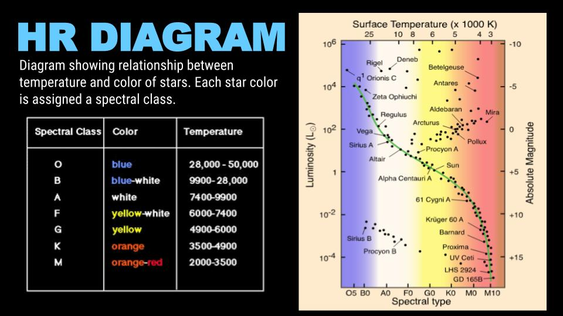
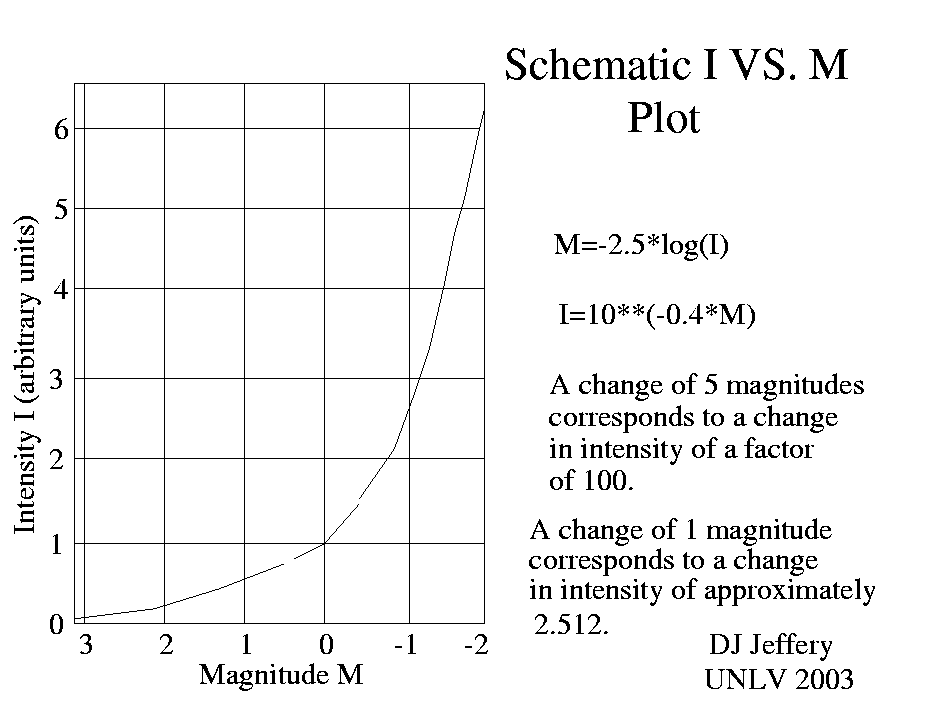
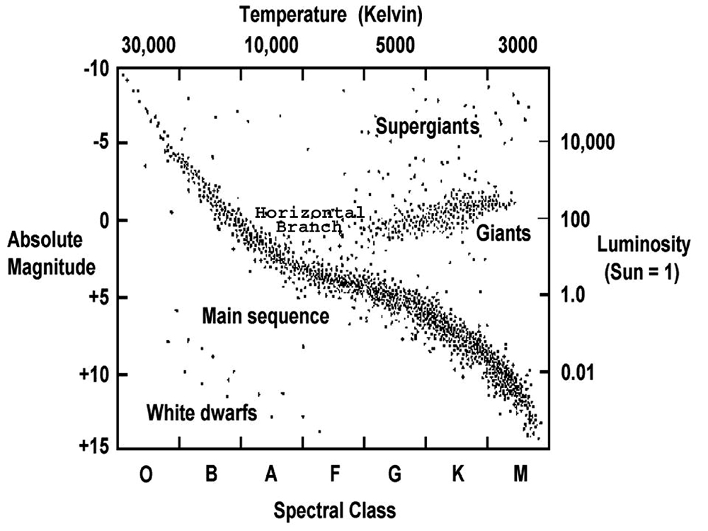

# Світність зорі. Формула зв’язку світності та абсолютної зоряної величини

**Світність зорі** — це загальна кількість енергії, яку зоря випромінює в навколишній космічний простір за одну секунду. Це її справжня абсолютна фізична потужність, яка не залежить від того, з якої відстані на неї дивиться спостерігач. Абсолютна зоряна величина є лише історично сформованим математичним способом виразити цю ж саму потужність у логарифмічній шкалі.

## Порівняння величин потужності

Хоча обидва поняття описують внутрішню енергетику зорі, вони використовуються для різних задач.

| Характеристика         | Світність ($L$)                                                   | Абсолютна зоряна величина ($M$)                                         |
| ---------------------- | ----------------------------------------------------------------- | ----------------------------------------------------------------------- |
| **Що описує?**         | Фізичну енергію (потужність випромінювання).                      | Оптичну яскравість (якби зоря була на відстані 10 пк).                  |
| **Одиниці виміру**     | Вати (Вт) або маси Сонця ($L_{\odot}$).                           | Безрозмірна величина ($^m$).                                            |
| **Характер шкали**     | Лінійна (у $2$ рази більше світла = у $2$ рази більша світність). | Логарифмічна (різниця у $5^m$ означає різницю світності у $100$ разів). |
| **Значення для Сонця** | $L_{\odot} \approx 3.828 \cdot 10^{26}$ Вт                        | $M_{\odot} \approx +4.8^m$                                              |

## Формула зв'язку (Закон Погсона для світностей)

Оскільки абсолютна зоряна величина — це та ж сама освітленість, але з фіксованої відстані ($10$ пк), формулу Погсона можна застосувати безпосередньо для порівняння світностей двох зір. Найчастіше будь-яку зорю порівнюють із нашим Сонцем.

Відношення світності зорі ($L$) до світності Сонця ($L_{\odot}$) дорівнює:

$$\frac{L}{L_{\odot}} = 100^{\frac{M_{\odot} - M}{5}}$$

Або з використанням основи $2.512$ (оскільки $\sqrt[5]{100} \approx 2.512$):

$$\frac{L}{L_{\odot}} \approx 2.512^{M_{\odot} - M}$$

Часто в астрофізиці цю ж формулу використовують у логарифмічному вигляді, щоб швидко знайти абсолютну зоряну величину, знаючи світність:

$$\lg\left(\frac{L}{L_{\odot}}\right) = 0.4(M_{\odot} - M)$$

_Де:_

- $L$ — світність досліджуваної зорі.
- $L_{\odot}$ — світність Сонця (приймається за $1$).
- $M$ — абсолютна зоряна величина досліджуваної зорі.
- $M_{\odot}$ — абсолютна зоряна величина Сонця ($+4.8^m$).

## Підсумок

Світність та абсолютна зоряна величина є синонімами в контексті фізичної потужності об'єкта. Формула зв'язку між ними — це класичний закон Погсона, який дозволяє легко конвертувати незручні для сприйняття гігантські числа у Ватах у зручну логарифмічну шкалу зоряних величин (і навпаки), взявши за еталон потужність нашого Сонця.

HR-діаграма з подвійною шкалою: ліворуч — світність у одиницях Сонця (L/L☉), праворуч — абсолютна зоряна величина (M). Чітко видно пряму відповідність: більша світність = менша (від’ємніша) абсолютна величина.

---

Графік показує логарифмічну залежність між світністю (інтенсивністю) та абсолютною зоряною величиною.

---

Класична HR-діаграма з обома шкалами (світність праворуч, абсолютна величина ліворуч) для порівняння різних типів зір.
(**О**дин **B**агатий **A**нглієць **F**ініки **G**ував **K**оло **M**узею)
