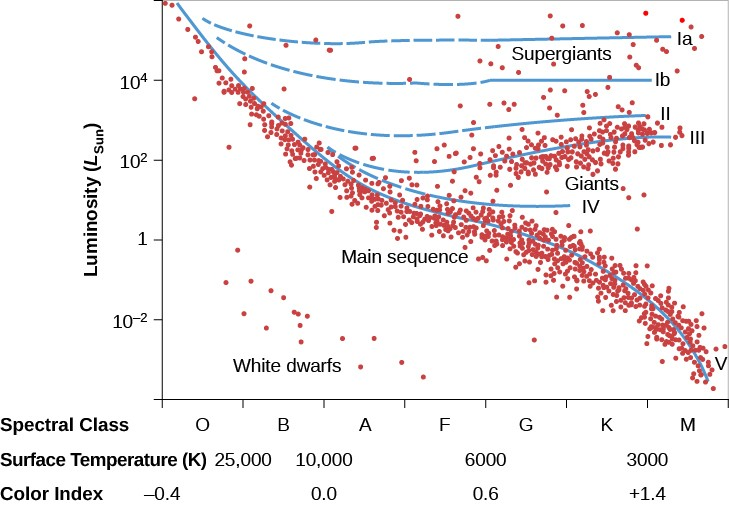
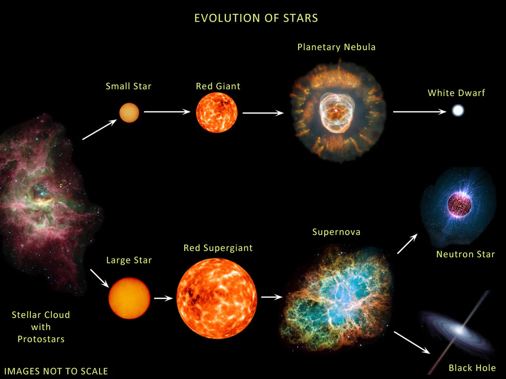

# Класи світності. Діаграма Герцшпрунга-Рассела. Еволюційний аспект

**Діаграма Герцшпрунга-Рассела (Г-Р)** — це головний графік в астрономії, який відображає залежність між температурою поверхні зорі та її абсолютною яскравістю (світністю). Ця діаграма доводить, що фізичні характеристики зір не є випадковими: зорі групуються у чіткі "класи світності", кожен з яких відповідає певному етапу життя та внутрішньої будови світила.

## Осі та структура діаграми

Кожна зоря на діаграмі Г-Р позначається точкою з двома координатами:

- **Горизонтальна вісь (X):** Температура поверхні ($T$) або відповідний спектральний клас (O, B, A, F, G, K, M). _Особливість:_ температура на цій осі зменшується зліва направо (найгарячіші блакитні зорі зліва, найхолодніші червоні — справа).
- **Вертикальна вісь (Y):** Світність ($L$) у масах Сонця ($L_{\odot}$) або абсолютна зоряна величина ($M$). Вісь має логарифмічний масштаб.

Більшість зір (близько 90%) розташовані вздовж діагональної смуги, що перетинає графік з верхнього лівого у нижній правий кут — це **Головна послідовність**.

## Класи світності (Єркська класифікація)

Оскільки зорі однакової температури можуть мати кардинально різну світність (наприклад, червоний карлик і червоний надгігант), астрономи запровадили класи світності (позначаються римськими цифрами від I до VII). Вони фактично відображають розмір зорі.

| Клас світності | Назва групи                     | Положення на діаграмі Г-Р                                          | Типовий приклад     |
| -------------- | ------------------------------- | ------------------------------------------------------------------ | ------------------- |
| **I (Ia, Ib)** | Надгіганти                      | Самий верхній край (величезна світність за будь-якої температури)  | Бетельгейзе, Рігель |
| **II, III**    | Яскраві гіганти та Гіганти      | Вище Головної послідовності, переважно у правій (холодній) частині | Альдебаран, Арктур  |
| **IV**         | Субгіганти                      | Вузька перехідна смуга між Головною послідовністю та гігантами     | Проціон             |
| **V**          | Карлики (Головна послідовність) | Діагональна смуга від гарячих яскравих до холодних тьмяних зір     | Сонце, Сіріус А     |
| **VI**         | Субкарлики                      | Трохи нижче Головної послідовності (бідні на метали зорі)          | Зорі гало Галактики |
| **VII**        | Білі карлики                    | Нижній лівий кут (дуже гарячі, але крихітні та тьмяні)             | Сіріус В            |

## Еволюційний аспект (Життя зорі на діаграмі)

Діаграма Г-Р — це карта еволюції. Зоря не стоїть на одному місці, а переміщується діаграмою протягом життя:

1. **Народження і Головна послідовність:** Після формування протозоря "сідає" на Головну послідовність. Тут вона проводить 90% свого життя, стабільно спалюючи водень. Положення залежить від маси (масивні — вгорі зліва, легкі — внизу справа).
2. **Стадія гіганта:** Коли водень у ядрі закінчується, ядро стискається, а зовнішні оболонки розширюються і охолоджуються. Зоря сходить з Головної послідовності і переміщується вправо і вгору, стаючи червоним гігантом або надгігантом.
3. **Загибель:** Скинувши оболонки, від маломасивної зорі залишається лише гаряче оголене ядро, яке різко "падає" в нижній лівий кут діаграми, перетворюючись на білого карлика, що повільно остигає.

## Головні формули

Зв'язок між положенням зорі на діаграмі Г-Р та її фізичним розміром (радіусом) описується законом Стефана-Больцмана. Світність ($L$) залежить від радіуса ($R$) і температури ($T$):

$$L = 4\pi R^2 \sigma T^4$$

Щоб визначити радіус зорі відносно сонячного ($R_{\odot}$), використовуючи координати з діаграми (світність і температуру), застосовують відносну формулу:

$$\frac{R}{R_{\odot}} = \left(\frac{T_{\odot}}{T}\right)^2 \sqrt{\frac{L}{L_{\odot}}}$$

_Де $T_{\odot} \approx 5800$ К (температура Сонця), $L_{\odot} = 1$ (світність Сонця). З формули видно: якщо дві зорі мають однакову температуру, але одна з них у $10000$ разів яскравіша, її радіус має бути більшим у $\sqrt{10000} = 100$ разів.\_

## Підсумок

Діаграма Герцшпрунга-Рассела впорядковує все розмаїття зір Всесвіту в логічну систему. Класи світності показують не лише поточну яскравість і розмір світила, а і його вік: приналежність до Головної послідовності означає зрілість і стабільність, перехід до класу гігантів сигналізує про швидке старіння, а положення серед білих карликів є свідченням закінчення активного життя.

---

Діаграма Герцшпрунга-Рассела з класами світності (Ia–Ib — надгіганти, II — яскраві гіганти, III — гіганти, IV — субгіганти, V — головна послідовність). Чітко видно розділення за світністю при однаковій температурі.

---

Еволюційні шляхи зір на HR-діаграмі:

- Малі зорі: головна послідовність → червоний гігант → планетарна туманність → білий карлик
- Великі зорі: червоний надгігант → наднова → нейтронна зоря / чорна діра
