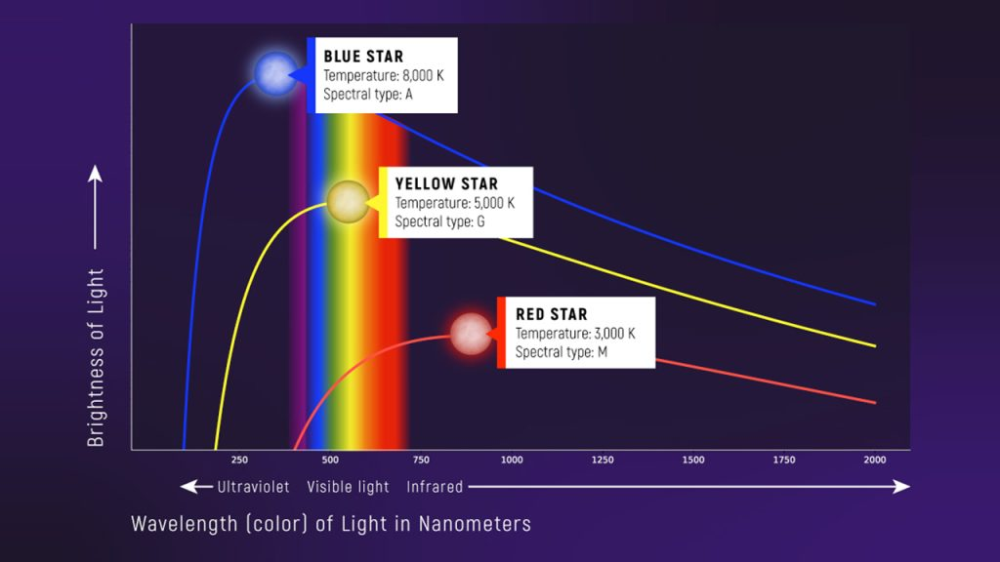
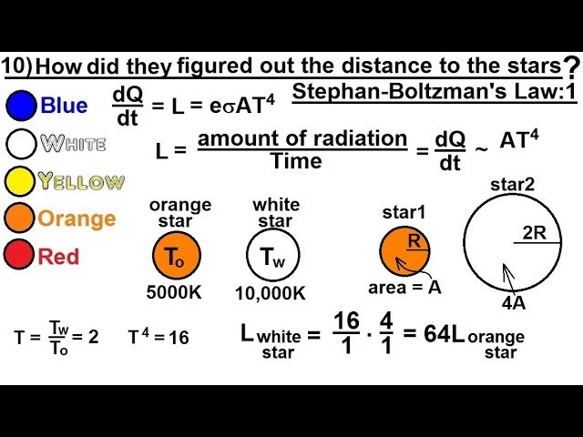

# Визначення температури та радіусу зір

**Визначення фізичних параметрів зір**, таких як температура та радіус, здійснюється переважно непрямими оптичними методами, оскільки зорі знаходяться надто далеко, щоб виглядати у телескоп більшими за крапку. Температуру дізнаються шляхом аналізу кольору та спектрального складу світла зорі, тоді як її реальний розмір найчастіше обчислюють математично, поєднуючи дані про температуру та загальну світність.

## Визначення температури зорі

Температура поверхні зорі (ефективна температура) безпосередньо впливає на її видимий колір і на те, які хімічні елементи проявляться в її спектрі.

- **За законом Віна (Колірний показник):** Вимірюючи інтенсивність світла зорі через різні світлофільтри (наприклад, синій та жовтий), астрономи знаходять довжину хвилі, на яку припадає максимум випромінювання. Чим гарячіша зоря, тим коротша ця хвиля (зоря здається блакитнішою).
- **Спектральний аналіз:** Найточніший метод. Залежно від температури, атоми в атмосфері зорі знаходяться у різному стані іонізації. Наприклад, лінії поглинання нейтральних металів видно лише у відносно холодних зір, а лінії іонізованого гелію — виключно у надгарячих.

## Визначення радіуса зорі

Астрономи використовують три основні методи для вимірювання розміру зір, з яких лише один підходить для масового застосування.

| Метод                                     | Суть методу                                                                                                                                                                                       | Переваги та обмеження                                                                                                              |
| ----------------------------------------- | ------------------------------------------------------------------------------------------------------------------------------------------------------------------------------------------------- | ---------------------------------------------------------------------------------------------------------------------------------- |
| **Теоретичний (Закон Стефана-Больцмана)** | Радіус математично обчислюється, якщо відомі температура зорі та її світність (яка розраховується через відстань).                                                                                | **Універсальний**. Працює для будь-якої зорі, для якої можна виміряти паралакс та спектр.                                          |
| **Оптична інтерферометрія**               | Пряме вимірювання кутового діаметра зорі шляхом об'єднання світла від кількох рознесених телескопів (інтерферометрів).                                                                            | **Прямий метод**, але працює лише для найближчих до нас зір-гігантів та надгігантів (наприклад, Бетельгейзе).                      |
| **Затемнювано-подвійні зорі**             | Аналіз "кривої блиску" (графіка падіння яскравості), коли одна зоря проходить на тлі іншої в подвійній системі. Знаючи швидкість їхнього орбітального руху та час затемнення, обчислюють діаметр. | Дуже **висока точність**, але застосовується виключно для специфічних подвійних систем, орбіта яких лежить на нашому промені зору. |

## Головні формули

**1. Формула температури (Закон Віна):**
Температура поверхні зорі ($T$) прямо виводиться з пікової довжини хвилі її випромінювання ($\lambda_{max}$):

$$T = \frac{b}{\lambda_{max}}$$

_Де:_

- $T$ — абсолютна температура поверхні (К).
- $b$ — стала Віна ($b \approx 2.898 \cdot 10^{-3}$ м·К).
- $\lambda_{max}$ — виміряна довжина хвилі з максимальною інтенсивністю (м).

**2. Формула радіуса (Закон Стефана-Больцмана):**
Загальна світність зорі ($L$) дорівнює добутку її площі поверхні ($4\pi R^2$) на випромінювання з одиниці площі ($\sigma T^4$). Звідси радіус зорі ($R$) дорівнює:

$$R = \sqrt{\frac{L}{4\pi \sigma T^4}}$$

_Де:_

- $R$ — радіус зорі (м).
- $L$ — загальна світність зорі (Вт).
- $\sigma$ — стала Стефана-Больцмана.
- $T$ — температура поверхні (К).

**3. Практична (відносна) формула радіуса:**
Астрономам зручніше вимірювати параметри зорі не в метрах, а в сонячних одиницях. Зіставивши попередню формулу з параметрами Сонця, отримуємо зручне рівняння:

$$R = R_{\odot} \left(\frac{T_{\odot}}{T}\right)^2 \sqrt{\frac{L}{L_{\odot}}}$$

_Де $R_{\odot}, T*{\odot}, L*{\odot}$ — радіус, температура ($5800$ К) та світність Сонця.\_

## Підсумок

Визначення головних параметрів зорі є взаємопов'язаним процесом: спектр дає нам температуру, температура вказує на потужність кожного квадратного метра зорі, а порівняння цієї потужності із загальною світністю об'єкта розкриває його справжні фізичні габарити, без необхідності підлітати до зорі з рулеткою.

---

Визначення температури: за піком випромінювання (закон Віна). Блакитні зорі — найгарячіші (~8000–50 000 K), червоні — найхолодніші (~3000 K). Колір = температура поверхні.

---

Визначення радіусу: за законом Стефана–Больцмана
$ L = 4\pi R^2 \sigma T^4 $
Зі світності (L) та температури (T) обчислюють радіус зорі. На прикладі: при однаковій температурі більший радіус → значно більша світність.
