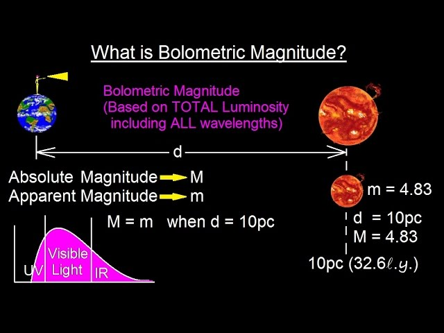

# Болометрична шкала зоряних величин. Болометрична поправка

**Болометрична зоряна величина** ($m_{bol}$ або $M_{bol}$) — це міра загальної (повної) кількості енергії, яку випромінює зоря на _всіх_ довжинах хвиль електромагнітного спектра (включаючи радіо-, інфрачервоне, видиме, ультрафіолетове та рентгенівське випромінювання). Термін походить від назви приладу "болометра", який вимірює загальну енергію теплового випромінювання.

Око людини та звичайні оптичні телескопи здатні фіксувати лише "видиму" (візуальну) зоряну величину ($m_v$). Але зорі бувають дуже гарячими або дуже холодними, і значна частина їхньої справжньої енергії може бути "невидимою" для нас. Болометрична шкала виправляє цю ілюзію.

## Болометрична поправка (BC)

Щоб дізнатися справжню потужність зорі (її болометричну величину), знаючи лише її видиму яскравість, астрономи додають до видимої величини спеціальний коригуючий коефіцієнт — **болометричну поправку (BC)**.

$$M_{bol} = M_v + BC$$

_Де:_

- $M_{bol}$ — абсолютна болометрична зоряна величина.
- $M_v$ — абсолютна візуальна зоряна величина.
- $BC$ — болометрична поправка.

**Важливе правило:** Оскільки загальна енергія зорі на всіх довжинах хвиль завжди більша (або дорівнює) за енергію лише у видимому діапазоні, болометрична яскравість завжди вища. У шкалі зоряних величин більшій яскравості відповідає _менше число_. Тому **болометрична поправка ($BC$) завжди є від'ємною величиною (або нулем)**.

## Залежність поправки від температури

Значення болометричної поправки безпосередньо залежить від температури зорі (закону Віна). Чим більша частка випромінювання зорі потрапляє за межі видимого діапазону (в ультрафіолет або інфрачервону зону), тим більшою за модулем буде поправка.

| Тип зорі                               | Температура       | Де знаходиться пік випромінювання? | Значення $BC$                                  | Фізичний зміст                                                                                                      |
| -------------------------------------- | ----------------- | ---------------------------------- | ---------------------------------------------- | ------------------------------------------------------------------------------------------------------------------- |
| **Гарячі гіганти (клас O, B)**         | $10000 - 30000$ К | В Ультрафіолеті (УФ)               | Від $-1^m$ до $-4^m$ і більше                  | Зоря випромінює величезну енергію в УФ, видиме світло — це лише мала частка. Вона набагато потужніша, ніж здається. |
| **Сонцеподібні зорі (клас F, G)**      | $5000 - 7000$ К   | У видимому діапазоні               | Близько до $0^m$ (Для Сонця $\approx -0.07^m$) | Майже вся енергія зорі випромінюється у вигляді видимого світла. $M_{bol}$ майже дорівнює $M_v$.                    |
| **Червоні карлики / гіганти (клас M)** | $2500 - 4000$ К   | В Інфрачервоному (ІЧ)              | Від $-1^m$ до $-3^m$                           | Зоря світить переважно невидимим теплом (ІЧ). Вона значно енергійніша, ніж показує її тьмяне червоне світло.        |

## Зв'язок із загальною світністю

Головна мета обчислення болометричної величини — знайти істинну **світність ($L$)** зорі, тобто загальну потужність її "термоядерного реактора" у Ватах. Для цього болометричну величину зорі порівнюють із болометричною величиною Сонця ($M_{bol, \odot} \approx +4.74^m$):

$$\lg\left(\frac{L}{L_{\odot}}\right) = 0.4(M_{bol, \odot} - M_{bol})$$

## Підсумок

Видима зоряна величина ($M_v$) показує лише те, що здатне побачити наше око. Болометрична зоряна величина ($M_{bol}$) показує всю фізичну картину. Болометрична поправка виступає своєрідним "відновлювачем справедливості" — вона додає до розрахунків ту енергію, яка схована від нас в ультрафіолетовому або інфрачервоному діапазонах, дозволяючи точно порівнювати загальну потужність будь-яких зір у Всесвіті.

Болометрична зоряна величина (M*bol) — враховує повну енергію зорі у всьому спектрі (UV + видиме світло + IR).
Візуальна величина (M_V) бачить лише видиму частину спектру.
Болометрична поправка (BC):
$ M*{bol} = M_V + BC $

Для зірок типу Сонця BC ≈ 0 (майже вся енергія у видимому діапазоні).
Для гарячих (O, B) та холодних (M) зір BC значно від’ємна — візуальна величина сильно недооцінює справжню світність.
