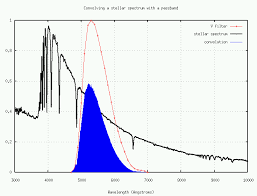
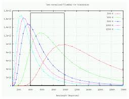

# Зоряні величини (фотометричні системи). Абсолютна зоряна величина

**Фотометричні системи** — це стандартизовані набори світлофільтрів, які дозволяють астрономам вимірювати яскравість зір не "взагалі", а в чітко визначених ділянках електромагнітного спектра. Оскільки зорі різної температури випромінюють різну кількість світла на різних довжинах хвиль, використання фільтрів є ключовим для розуміння їхньої фізичної природи.

## Стандартна фотометрична система UBV

Найвідомішою в астрономії є система UBV (система Джонсона — Моргана), розроблена у 1950-х роках. Вона вимірює видиму зоряну величину через три базові фільтри:

| Фільтр              | Назва діапазону            | Центральна довжина хвилі | Що фізично вимірює?                                                    |
| ------------------- | -------------------------- | ------------------------ | ---------------------------------------------------------------------- |
| **U** (Ultraviolet) | Ультрафіолетовий           | $\approx 365$ нм         | Випромінювання найгарячіших зір (класів O та B).                       |
| **B** (Blue)        | Синій                      | $\approx 440$ нм         | Максимум випромінювання гарячих зір (наприклад, Веги).                 |
| **V** (Visual)      | Візуальний (Жовто-зелений) | $\approx 550$ нм         | Світло, до якого найбільш чутливе людське око. Видима яскравість зорі. |

_Примітка: Сучасні фотометричні системи розширені інфрачервоними та червоними фільтрами (R, I, J, H, K тощо) для дослідження холодних зір і коричневих карликів._

## Показник кольору (B-V)

Якщо виміряти зоряну величину одного й того ж об'єкта через два різні фільтри і знайти їхню різницю, ми отримаємо **показник кольору**. Найчастіше використовують різницю між синім та візуальним фільтрами: $B - V$.

Цей показник є прямим індикатором температури зорі (практичним аналогом закону Віна):

- **Еталон:** За нульову точку ($B-V = 0$) історично взято зорю Вега (температура $\approx 10000$ К). У неї інтенсивність у синьому та візуальному фільтрах однакова.
- **Гарячі зорі ($>10000$ К):** Випромінюють більше енергії у синьому фільтрі. Оскільки у фотометрії яскравішим об'єктам відповідають менші числа, $B$ буде меншим за $V$. Тому їхній показник $B-V < 0$ (від'ємний).
- **Холодні зорі ($<10000$ К):** Випромінюють більше світла у жовто-зеленій зоні (V). Отже, $V$ менше за $B$, і показник $B-V > 0$ (додатний). Наприклад, для Сонця $B-V \approx +0.65$.

## Абсолютна зоряна величина у фотометрії

Коли ми говорили про абсолютну зоряну величину раніше ($M$), ми мали на увазі фізичну яскравість зорі з відстані $10$ парсеків. Однак у професійній астрофізиці завжди уточнюють, **через який саме фільтр** вимірювалася ця величина.

Найчастіше використовують абсолютну візуальну зоряну величину ($M_V$). У такому разі формула модуля відстані записується з індексами конкретного фільтра:

$$m_V - M_V = 5 \lg D - 5$$

Якщо ж астроном має справу з болометричною шкалою (загальною енергією), то $M_{bol}$ можна розрахувати з візуальної величини, використовуючи болометричну поправку ($BC$):

$$M_{bol} = M_V + BC$$

## Підсумок

Зорі не випромінюють світло рівномірно. Фотометричні системи дозволяють астрономам "розрізати" світловий потік на стандартизовані частини (U, B, V). Порівнюючи, наскільки зоря яскрава в синьому фільтрі порівняно з візуальним (показник $B-V$), вчені можуть миттєво і дуже точно визначити її температуру, без необхідності розкладати її світло у складний спектр.

**Фотометричні системи** (UBV, UBVRI тощо):  
Зоряна величина в конкретній системі — це результат згортки спектру зорі з кривою пропускання фільтра (наприклад, V-фільтр). Кожен фільтр вимірює яскравість у своєму діапазоні довжин хвиль.

Чорні тіла різної температури та положення типових фотометричних фільтрів (U, B, V та інші). Гарячі зорі яскравіші в ультрафіолеті (U), холодні — в інфрачервоному.

**Абсолютна зоряна величина** — це видима величина зорі на стандартній відстані **10 пк** у певній фотометричній системі (найчастіше M_V у V-смузі).
