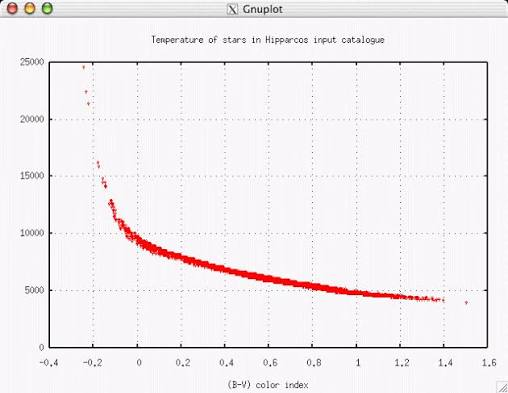
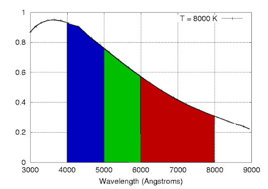

# Показник кольору. Його зв’язок з температурою

**Показник кольору ($B-V$)** — це стандартизована різниця між видимою зоряною величиною об'єкта, виміряною у синьому фільтрі ($B$), та його зоряною величиною у візуальному (жовто-зеленому) фільтрі ($V$). Цей показник є одним із найважливіших інструментів практичної астрофізики, оскільки він дозволяє безпосередньо і дуже точно визначити температуру поверхні зорі без необхідності проведення складного спектрального аналізу.

## Фізичний зміст та зв'язок із температурою

Зв'язок між показником кольору та температурою ґрунтується на законі зміщення Віна. Зорі випромінюють світло подібно до абсолютно чорного тіла: гарячі зорі випромінюють найбільше енергії у короткохвильовій (синій) частині спектра, а холодні — у довгохвильовій (червоній).

Оскільки шкала зоряних величин є оберненою (чим яскравіший об'єкт, тим _менше_ значення його зоряної величини), ми отримуємо таку закономірність:

| Температура зорі                 | Розподіл енергії                                                     | Значення $B-V$                  | Видимий колір | Приклад                           |
| -------------------------------- | -------------------------------------------------------------------- | ------------------------------- | ------------- | --------------------------------- |
| **Дуже гаряча** ($>10000$ К)     | Зоря набагато яскравіша у синьому фільтрі ($B < V$).                 | **Від'ємне** ($< 0$)            | Блакитний     | Спіка ($B-V \approx -0.23$)       |
| **Еталонна** ($\approx 10000$ К) | Інтенсивність у синьому та візуальному фільтрах однакова ($B = V$).  | **Нуль** ($= 0$)                | Білий         | Вега ($B-V \approx 0.00$)         |
| **Середня** ($\approx 6000$ К)   | Зоря трохи яскравіша у візуальному (жовтому) фільтрі ($B > V$).      | **Позитивне** ($> 0$)           | Жовтий        | Сонце ($B-V \approx +0.65$)       |
| **Холодна** ($<4000$ К)          | Зоря набагато яскравіша у візуальному/червоному фільтрі ($B \gg V$). | **Велике позитивне** ($> +1.0$) | Червоний      | Бетельгейзе ($B-V \approx +1.85$) |

## Емпірична формула (Формула Баллестероса)

Математичний зв'язок між температурою ($T$) та показником кольору ($B-V$) є нелінійним. Для зір Головної послідовності астрономи часто використовують наближену емпіричну формулу Баллестероса, яка дозволяє обчислити температуру в Кельвінах:

$$T \approx 4600 \left( \frac{1}{0.92(B-V) + 1.70} + \frac{1}{0.92(B-V) + 0.62} \right)$$

## Підсумок

Показник кольору $B-V$ працює як універсальний "оптичний термометр". Вимірявши яскравість зорі лише через два скельця (синє та жовто-зелене) і просто віднявши одне число від іншого, астроном миттєво отримує числове значення, яке жорстко прив'язане до реальної фізичної температури плазми на поверхні космічного об'єкта.

---

Показник кольору (B-V) — це різниця зоряних величин у синьому (B) та видимому (V) фільтрах.
Графік реальних даних Hipparcos чітко показує залежність: менший (від’ємний) B-V → вища температура.

---

Як вимірюється колір:
Потік зорі пропускають через різні фільтри (B, V, R). Різниця потоків дає показник кольору. Гарячі зорі випромінюють більше в синьому діапазоні → менший B-V.
