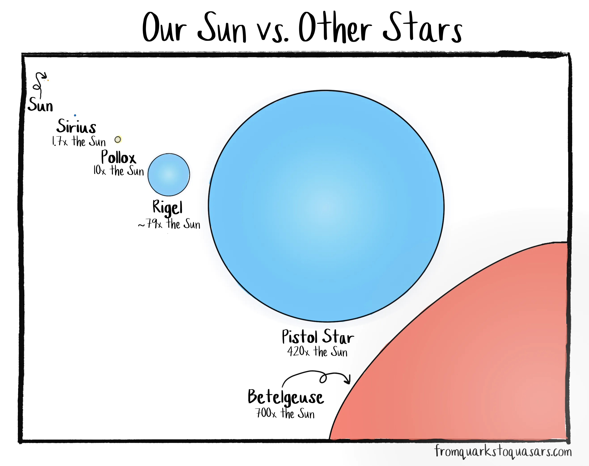
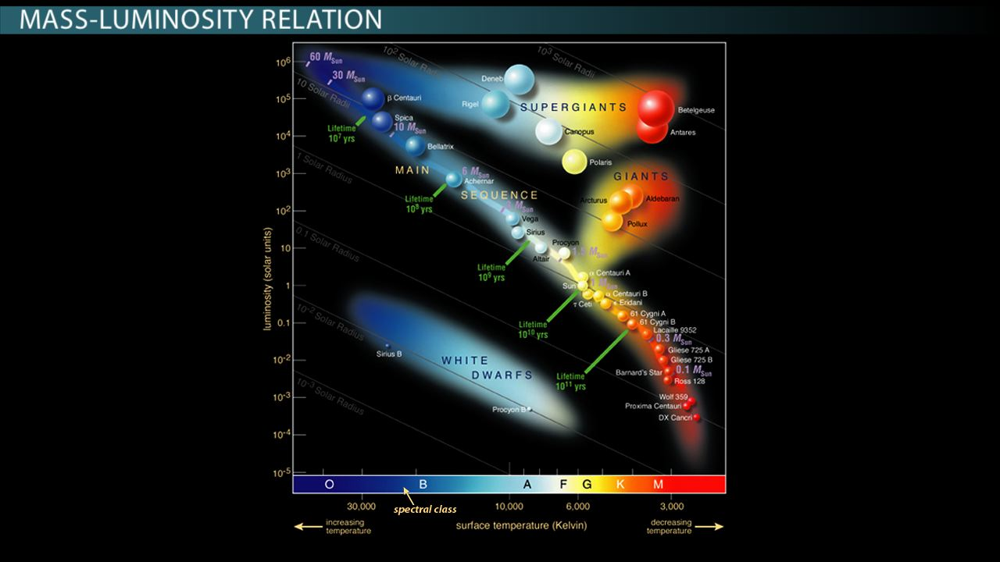
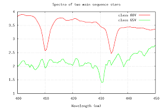

# Зорі. Основні характеристики: маса, форма, розміри, температура, світність, хімічний склад, тривалість життя

**Зоря** — це масивне, розжарене плазмове космічне тіло, що утримується у стані рівноваги власною гравітацією і випромінює світло та тепло завдяки термоядерним реакціям у своєму ядрі.

Нижче наведено структурований конспект основних характеристик зір.

## 1. Маса ($M$)

Це **найважливіший параметр**, який повністю визначає долю, температуру, світність і тривалість життя зорі. Вимірюється у масах Сонця ($M_{\odot}$).

- **Мінімальна маса:** $\approx 0.08 M_{\odot}$ (близько 80 мас Юпітера). Якщо маса менша, гравітаційного тиску не вистачить для запуску термоядерних реакцій (утворюються "коричневі карлики").
- **Максимальна маса:** $\approx 150 - 300 M_{\odot}$. Більш масивні зорі нестабільні і розриваються власним випромінюванням (межа Еддінгтона).

## 2. Тривалість життя

Час життя зорі **обернено пропорційний** її масі. Чим важча зоря, тим інтенсивніше її гравітація стискає ядро, і тим швидше вона спалює своє паливо.

- **Масивні зорі** ($>10 M_{\odot}$): Живуть лічені мільйони років і вибухають як наднові.
- **Сонцеподібні зорі** ($\approx 1 M_{\odot}$): Живуть близько 10 мільярдів років.
- **Червоні карлики** ($<0.5 M_{\odot}$): Економно спалюють водень і можуть жити сотні мільярдів або навіть трильйони років (жоден червоний карлик у Всесвіті ще не помер від старості).

## 3. Температура ($T$)

Температура поверхні визначає спектральний клас зорі та її видимий колір (за законом Віна). Вимірюється у Кельвінах (К).

- **Червоні зорі:** Холодні, $2500 - 3500$ К.
- **Жовті зорі (як Сонце):** Середні, $\approx 5000 - 6000$ К.
- **Блакитні зорі:** Надгарячі, від $10000$ до $50000$ К і вище.
- _Примітка:_ Температура в ядрі зорі становить десятки мільйонів градусів (для горіння водню потрібно мінімум $\approx 10$ млн К).

## 4. Світність ($L$)

Загальна потужність випромінювання зорі (уся енергія, що виділяється за одну секунду). Залежить від двох факторів: радіуса та температури поверхні ($L = 4\pi R^2 \sigma T^4$).

- Вимірюється у Ватах або світностях Сонця ($L_{\odot}$).
- Діапазон величезний: від $0.0001 L_{\odot}$ (тьмяні карлики) до понад $10^6 L_{\odot}$ (засліплюючі надгіганти).

## 5. Розміри (Радіус, $R$)

Розміри зір надзвичайно різноманітні і змінюються в процесі їхньої еволюції. Вимірюються у радіусах Сонця ($R_{\odot}$) або кілометрах.

- **Нейтронні зорі:** Діаметр всього $10-20$ км (розмір міста).
- **Білі карлики:** Розміром із Землю (близько $10000$ км).
- **Карлики головної послідовності:** $0.1 - 10 R_{\odot}$.
- **Надгіганти:** Можуть перевищувати $1000 R_{\odot}$ (якби таку зорю помістити на місце Сонця, вона б поглинула орбіту Юпітера).

## 6. Форма

Зорі мають форму, дуже близьку до **ідеальної кулі**.

- Це зумовлено **гідростатичною рівновагою**: сила гравітації, яка тягне матерію до центру, врівноважується тиском гарячого газу та випромінювання зсередини.
- Деякі зорі, що дуже швидко обертаються навколо своєї осі (наприклад, Ахернар або Вега), набувають форми сплюснутого еліпсоїда через відцентрову силу (екваторіальний радіус стає помітно більшим за полярний).

## 7. Хімічний склад

Первинний хімічний склад зовнішніх шарів майже однаковий для більшості зір у Всесвіті:

- **Гідроген (Водень, H):** $\approx 73-75\%$ за масою.
- **Гелій (He):** $\approx 24-25\%$.
- **Метали (важкі елементи):** $\approx 1-2\%$. _(В астрономії "металами" називають усі хімічні елементи, важчі за гелій: кисень, вуглець, неон, залізо тощо)._
- Вміст металів (металічність) вказує на вік зоряної системи: найстаріші зорі Всесвіту майже не містять важких елементів, тоді як молоді зорі (як Сонце) утворилися з газопилових хмар, уже збагачених металами від вибухів попередніх поколінь зір.

---

Розміри: зорі сильно відрізняються за радіусом — від білих карликів до червоних надгігантів (Бетельгейзе ≈ 700 R☉, Pistol Star ≈ 420 R☉). Форма майже ідеально сферична завдяки гравітації.

---

Маса, світність і тривалість життя:
Масивніші зорі — значно світніші (співвідношення маса–світність) і живуть набагато коротше.
Приклад: 60 M☉ → життя ~10 млн років; 1 M☉ (Сонце) → ~10 млрд років.

---

Хімічний склад і температура:
Визначаються за спектрами (лінії поглинання водню, гелію, металів). Гарячі зорі (A0V) і холодніші (G5V) мають різний вигляд спектрів.
Температура поверхні — від ~2000 K (червоні карлики) до >50 000 K (гарячі зорі O-типу).
Світність залежить від радіуса і температури (закон Стефана–Больцмана).
