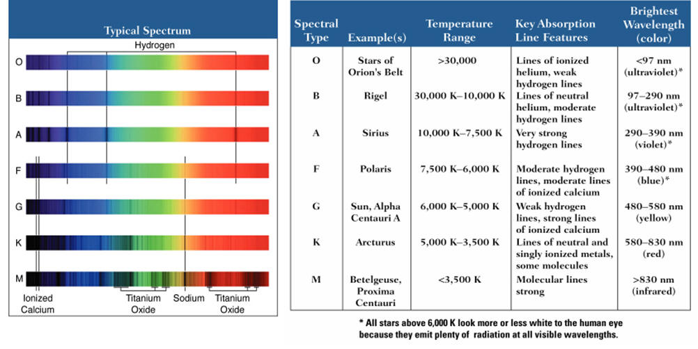

# Спектральна класифікація зір. Основні характеристики

**Спектральна класифікація зір** — це розподіл зір на класи залежно від їхнього спектра, який безпосередньо визначається температурою поверхні зорі. Сучасна астрономія використовує **Гарвардську класифікацію**, розроблену на початку XX століття.

Вона складається з безперервної послідовності спектральних класів, які позначаються великими літерами латинського алфавіту за мірою зниження температури: **O, B, A, F, G, K, M**.

_(Для запам'ятовування послідовності часто використовують мнемонічні фрази, наприклад англійську: "Oh, Be A Fine Girl/Guy, Kiss Me", або жартівливу українську: "Один Багатий Англієць Фініки Жував Коло Музею")._

## Основні спектральні класи (Гарвардська система)

| Спектральний клас | Температура ($T$)   | Видимий колір   | Основні хімічні особливості спектра                                                       | Типові представники                     |
| ----------------- | ------------------- | --------------- | ----------------------------------------------------------------------------------------- | --------------------------------------- |
| **O**             | $30 000 - 60 000$ К | Блакитний       | Лінії іонізованого гелію, багатократно іонізованих металів. Водень дуже слабкий.          | Мінтака, Альнітак                       |
| **B**             | $10 000 - 30 000$ К | Біло-блакитний  | Лінії нейтрального гелію, з'являються лінії водню.                                        | Рігель, Спіка                           |
| **A**             | $7 500 - 10 000$ К  | Білий           | Максимальна інтенсивність ліній водню (серія Бальмера), слабкі лінії іонізованих металів. | Сіріус, Вега                            |
| **F**             | $6 000 - 7 500$ К   | Жовтувато-білий | Лінії водню слабшають, посилюються лінії іонізованих металів (особливо кальцію).          | Проціон, Канопус                        |
| **G**             | $5 000 - 6 000$ К   | Жовтий          | Дуже чіткі лінії металів (залізо, кальцій, титан). Лінії водню стають ледь помітними.     | **Сонце**, Капелла                      |
| **K**             | $3 500 - 5 000$ К   | Помаранчевий    | Домінують лінії нейтральних металів, починають з'являтися смуги молекулярних сполук.      | Арктур, Альдебаран                      |
| **M**             | $2 000 - 3 500$ К   | Червоний        | Яскраво виражені смуги поглинання складних молекул (особливо оксиду титану $TiO$).        | Бетельгейзе, Антарес, Проксима Центавра |

## Деталізація (Підкласи)

Оскільки температури зір змінюються плавно, кожен спектральний клас додатково поділяють на **10 підкласів**, позначаючи їх арабськими цифрами від **0** (найгарячіші у своєму класі) до **9** (найхолодніші).

- Наприклад, зоря класу **A0** гарячіша за зорю класу **A5**, а та, своєю чергою, гарячіша за **A9**.
- Наше Сонце має точний спектральний клас **G2**.

## Додаткові (розширені) спектральні класи

З розвитком астрономії та відкриттям нових типів об'єктів Гарвардську класифікацію було розширено:

- **Клас W (Зорі Вольфа-Райє):** Надгарячі зорі (від $50000$ до $100000$ К), що скидають свою оболонку. У спектрі переважають яскраві широкі лінії випромінювання (замість поглинання).
- **Класи C та S (Вуглецеві та Цирконієві зорі):** Холодні зорі-гіганти (аналоги класу M), у яких замість оксиду титану домінують сполуки вуглецю (C) або оксиду цирконію (S).
- **Класи L, T, Y (Коричневі карлики):** Субзоряні об'єкти, які занадто малі для підтримки стабільного горіння водню. Їхня температура менша за $2000$ К (випромінюють майже виключно в інфрачервоному діапазоні, у спектрах є вода, метан та аміак).

---

Детальна таблиця спектральних класів: температура, приклади зір, ключові лінії поглинання та колір.
O і B — гарячі, з іонізованим гелієм; G — як Сонце; M — холодні з молекулами.
Додатково (класи світності):
До спектрального класу додають римську цифру (I — надгіганти, III — гіганти, V — головна послідовність).
Визначається за шириною ліній (тиск у атмосфері).
