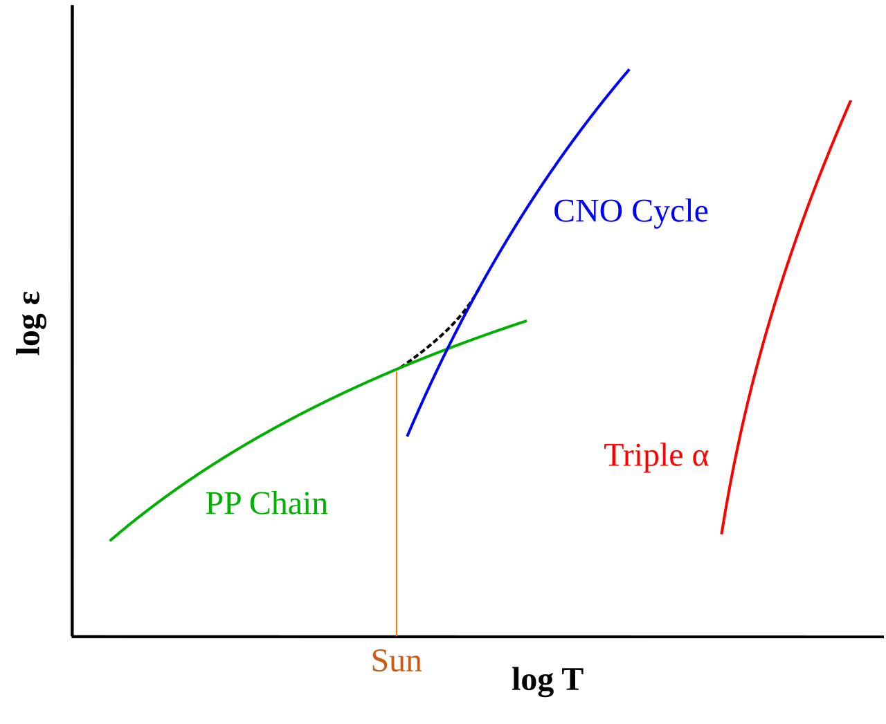
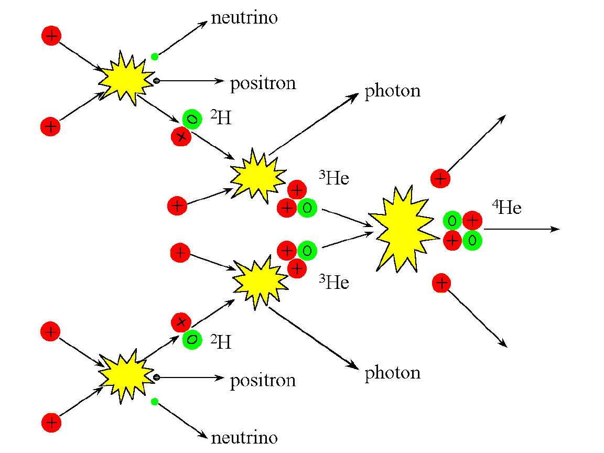
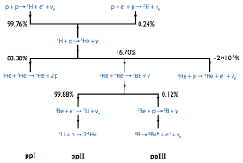

# Джерела енергії зір. Основні типи ланцюжків термоядерних реакцій у зоряних надрах

Зрозумів. Надалі лише чіткий, структурований текстовий конспект без жодних віджетів та візуалізацій.

---

**Джерела енергії зір** — це фізичні процеси, які дозволяють зорям випромінювати величезну кількість світла і тепла протягом мільярдів років. Головним джерелом енергії переважної більшості зір є термоядерний синтез, що відбувається в їхніх надрах за екстремальних температур та тиску.

## 1. Еволюція джерел енергії

Залежно від етапу життя зорі, її енергія генерується різними шляхами:

- **Гравітаційне стискання (Механізм Кельвіна — Гельмгольца):** Працює на етапі народження зорі (протозорі). Хмара газу стискається під дією власної гравітації, потенціальна енергія переходить у кінетичну, і газ нагрівається. Цього вистачає, щоб розігріти ядро до мільйонів градусів, але не вистачило б для підтримки світіння мільярди років.
- **Термоядерні реакції:** Основне джерело енергії. Після досягнення в ядрі температури понад $10$ млн К запускається процес злиття легких ядер у важчі з виділенням величезної кількості енергії (за формулою Ейнштейна $E = mc^2$, де частина маси перетворюється на енергію).

## 2. Протон-протонний цикл (p-p цикл)

Це головний ланцюжок реакцій для **Сонця та менш масивних зір** (з масою до $\approx 1.2 M_{\odot}$).

- **Умови:** Відбувається при температурах від $10$ до $15$ мільйонів Кельвінів.
- **Суть:** Найповільніший, але найстабільніший процес. Чотири протони (ядра водню) послідовно зливаються, утворюючи одне ядро гелію.
- **Загальне рівняння реакції:**

$$4 ^1\text{H} \rightarrow ^4\text{He} + 2e^+ + 2\nu_e + 26.7 \text{ МеВ}$$

_(Де $e^+$ — позитрони, $\nu_e$ — нейтрино, а $26.7$ МеВ — кількість виділеної енергії)._

## 3. Вуглецево-азотний цикл (CNO-цикл)

Це основний ланцюжок реакцій для **масивних зір** (з масою понад $1.5 M_{\odot}$).

- **Умови:** Потребує значно вищих температур — понад $15-20$ мільйонів Кельвінів.
- **Суть:** Результат такий самий, як і в p-p циклі (чотири протони перетворюються на один гелій), але реакція йде набагато швидше і потужніше. Особливістю є те, що ядра вуглецю (C), азоту (N) та кисню (O) виступають у ролі **каталізаторів** — вони беруть участь у реакціях, допомагають протонам зливатися, але наприкінці циклу повертаються до свого початкового стану.

## 4. Потрійний альфа-процес (Горіння гелію)

Цей процес запускається на пізніх етапах життя зорі, коли вона вичерпує водень у ядрі і перетворюється на **червоного гіганта**.

- **Умови:** Потребує екстремальної температури — близько **$100$ мільйонів Кельвінів**.
- **Суть:** Ядра гелію (які фізики називають альфа-частинками) зливаються разом, утворюючи вуглець. Оскільки для зустрічі трьох частинок потрібна надзвичайна щільність, реакція йде дуже інтенсивно.
- **Загальне рівняння реакції:**

$$3 ^4\text{He} \rightarrow ^{12}\text{C} + \gamma + 7.27 \text{ МеВ}$$

_(У ще масивніших зорях після цього запускаються наступні ланцюжки: горіння вуглецю, неону, кисню і кремнію, аж до утворення залізного ядра, після чого термоядерний синтез зупиняється)._

## Підсумок

Зорі — це гігантські ядерні реактори, які існують завдяки балансу між гравітацією (що стискає зорю) та енергією термоядерного синтезу (що розпирає її зсередини). Маломасивні зорі повільно "тліють" на протон-протонному циклі, масивні зорі швидко згорають завдяки CNO-циклу, а потрійний альфа-процес є "другим диханням" для постарілих зір, які вичерпали свої запаси водню.

Основні джерела енергії — термоядерний синтез водню в ядрі.
Залежно від температури ядра домінують різні процеси:

PP-ланцюжок (зелений) — у зорях типу Сонця та менш масивних.
CNO-цикл (синій) — у гарячіших і масивніших зорях.
Потрійний альфа-процес (червоний) — горіння гелію на пізніх стадіях.

Протон-протонний ланцюжок (pp-ланцюжок) — основний у Сонці (~99 % енергії).
4 протони → ядро гелію + 2 позитрони + 2 нейтрино + енергія (γ-кванти).

Галузі pp-ланцюжка (ppI, ppII, ppIII) з відсотками ймовірності.
ppI — найпоширеніша гілка. Кожна гілка дає різну кількість нейтрино та енергії.
CNO-цикл (не показаний на останньому зображенні) — каталітичний цикл з участю вуглецю, азоту та кисню. Домінує при T > ~15–20 млн K.
