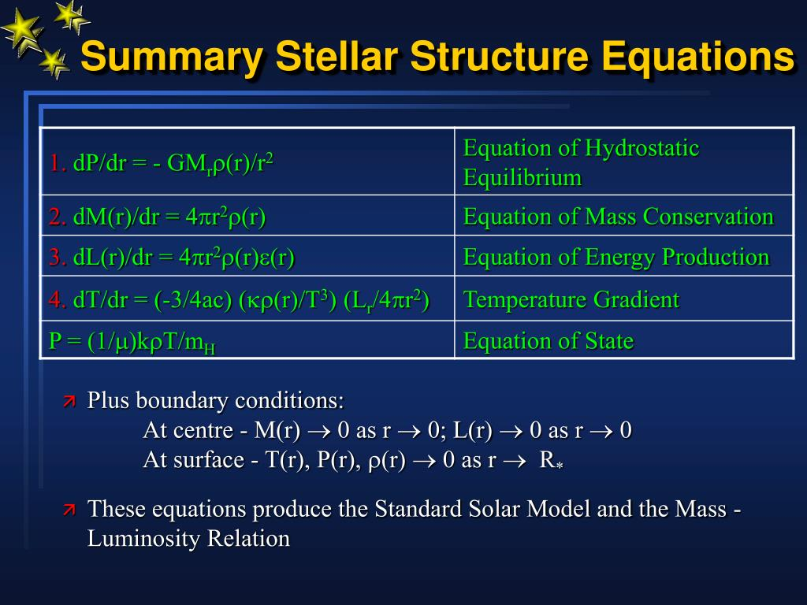

# Рівняння внутрішньої будови зір

Для побудови теоретичної моделі зорі астрофізики використовують систему фундаментальних диференціальних рівнянь. Вони описують зорю як ідеальну газову кулю (сферично-симетричну), яка перебуває у стані механічної та теплової рівноваги.

Усі ці рівняння розглядають зміну фізичних параметрів залежно від відстані до центру зорі ($r$).

## 1. Рівняння гідростатичної рівноваги (Баланс сил)

Це найголовніше механічне рівняння. Воно стверджує, що на будь-якій глибині всередині зорі сила гравітації, яка тягне речовину до центру, точно врівноважується силою тиску гарячого газу та випромінювання, що розпирає зорю зсередини.

$$\frac{dP}{dr} = - \frac{G m \rho}{r^2}$$

_Де:_

- $\frac{dP}{dr}$ — градієнт тиску (зміна тиску зі зміною радіуса).
- $G$ — гравітаційна стала.
- $m$ — маса зорі, що міститься всередині сфери радіусом $r$.
- $\rho$ — густина речовини на відстані $r$.
  _(Знак мінус означає, що тиск зменшується при русі від центру до поверхні)._

## 2. Рівняння розподілу маси (Закон збереження маси)

Описує, як поступово зростає маса зорі $m(r)$, якщо рухатися від центру до її поверхні. Воно пов'язує масу з густиною в кожному шарі.

$$\frac{dm}{dr} = 4 \pi r^2 \rho$$

_Де:_

- $4 \pi r^2$ — площа поверхні сфери радіусом $r$.

## 3. Рівняння теплової рівноваги (Виділення енергії)

Показує, як змінюється потік енергії (світність $L$) при русі назовні. Світність шару зростає лише за рахунок енергії, яка виділяється в цьому ж шарі внаслідок термоядерних реакцій.

$$\frac{dL}{dr} = 4 \pi r^2 \rho \epsilon$$

_Де:_

- $L$ — світність (потужність випромінювання), яка проходить через сферу радіусом $r$.
- $\epsilon$ — питома потужність джерел енергії (кількість енергії, що виділяється $1$ кг речовини за $1$ секунду через термоядерні реакції).

## 4. Рівняння переносу енергії (Температурний градієнт)

Описує, як швидко падає температура від розжареного ядра до холодної поверхні, щоб забезпечити переніс енергії назовні. Вигляд рівняння залежить від механізму переносу.

Якщо енергія переноситься **променистим шляхом** (випромінюванням фотонів):

$$\frac{dT}{dr} = - \frac{3 \kappa \rho L}{64 \pi r^2 \sigma T^3}$$

_Де:_

- $T$ — температура.
- $\kappa$ — непрозорість зоряної речовини (наскільки сильно газ поглинає світло).
- $\sigma$ — стала Стефана-Больцмана.

Якщо газ надто непрозорий (або градієнт температури дуже великий), виникає **конвекція** (перемішування речовини, як кипіння води). У такому разі використовується рівняння для адіабатичного градієнта температури.

## 5. Додаткові рівняння (Замикання системи)

Щоб розв'язати наведені вище чотири диференціальні рівняння, їх потрібно доповнити законами, які пов'язують параметри самої речовини (газу):

- **Рівняння стану:** Пов'язує тиск, густину та температуру (зазвичай це рівняння стану ідеального газу з урахуванням тиску світла: $P = \frac{\rho k T}{\mu m_H} + \frac{1}{3} a T^4$).
- **Закон енерговиділення:** Залежність питомої енергії від температури та густини ($\epsilon = f(\rho, T, \text{хім. склад})$).
- **Закон непрозорості:** Залежність коефіцієнта непрозорості від тих самих параметрів ($\kappa = f(\rho, T, \text{хім. склад})$).

## Підсумок

Ця система рівнянь є основою теоретичної астрофізики. Розв'язуючи її за допомогою потужних комп'ютерів (так зване "чисельне моделювання"), вчені отримують стандартні моделі зір. Завдяки цьому ми точно знаємо, які тиск, температура та густина панують у центрі Сонця, хоча ніколи не зможемо зазирнути туди безпосередньо.

---

Чотири основні рівняння внутрішньої будови зір:

Гідростатична рівновага$$\frac{dP}{dr} = -\frac{G M(r) \rho(r)}{r^2}$$
Збереження маси$$\frac{dM(r)}{dr} = 4\pi r^2 \rho(r)$$
Генерація енергії$$\frac{dL(r)}{dr} = 4\pi r^2 \rho(r) \varepsilon(r)$$
Перенесення енергії (радіаційне)$$\frac{dT}{dr} = -\frac{3 \kappa \rho}{16 \pi a c T^3} \frac{L(r)}{r^2}$$

Рівняння стану (для ідеального газу): $ P = \frac{\rho k T}{\mu m_H} $
