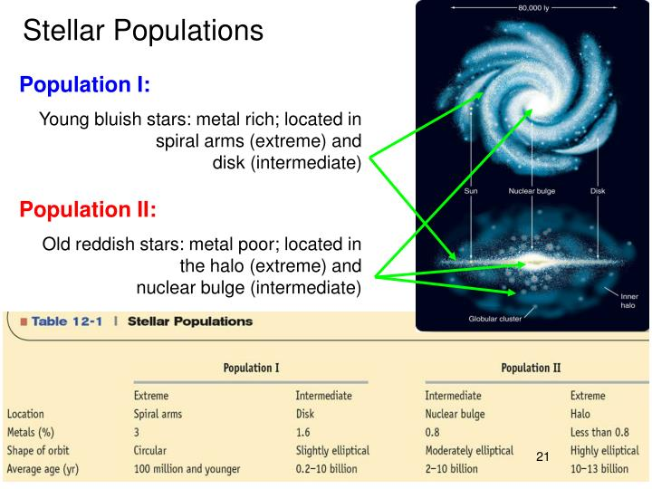

# Типи зоряного населення. Еволюційний аспект

Поняття «зоряного населення» було введено німецьким астрономом Вальтером Бааде у 1944 році. Він виявив, що зорі в нашій Галактиці не є однорідною масою: їх можна чітко розділити на дві великі групи (населення), які кардинально відрізняються за трьома параметрами: **віком, хімічним складом та просторовим розташуванням (кінематикою).**

Сучасна астрофізика виділяє три типи зоряного населення.

### 1. Зоряне населення I типу (Дискова складова)

Це відносно **молоді зорі**, вік яких не перевищує 10 мільярдів років. Наше Сонце є типовим представником цієї групи.

- **Хімічний склад:** Відрізняються високою «металічністю». В астрономії металами називають усі хімічні елементи, важчі за гелій (вуглець, кисень, залізо тощо). У зорях I типу вміст металів становить 1–3% від загальної маси.
- **Локалізація:** Вони зосереджені в площині Галактики — у її диску та спіральних рукавах. Саме тут зосереджена основна маса міжзоряного газу та пилу, тому в цих областях процеси зореутворення активно тривають і сьогодні.
- **Кінематика (рух):** Рухаються навколо центру Галактики майже правильними коловими орбітами з невеликими швидкостями відносно одне одного.

### 2. Зоряне населення II типу (Сферична складова)

Це **найстаріші зорі**, які сформувалися 10–13.5 мільярдів років тому, ще на етапі зародження самої Галактики.

- **Хімічний склад:** Мають вкрай низьку металічність (менше 0.1%). Вони складаються майже виключно з первинного водню та гелію.
- **Локалізація:** Утворюють так зване сферичне гало (зоряну корону) Галактики та її центральне здуття (балджо). Більшість зір населення II сконцентровані в кулястих зоряних скупченнях. Газу і пилу в цих регіонах практично немає, тому нові зорі там не народжуються.
- **Кінематика:** Рухаються по сильно витягнутих еліптичних орбітах. Вони часто перетинають площину галактичного диска під великими кутами і на величезних швидкостях.

### 3. Гіпотетичне населення III типу

Це теоретично передбачене найперше покоління зір, які виникли невдовзі після Великого вибуху.

- Вони мали масу в сотні разів більшу за сонячну і складалися **виключно з водню та гелію** (металічність дорівнювала абсолютному нулю).
- Через гігантську масу тривалість їхнього життя складала лише кілька мільйонів років, тому до наших днів жодна така зоря не дожила. Вони закінчили своє життя грандіозними вибухами наднових.

---

### Еволюційний аспект (Головна суть для екзамену)

Розподіл зір на типи населення — це не просто їхня класифікація за місцем розташування. Це прямий **літопис хімічної та динамічної еволюції нашого Всесвіту.**

**1. Хімічна еволюція (Нуклеосинтез):**
Одразу після Великого вибуху у Всесвіті існували лише водень, гелій та сліди літію. Важкі елементи (вуглець, кремній, залізо) просто не мали звідки взятися.

- Перші масивні зорі (Населення III) запустили у своїх надрах термоядерні реакції, синтезували перші метали і під час вибухів наднових розкидали їх у космос.
- Наступне покоління (Населення II) утворилося з газу, який був лише трохи «забруднений» цими елементами. Протягом мільярдів років вони також синтезували метали і вмирали, віддаючи збагачений матеріал назад у космос.
- Нарешті, зорі Населення I (як наше Сонце) сформувалися з міжзоряного середовища, яке було багаторазово збагачене відходами життєдіяльності попередніх поколінь зір. Отже, **металічність зорі є беззаперечним індикатором її віку.**

**2. Динамічна еволюція Галактики:**
Різниця в кінематиці зір пояснює, як формувалася наша Галактика:

- Спочатку Галактика являла собою гігантську, повільно обертову сферичну хмару газу. Зорі Населення II формувалися саме тоді, тому вони зберегли цей первісний сферичний розподіл (гало) та хаотичні траєкторії.
- З часом, під дією гравітації та відцентрових сил, залишки газу осіли, утворивши плоский обертовий диск. У цьому ущільненому та збагаченому металами диску почали формуватися нові зорі — Населення I, які вже рухаються разом із диском по колових орбітах.

**Висновок:** Без еволюційної зміни зоряних населень у Всесвіті ніколи б не з'явилися тверді планети земної групи, адже для їхнього формування потрібні такі елементи, як кремній, кисень і залізо. Відповідно, біологічне життя можливе лише в епоху домінування зір Населення I.

---

Населення I (Pop I)

Молоді зорі (до ~100 млн років і молодші)
Високий вміст металів (Z ≈ 0.02–0.03)
Розташовані в диску та спіральних рукавах Галактики
Приклади: молоді розсіяні скупчення, асоціації, зорі головної послідовності спектральних класів O–B

Населення II (Pop II)

Старі зорі (вік 2–13 млрд років)
Низький вміст металів (Z ≈ 0.001 і менше)
Розташовані в гало та балджі Галактики
Приклади: зорі горизонтальної гілки, RR Ліри, зорі кульових скупчень

Еволюційний аспект
З часом металевий вміст міжзоряного газу зростає завдяки збагаченню від попередніх поколінь зір (супернові, планетарні туманності).
Тому старі зорі (Pop II) бідніші на метали, ніж молоді (Pop I).
Гіпотетичне Населення III — перші зорі у Всесвіті (дуже масивні, майже без металів).
