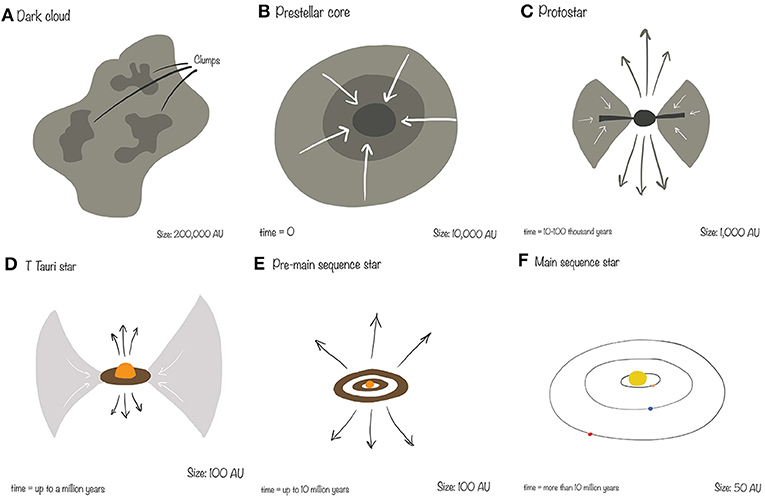

# Еволюція зір. Стадії формування зорі

**Еволюція зір** — це незворотна послідовність змін фізичних параметрів та внутрішньої будови зорі від моменту її зародження з міжзоряного середовища до остаточного перетворення на кінцеву стадію (білий карлик, нейтронну зорю або чорну діру).

Процес формування зорі — це грандіозна боротьба між гравітацією, яка намагається стиснути матерію в точку, та внутрішнім тиском (газовим і світловим), який протидіє цьому стисканню. Формування зорі традиційно поділяють на кілька ключових фізичних стадій.

### 1. Гравітаційна нестабільність (Критерій Джинса)

Зорі народжуються всередині **гігантських молекулярних хмар (ГМХ)** — величезних, холодних (від 10 до 30 К) і розріджених комплексів газу та пилу.

- У нормальному стані хмара є стабільною: слабка гравітація врівноважується внутрішнім тиском холодного газу.
- Щоб почалося формування зорі, хмара повинна втратити рівновагу. Це відбувається, коли маса певної ділянки хмари перевищує критичну межу — **масу Джинса**.
- Тригером для стискання (колапсу) часто виступає зовнішній фактор: ударна хвиля від спалаху близької наднової зорі, зіткнення двох хмар або проходження хмари через спіральний рукав Галактики.

### 2. Ізотермічний колапс (Вільне падіння) та фрагментація

Коли гравітація перемагає, хмара починає стрімко стискатися до центру — відбувається гравітаційний колапс.

- На цьому етапі газ є прозорим для власного випромінювання. Тепло, що виділяється при стисканні, безперешкодно випромінюється у космос (в інфрачервоному діапазоні).
- Через це температура хмари майже не зростає (процес є ізотермічним), а отже, не зростає і внутрішній тиск. Гравітація діє безперешкодно, і речовина падає до центру практично у режимі вільного падіння.
- У процесі стискання велика хмара розпадається на дрібніші ущільнення — **фрагменти**. Кожен такий фрагмент згодом стане окремою зорею (саме тому зорі зазвичай народжуються не поодинці, а скупченнями).

### 3. Утворення протозорі (Адіабатичний колапс)

У міру стискання щільність центральної частини фрагмента колосально зростає.

- Ядро стає настільки щільним, що втрачає прозорість: тепер випромінювання не може вільно вирватися назовні.
- Тепло починає накопичуватися всередині, процес стає адіабатичним. Температура і внутрішній тиск різко зростають, що зупиняє вільне падіння речовини.
- Формується **протозоря** — щільне, розжарене ядро, яке ще не є справжньою зорею, оскільки термоядерні реакції в ньому ще не почалися. Єдиним джерелом енергії протозорі є енергія гравітаційного стискання (механізм Кельвіна — Гельмгольца). Навколо протозорі формується газопиловий акреційний диск, з якого речовина продовжує падати на об'єкт.

### 4. Стадія T Тельця (Дозоряна еволюція)

Коли протозоря (з масою, близькою до сонячної) стає видимою, розсіявши свій газопиловий кокон, вона переходить на стадію типу **T Тельця**.

- Це період надзвичайної нестабільності. Зоря швидко обертається, має потужне магнітне поле та генерує інтенсивний зоряний вітер.
- Цей потужний потік частинок «видмухує» залишки газу і пилу з околиць зорі, зупиняючи подальший набір маси (акрецію). У цей же час у залишках акреційного диска починається формування планет.
- Ядро протозорі продовжує повільно стискатися, а його температура неухильно наближається до критичної позначки.

### 5. Вихід на Головну послідовність (Запалювання ядра)

Фінальна стадія формування настає, коли температура в центрі протозорі досягає приблизно **10 мільйонів Кельвінів**.

- За таких екстремальних умов енергія теплового руху ядер водню (протонів) стає достатньою для подолання кулонівського відштовхування. Запускається протон-протонний цикл — термоядерне горіння водню з утворенням гелію.
- Виділення величезної кількості термоядерної енергії створює потужний внутрішній тиск, який на 100% зупиняє гравітаційне стискання.
- Настає стан повної **гідростатичної рівноваги**. З цього моменту об'єкт офіційно вважається **повноцінною зорею**.

**Висновок для екзамену:** Формування зорі закінчується її виходом на Головну послідовність діаграми Герцшпрунга — Рассела. Тут зоря проведе найдовший і найстабільніший етап свого життя (для Сонця це близько 10 мільярдів років), спокійно перетворюючи водень на гелій. Положення новонародженої зорі на цій послідовності (а отже, і вся її подальша доля) визначається виключно одним параметром — її початковою масою.

---

Основні стадії формування зорі (на прикладі зорі сонячної маси):

A. Темна хмара (Dark cloud) — холодна молекулярна хмара, фрагментація під дією гравітації.
B. Дозоряне ядро (Prestellar core) — гравітаційний колапс, щільність зростає.
C. Протозоря (Protostar) — колапсуюче ядро з акреційним диском і біполярними потоками (джетами).
D. Зоря T Тельця (T Tauri star) — сильна акреція, потужні вітри, віком до ~1 млн років.
E. Передголовна послідовність (Pre-main sequence) — контракція по треку Хаяші, поступове розігрівання.
F. Головна послідовність (Main sequence) — запалення термоядерного горіння водню, стабільна зоря.

Час формування від молекулярної хмари до головної послідовності — від кількох мільйонів до ~50 млн років залежно від маси.
