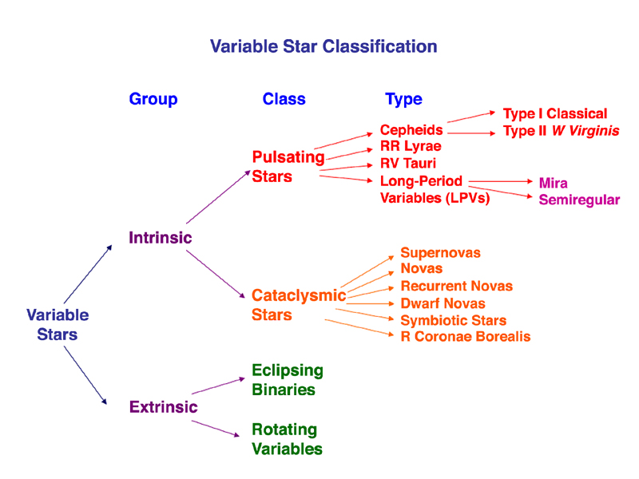

# Змінні зорі. Класифікація

**Змінними зорями** називають космічні об'єкти, видима яскравість (блиск) яких помітно змінюється з часом. Ця зміна може відбуватися суворо періодично, напівправильно або абсолютно хаотично (спалахоподібно). Змінність є наслідком фізичних процесів, що відбуваються в самих зорях, або оптичних ефектів у кратних системах.

Сучасна астрофізика поділяє змінні зорі на дві великі групи: затемнювано-подвійні (де зміна блиску є оптичною ілюзією) та фізично змінні зорі (де змінюється сама світність об'єкта).

### 1. Затемнювано-подвійні зорі

Це системи з двох (або більше) зір, які обертаються навколо спільного центру мас. Їхня змінність **не пов'язана з фізичними змінами** самих світил.

- Зміна видимої яскравості відбувається виключно через те, що площина їхньої орбіти розташована майже на промені зору спостерігача із Землі.
- Під час руху по орбіті одна зоря періодично закриває (затемнює) іншу.
- Графік зміни яскравості (крива блиску) має характерні спади (мінімуми) двох типів: головний мінімум (коли тьмяніша зоря закриває яскравішу) та вторинний мінімум (коли яскравіша зоря частково перекриває тьмянішу).
- _Типовий представник:_ Алголь (Бета Персея).

### 2. Фізично змінні зорі

У цих зір змінюється їхня справжня потужність випромінювання (світність). Фізично змінні зорі поділяються на пульсуючі та еруптивні.

#### 2.1. Пульсуючі зорі

Це зорі, які періодично розширюються і стискаються (як серце, що б'ється). При цьому змінюється їхній радіус та температура поверхні, що призводить до зміни світності. Пульсації виникають на певних етапах еволюції зорі через нестабільність газового тиску в її зовнішніх оболонках (каппа-механізм).

Основні підкласи пульсуючих зір:

- **Цефеїди (класичні):** Масивні зорі-надгіганти з періодом пульсацій від 1 до 135 діб. Вони надзвичайно важливі для астрономії: існує сувора залежність між періодом їхньої пульсації та абсолютною світністю. Вимірявши період цефеїди, можна точно дізнатися її справжню потужність, а отже, і відстань до неї (цефеїди — «маяки Всесвіту»).
- **Зорі типу RR Ліри:** Старі, маломасивні зорі (Населення II), які мають короткі періоди пульсацій (від кількох годин до 1 доби). Часто зустрічаються в кулястих скупченнях.
- **Міриди (довгоперіодичні змінні):** Червоні гіганти, що перебувають на пізніх стадіях еволюції. Мають величезні періоди пульсацій (від 100 до 1000 діб) і дуже великі амплітуди зміни блиску (яскравість може змінюватися в тисячі разів). _Представник:_ Міра Кита.

#### 2.2. Еруптивні (вибухові) змінні зорі

Це зорі, які демонструють раптові, непередбачувані і дуже потужні спалахи, що супроводжуються колосальним викидом енергії та матерії (ерупцією).

Основні підкласи еруптивних зір:

- **Нові зорі:** Це тісні подвійні системи, що складаються з білого карлика та звичайної зорі-компаньйона. Речовина (переважно водень) перетікає із звичайної зорі на поверхню білого карлика. Коли маса накопиченого водню досягає критичної межі, відбувається термоядерний вибух оболонки. Блиск зорі стрімко зростає у десятки тисяч разів, після чого повільно (місяцями) згасає. Сама зоря при цьому не руйнується, і процес може повторюватися.
- **Наднові зорі:** Це фінальний, катастрофічний етап еволюції масивної зорі. Коли в її ядрі закінчується ядерне паливо, відбувається гравітаційний колапс ядра, що супроводжується колосальним вибухом, який розриває зорю. Під час вибуху наднова може світитися яскравіше за всю галактику, в якій вона знаходиться. Залишок наднової перетворюється на нейтронну зорю або чорну діру.
- **Зорі типу T Тельця:** Молоді зорі на стадії формування (до виходу на Головну послідовність). Їхня яскравість хаотично змінюється через активні процеси акреції (випадіння речовини) та потужні зоряні вітри.

---

Основна класифікація змінних зір:
Внутрішні (Intrinsic)

- Пульсуючі зорі — цефеїди, RR Ліри, RV Тельця, довгоперіодичні (Міри), δ Щита тощо.
- Катаклізмічні зорі — нові, повторні нові, карликові нові, симбіотичні зорі, R Північної Корони, супернові.

Зовнішні (Extrinsic)

- Затемнювані подвійні (Eclipsing binaries) — EA, EB, EW.
- Обертальні змінні — зорі з плямами, еліпсоїдальні змінні.

Пульсуючі зорі найчастіше розташовані в смужці нестабільності на діаграмі HR.
Катаклізмічні — пов’язані з вибуховими процесами на пізніх стадіях еволюції.
