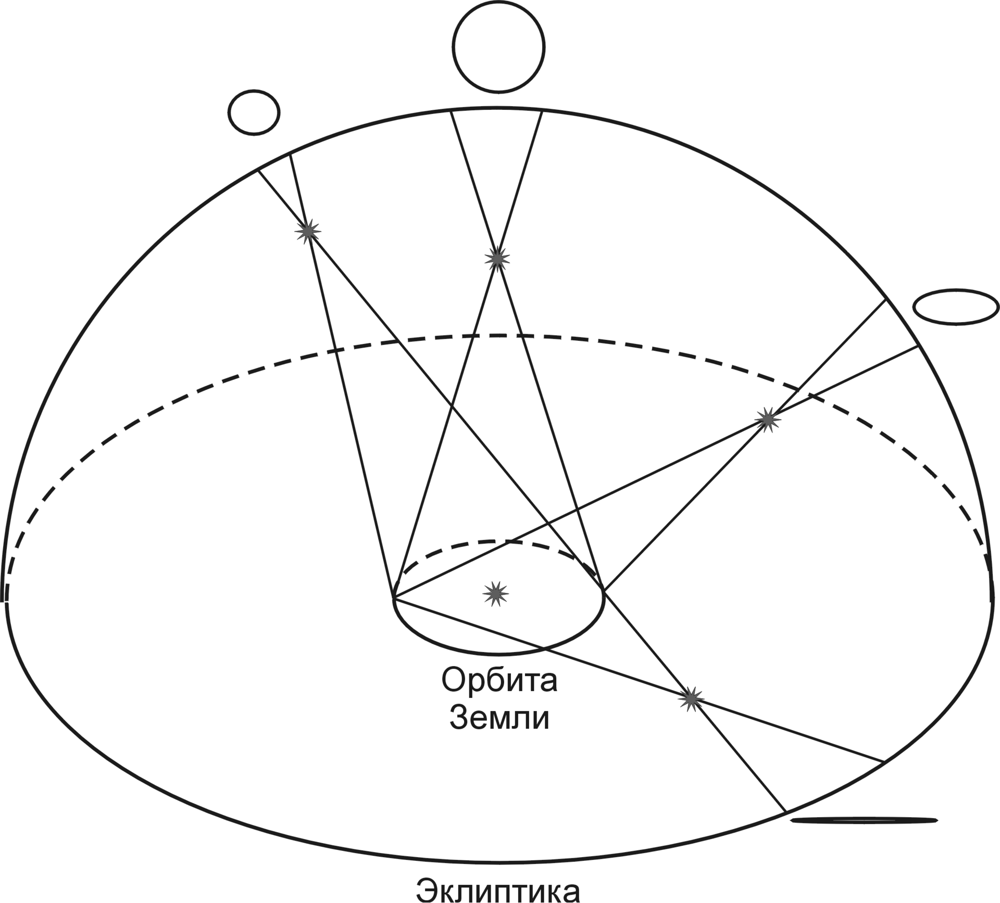

# Визначення відстані в астрономії

**Визначення відстаней в астрономії** неможливо здійснити звичайною лінійкою чи рулеткою, тому астрономи використовують непрямі методи. Залежно від того, наскільки далеко розташований об'єкт (у межах нашої Сонячної системи, сусідніх зірок чи далеких галактик), застосовуються різні математичні та фізичні принципи.

## Основні методи вимірювання відстаней

| Метод                 | Діапазон застосування        | Головний принцип                                                                                                        |
| --------------------- | ---------------------------- | ----------------------------------------------------------------------------------------------------------------------- |
| **Радіолокаційний**   | Сонячна система              | Вимірювання часу польоту радіосигналу до об'єкта і назад.                                                               |
| **Річний паралакс**   | Найближчі зорі (до $100$ пк) | Вимірювання видимого кутового зсуву зорі на тлі далеких зір через рух Землі навколо Сонця.                              |
| **Стандартні свічки** | Галактики (до $30$ Мпк)      | Порівняння відомої (істинної) світності об'єкта (наприклад, пульсуючих зір — цефеїд) з його видимою яскравістю на небі. |
| **Закон Габбла**      | Далекі галактики             | Визначення швидкості віддалення галактики за "червоним зміщенням" у її спектрі.                                         |

## Головні формули розрахунку

**1. Радіолокаційний метод**
Відстань ($D$) обчислюється за часом запізнення відбитого сигналу ($t$):

$$D = \frac{c \cdot t}{2}$$

_Де $c$ — швидкість світла ($\approx 300000$ км/с), $t$ — загальний час, за який радіосигнал долетів туди й назад (тому ділимо на 2)._

**2. Метод річного паралаксу**
Базовий метод для зір. За одиницю виміру тут беруть **парсек (пк)** — це відстань, з якої середній радіус орбіти Землі видно під кутом $1$ секунда дуги ($1''$).

$$D = \frac{1}{p}$$

_Де $D$ — відстань до зорі у парсеках, $p$ — кут річного паралаксу в секундах дуги ($''$)._
_(Для розуміння масштабів: $1 \text{ пк} \approx 3,26 \text{ світлового року}$)._

**3. Закон Габбла**
Використовується для космологічних відстаней. Оскільки Всесвіт розширюється, швидкість віддалення галактик пропорційна відстані до них:

$$D = \frac{v}{H}$$

_Де $v$ — швидкість віддалення галактики (визначається за зсувом ліній у спектрі), $H$ — стала Габбла ($\approx 70$ км/(с·Мпк))._

## Підсумок

В астрономії не існує єдиного універсального інструменту для вимірювання відстаней. Вчені використовують "драбину космічних відстаней", де кожен наступний, більш масштабний метод спирається на калібрування попереднього — від радіолокації планет до вимірювання червоного зміщення найвіддаленіших галактик.

