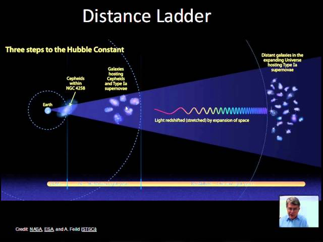

# Пульсуючі змінні зорі. Визначення відстаней до цефеїд

### 1. Фізична природа пульсуючих зір

**Пульсуючі змінні зорі** — це клас фізично змінних космічних об'єктів, світність яких змінюється внаслідок періодичного розширення та стискання їхніх зовнішніх шарів. Разом зі зміною радіуса періодично змінюється і температура поверхні зорі.

**Механізм пульсації (Каппа-механізм):**
Пульсації не зачіпають термоядерне ядро зорі, вони відбуваються лише в її оболонці. Головним «двигуном» пульсацій є так званий $\kappa$-механізм (каппа-механізм), який працює як своєрідний термодинамічний клапан завдяки зміні непрозорості плазми (зокрема, зони одно- та двократно іонізованого гелію):

1. Коли зоря стискається, густина і температура в гелієвій зоні зростають. Гелій іонізується вдруге, що різко збільшує його непрозорість (здатність затримувати випромінювання, що йде від ядра).
2. Оскільки випромінювання затримується, тиск світла та газу в оболонці колосально зростає. Цей надлишковий тиск змушує зорю розширюватися.
3. Під час розширення оболонка охолоджується, іони гелію рекомбінують (захоплюють електрони назад). Плазма знову стає прозорою для випромінювання.
4. Накопичена енергія безперешкодно виходить у космос, внутрішній тиск падає, і гравітація знову стягує оболонку до центру. Цикл повторюється.

### 2. Цефеїди: загальна характеристика

**Класичні цефеїди** (названі на честь зорі $\delta$ Цефея) — це пульсуючі жовті надгіганти високої світності (у сотні й тисячі разів яскравіші за Сонце). Вони перебувають на стадії еволюції, коли водень у ядрі вже вигорів, і зоря перетинає так звану «смугу нестабільності» на діаграмі Герцшпрунга — Рассела.

Характерні риси цефеїд:

- **Період пульсацій ($P$):** від $1$ до $135$ діб.
- **Амплітуда зміни блиску:** від $0.5$ до $2$ зоряних величин.
- **Спектральний клас:** Змінюється протягом циклу (від F у максимумі блиску до G/K у мінімумі). Цефеїда є найгарячішою в момент максимального стискання і найхолоднішою при максимальному розширенні.

### 3. Залежність «період — світність» (Закон Лівітт)

Фундаментальне значення цефеїд для астрофізики полягає у відкритті, зробленому Генрієттою Лівітт у 1912 році. Вона встановила жорстку емпіричну закономірність: **чим довший період пульсації цефеїди, тим вища її абсолютна світність.**

Фізично це пояснюється тим, що більш масивні і великі (а отже, і яскравіші) зорі мають меншу середню густину, тому їхні пульсації відбуваються повільніше, як коливання довгого маятника.

Ця залежність математично виражається лінійним рівнянням, що пов'язує абсолютну зоряну величину ($M$) та логарифм періоду ($P$, у добах). У спрощеному вигляді для класичних цефеїд вона має вигляд:

$$M_V \approx -2.81 \lg P - 1.43$$

_(де $M_V$ — середня абсолютна зоряна величина у візуальному діапазоні)._

### 4. Алгоритм визначення відстаней (Екзаменаційне ядро)

Завдяки закону Лівітт цефеїди отримали статус **«стандартних свічок»** Всесвіту. Знаючи їхню абсолютну світність, астрономи можуть обчислити відстань до них і до галактик, у яких вони знаходяться. Алгоритм виглядає так:

1. **Спостереження:** Астроном знаходить цефеїду за характерною кривою блиску (швидке зростання яскравості і повільне спадання).
2. **Вимірювання періоду ($P$):** Визначається точний час між двома максимумами блиску. Наприклад, $P = 10$ діб.
3. **Обчислення абсолютної величини ($M$):** За допомогою графіка «період — світність» (або формули, наведеної вище) на основі періоду розраховується справжня абсолютна зоряна величина $M$.
4. **Вимірювання видимої величини ($m$):** За допомогою фотометрії вимірюється середня видима яскравість зорі на нашому небі.
5. **Розрахунок відстані ($D$):** Застосовується класична формула модуля відстані:

$$m - M = 5 \lg D - 5$$

Звідки відстань у парсеках обчислюється як:

$$D = 10^{\frac{m - M + 5}{5}}$$

_(Примітка: у реальних сучасних розрахунках у цю формулу також додають поправку на міжзоряне поглинання світла пилом)._

### 5. Наукове значення

Використання цефеїд здійснило революцію в астрономії. Саме за допомогою цефеїд у 1924 році Едвін Габбл довів, що туманність Андромеди знаходиться далеко за межами Чумацького Шляху (тим самим довівши, що існують інші галактики). Згодом, вимірюючи відстані до цефеїд у різних галактиках, Габбл відкрив розширення Всесвіту. Сьогодні цефеїди залишаються першою і найважливішою сходинкою в «шкалі космічних відстаней».

---

Визначення відстаней до цефеїд базується на співвідношенні період–світність (відкриття Генрієтти Лівітт):

Чим довший період пульсацій → тим більша світність (абсолютна зоряна величина).
Вимірявши період, знаходимо $ M $.
За видимою величиною $ m $ обчислюємо відстань за формулою модуля відстані:

$$m - M = 5 \log_{10} d - 5 \quad (d \text{ в парсеках})$$
Цефеїди дозволяють вимірювати відстані до інших галактик (до ~30–40 Мпк) і калібрувати наступні щаблі «сходів відстаней».
