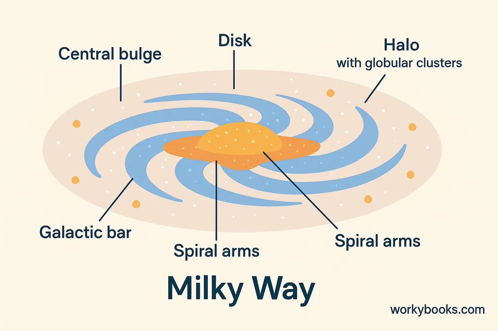

## Морфологія галактик. Основні відомі морфологічні утворення у нашій Галактиці

**Морфологія галактик** — це розділ астрофізики, що вивчає форму, структуру та просторовий розподіл зоряних і газопилових комплексів у галактиках. Загальноприйнятою базовою системою є морфологічна класифікація Едвіна Габбла («камертон Габбла»), яка розділяє галактики на кілька основних типів залежно від їхнього візуального вигляду та структурних особливостей.

### 1. Загальна морфологічна класифікація (Послідовність Габбла)

- **Еліптичні галактики (E):** Мають форму гладких еліпсоїдів різного ступеня стиснутості (від E0 — майже ідеальна куля, до E7 — сильно сплюснута лінза). У них практично відсутній міжзоряний газ і пил, тому процеси зореутворення давно завершилися. Складаються виключно зі старих зір (зоряне населення II типу).
- **Спіральні галактики (S):** Складаються з центрального сферичного потовщення (балджа) та розлогого плоского диска, у якому чітко виділяються спіральні рукави (гілки). Багаті на газ і пил, у рукавах активно формуються молоді гарячі зорі.
- **Спіральні галактики з баром (SB):** Різновид спіральних галактик, у яких спіральні гілки починаються не безпосередньо від балджа, а від кінців прямої перемички (бара), що перетинає центр галактики.
- **Лінзоподібні галактики (S0):** Перехідний тип між еліптичними та спіральними. Мають чітко виражений центральний балдж і диск, але в диску відсутні спіральні рукави та газ для зореутворення.
- **Неправильні галактики (Ir):** Об'єкти асиметричної, рваної форми без чітко вираженого ядра чи обертальної симетрії. Містять аномально велику кількість міжзоряного газу та молодих зір. Форма часто спотворена гравітаційним впливом масивніших сусідів.

---

### 2. Наша Галактика (Чумацький Шлях) та її морфологічні утворення

Наша Галактика належить до типу **SBbc** — це велика спіральна галактика з добре вираженим баром (перемичкою) і помірно закрученими спіральними рукавами. Маса Галактики становить близько $1.5 \cdot 10^{12} M_{\odot}$, а діаметр видимого диска — понад $100 000$ світлових років.

Морфологічна структура Галактики є складною і складається з кількох взаємопов'язаних підсистем (утворень).

#### 2.1. Галактичний диск

Це головний плоский компонент Галактики, де зосереджена переважна більшість зір, газу та пилу. Диск неоднорідний і поділяється на дві складові:

- **Тонкий диск:** Товщина близько $1000$ світлових років. Містить майже весь міжзоряний газ, пил і наймолодші зорі (населення I типу). Саме тут відбуваються процеси зореутворення.
- **Товстий диск:** Товщина до $5000$ світлових років. Складається зі старіших зір, що утворилися на більш ранніх етапах розвитку Галактики.

Найвизначнішою морфологічною структурою диска є **спіральні рукави**. Це області підвищеної густини речовини (хвилі щільності), де інтенсивно стискається газ і народжуються яскраві зорі. У нашій Галактиці виділяють чотири головні рукави:

1. Рукав Персея.
2. Рукав Косинця (Норми) — Лебедя.
3. Рукав Щита — Центавра.
4. Рукав Стрільця — Кіля.
   _Примітка: Сонячна система знаходиться не в головному рукаві, а в невеликому місцевому відгалуженні — **Рукаві Оріона** (Шпорі Оріона)._

#### 2.2. Центральний балдж та бар

**Балдж** (від англ. _bulge_ — здуття) — це центральна, щільна, еліпсоїдальна область Галактики. Його радіус становить близько $10 000$ світлових років. Складається переважно зі старих зір і практично не містить газу.
Морфологічною особливістю балджа нашої Галактики є наявність масивного **бара (перемички)**. Бар обертається як єдине тверде тіло, його довжина становить близько $27 000$ світлових років. Фізична роль бара полягає в перекачуванні міжзоряного газу з диска в центральні області галактики, що живить зореутворення в ядрі. Візуально наш балдж має форму видовженого «арахісу» або літери X.

#### 2.3. Галактичне гало та зоряна корона

**Гало** — це велетенська розріджена сферична оболонка, що охоплює диск і балдж. Радіус гало сягає $150 000 - 300 000$ світлових років.
Особливості гало:

- Складається з найстаріших зір у Галактиці (населення II типу), які мають вкрай низьку металічність.
- Зорі гало рухаються по дуже витягнутих (ексцентричних) орбітах, що перетинають площину диска під різними кутами.
- Найважливішим морфологічним елементом гало є **кулясті зоряні скупчення** — щільні гравітаційно-зв'язані групи зір (сотні тисяч об'єктів у кожній), які існують з часів зародження Галактики.

#### 2.4. Галактичне ядро

Розташоване в самому центрі балджа в напрямку сузір'я Стрільця. Це область із надзвичайно високою концентрацією зір, пилу та розігрітого газу. Через густий пил ядро неможливо спостерігати в оптичному діапазоні, його досліджують за допомогою радіо-, інфрачервоних та рентгенівських телескопів.
У центрі ядра знаходиться компактне і надзвичайно інтенсивне радіоджерело \*_Стрілець A_ (Sgr A\*). Сьогодні доведено, що це надмасивна чорна діра масою близько $4.3$ мільйона мас Сонця. Навколо чорної діри обертається акреційний диск та щільний ядерний зоряний кластер.

#### 2.5. Гало темної матерії

Хоча ця структура не випромінює і не поглинає світло, її гравітаційний вплив є вирішальним для морфології Галактики. Темне гало простягається на сотні тисяч світлових років за межі видимого диска. Саме його колосальна маса (що у 5-10 разів перевищує масу всієї видимої речовини) утримує швидкі зорі на краях диска від розлітання в міжгалактичний простір. Системи кулястих скупчень та карликових галактик-супутників (таких як Магелланові Хмари) занурені саме в це темне гало Чумацького Шляху.

---

Центральний бар — видовжене зоряне утворення в центрі, через яке проходять спіральні рукави.
Ядерний балдж — щільне зоряне скупчення в центрі (з супермасивною чорною дірою Sgr A\*).
Диск (тонкий + товстий) — містить спіральні рукави, газ, пил і молоді зорі (Population I).
Спіральні рукави — Perseus, Sagittarius, Carina, Orion, Cygnus та ін. — зони активного зореутворення.
Гало — сферичне утворення зі старих зір (Population II), кульових скупчень і темної матерії. Простягається далеко за межі диска.
Додаткові структури:

- Випинання (warp) зовнішнього диска
- Зоряні потоки від поглинутих карликових галактик (наприклад, потік Стрільця)
- Бульбашки Фермі — гігантські структури з гарячого газу над і під центром
