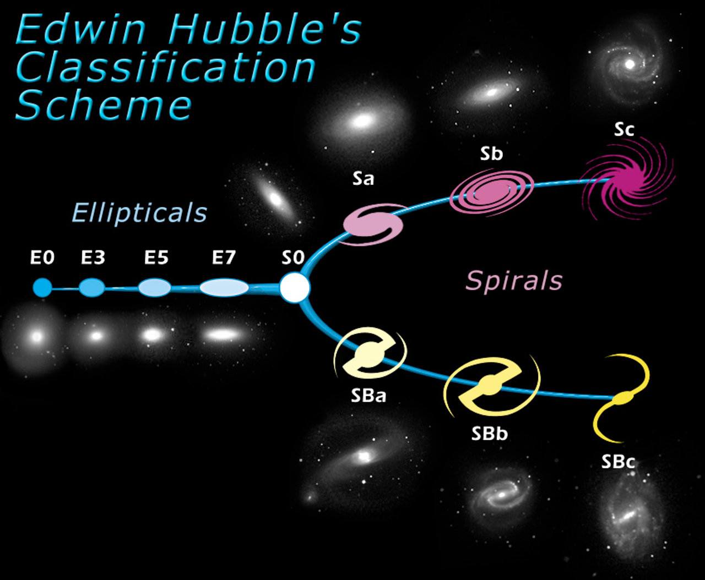

## Морфологічна класифікація галактик за Габблом

**Морфологільна класифікація Габбла** — це фундаментальна система візуальної класифікації галактик, запропонована американським астрономом Едвіном Габблом у 1926 році. Через характерний графічний вигляд схему часто називають **«камертоном Габбла»**.

Незважаючи на те, що класифікація базується суто на зовнішньому вигляді об'єктів (геометрії та структурі), вона виявилася надзвичайно глибокою фізично: морфологічний тип галактики жорстко корелює з її масою, вмістом міжзоряного газу, швидкістю зореутворення та типом зоряного населення.

Габбл розділив усі галактики на чотири основні класи, які розташовуються на «ручці» та двох «зубцях» камертона.

### 1. Еліптичні галактики (Клас E)

Утворюють «ручку» камертона. Вони мають вигляд гладких, розмитих еліпсоїдів без будь-яких ознак внутрішньої структури (диска чи спіральних рукавів).

- **Поділ на підкласи:** Класифікуються за ступенем видимого стиснення від **E0** (майже ідеально кулясті) до **E7** (сильно сплющені, схожі на сигару). Цифра обчислюється за формулою: $n = 10(a-b)/a$, де _a_ та _b_ — велика і мала півосі еліпса.
- **Фізичні особливості:** Практично повністю позбавлені холодного міжзоряного газу та пилу. Через відсутність «будівельного матеріалу» процеси зореутворення в них давно зупинилися.
- **Зоряне населення:** Складаються виключно зі старих зір населення II типу (червоних і жовтих карликів та червоних гігантів). Мають червонуватий відтінок спектра.

### 2. Лінзоподібні галактики (Клас S0)

Це перехідна ланка, що знаходиться в точці розгалуження камертона — між еліптичними та спіральними галактиками.

- **Структура:** Мають яскраво виражене сферичне центральне здуття (балдж) і плоский зоряний диск, але у диску **повністю відсутні спіральні рукави**.
- **Фізичні особливості:** Як і еліптичні галактики, вони вже втратили свій міжзоряний газ і пил, тому зореутворення в них не відбувається. Кінематично вони подібні до спіральних (диск обертається), але за фізичним станом та кольором ближчі до еліптичних.

### 3. Спіральні галактики (Класи S та SB)

Утворюють два «зубці» камертона Габбла. Вони складаються з балджа та диска, у якому зосереджені спіральні рукави. Габбл розділив їх на дві паралельні гілки:

**Нормальні спіральні галактики (Клас S):** Спіральні рукави виходять безпосередньо з центрального балджа.
**Спіральні галактики з баром (Клас SB):** Рукави починаються від кінців яскравої прямої перемички (бара), яка перетинає ядро галактики. Наш Чумацький Шлях належить саме до цього класу.

Кожна з цих гілок додатково поділяється на підкласи **a, b, c** залежно від співвідношення розмірів балджа і диска, а також від ступеня закрученості рукавів:

- **Sa / SBa:** Величезний, яскравий балдж і дуже щільно скручені, гладкі спіральні рукави.
- **Sb / SBb:** Проміжний тип (балдж і диск збалансовані, рукави виражені чіткіше).
- **Sc / SBc:** Дуже малий балдж і широко розкриті, масивні, клапчасті спіральні рукави.
- **Фізичні особливості:** Диски спіральних галактик надзвичайно багаті на газ і пил. У спіральних рукавах активно триває формування молодих, гарячих зір (населення I типу), що надає рукавам яскраво вираженого блакитного кольору. Балдж при цьому залишається червонуватим (населення II).

### 4. Неправильні галактики (Клас Irr)

Ці галактики не вписалися у класичний камертон Габбла через повну відсутність обертальної симетрії чи чіткого ядра.

- **Irregular (Irr):** Мають хаотичну, рвану структуру. Часто їхня форма є наслідком гравітаційного спотворення (припливних сил) від більших сусідніх галактик.
- **Фізичні особливості:** Містять аномально велику кількість газу (до 50% від маси галактики) та є ареною надекстремальних спалахів зореутворення. Складаються переважно з молодих гарячих зір. Типові представники — Магелланові Хмари.

---

### Історико-еволюційний нюанс (Важливо для екзамену)

Створюючи свою класифікацію, Едвін Габбл помилково вважав її еволюційною послідовністю. Він припускав, що всі галактики народжуються кулястими (E0), потім сплющуються (до E7), перетворюються на лінзоподібні (S0), після чого в них «розкручуються» спіральні рукави (Sa $\rightarrow$ Sc).

Сьогодні доведено, що ця гіпотеза є хибною: **еліптичні галактики не перетворюються на спіральні.** Навпаки, гігантські еліптичні галактики часто утворюються внаслідок злиття кількох спіральних.

Проте історична помилка Габбла назавжди закріпилася в астрономічній термінології:

- Еліптичні та лінзоподібні галактики (E, S0) досі називають **галактиками ранніх типів**.
- Спіральні та неправильні (S, Irr) називають **галактиками пізніх типів**.

**Класифікація Габбла** (діаграма «камертон»):

### **Еліптичні галактики (E0–E7)**

- Від майже сферичних (E0) до сильно сплюснутих (E7).
- Мало газу й пилу, переважно старі зорі (Population II).
- Низька швидкість зореутворення.

### **Лінзоподібні галактики (S0)**

- Перехідний тип між еліптичними та спіральними.
- Мають диск, але без виражених спіральних рукавів.

### **Спіральні галактики**

- **Нормальні спіральні (Sa–Sc)**:  
  Sa — щільно закручені рукави, великий балдж;  
  Sc — розпушені рукави, маленький балдж.
- **Перехрещені спіральні (SBa–SBc)**: з центральним баром, через який проходять рукави.

Габбл вважав, що еволюція йде зліва направо (від еліптичних до спіральних), однак сучасні дані показують складнішу картину (злиття, акреція газу тощо).
