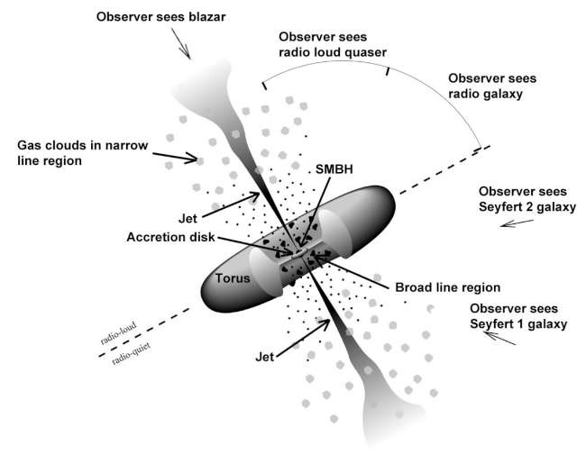

## Активні ядра галактик. Уніфікована схема

**Активне ядро галактики (АЯГ)** — це надзвичайно компактна центральна область галактики, яка випромінює колосальну кількість енергії (часто більше, ніж усі зорі цієї галактики разом узяті), причому це випромінювання має незоряну природу. Галактики, що містять такі ядра, називаються активними галактиками.

Єдиним фізичним механізмом, здатним забезпечити таку феноменальну світність у такому малому об'ємі простору, є **акреція (падіння) речовини на надмасивну чорну діру (НМЧД)** з масою від $10^6$ до $10^{10} M_{\odot}$. Гравітаційна енергія падаючої матерії перетворюється на тепло та потужне електромагнітне випромінювання.

### 1. Фізична структура активного ядра (Базова модель)

Згідно з сучасними астрофізичними уявленнями, структура будь-якого АЯГ складається з наступних обов'язкових компонентів (від центру до периферії):

1. **Надмасивна чорна діра (НМЧД):** Центральний гравітаційний «двигун» системи.
2. **Акреційний диск:** Диск із надзвичайно розігрітої плазми, що по спіралі падає на чорну діру. Плазма розігрівається через внутрішнє тертя до мільйонів градусів і є головним джерелом потужного ультрафіолетового та рентгенівського випромінювання ядра.
3. **Область широких ліній (BLR - Broad Line Region):** Щільні хмари газу, розташовані дуже близько до акреційного диска. Вони обертаються навколо чорної діри з колосальними швидкостями (до $10 000$ км/с). Через ефект Доплера їхні емісійні спектральні лінії сильно розширюються.
4. **Пиловий тор:** Гігантський, оптично непрозорий «бублик» (тор) із газу та космічного пилу, який оточує акреційний диск та BLR на більшій відстані. Пил поглинає частину жорсткого випромінювання ядра і перевипромінює його в інфрачервоному діапазоні.
5. **Область вузьких ліній (NLR - Narrow Line Region):** Розріджені газові хмари, що знаходяться далеко за межами пилового тора. Оскільки гравітаційний вплив чорної діри тут слабший, вони рухаються відносно повільно (сотні км/с), формуючи у спектрі вузькі емісійні лінії.
6. **Релятивістські джети (струмені):** У деяких АЯГ потужні магнітні поля викидають частину плазми з полюсів чорної діри у вигляді двох вузьких струменів, що рухаються зі швидкостями, близькими до швидкості світла. Вони є потужними джерелами радіовипромінювання.

---

### 2. Уніфікована схема (модель) АЯГ

Історично астрономи класифікували активні галактики на кілька кардинально різних типів (квазари, сейфертівські галактики, радіогалактики, блазари) залежно від їхнього вигляду та спектра.

**Уніфікована схема АЯГ** (запропонована у 1990-х роках) зробила революцію, стверджуючи: **усі типи активних ядер є фізично однаковими об'єктами.** Величезна різниця в їхніх спостережних характеристиках (світності, ширині спектральних ліній, наявності радіовипромінювання) пояснюється виключно **кутом зору**, під яким земний спостерігач дивиться на систему відносно пилового тора.

#### Як кут зору визначає тип АЯГ:

- **Погляд «з ребра» (Екваторіальний ракурс):**
  Спостерігач дивиться на АЯГ прямо крізь товщу непрозорого пилового тора. Тор повністю закриває від нас акреційний диск та область широких ліній (BLR). Ми бачимо лише віддалені газові хмари (NLR) та потужне інфрачервоне випромінювання самого тора.
- _Спостережний об'єкт:_ **Сейфертівська галактика 2-го типу** або **Радіогалактика (з вузькими лініями)**. У спектрі присутні лише вузькі лінії випромінювання.

- **Погляд «під кутом» (Проміжний ракурс):**
  Спостерігач заглядає всередину пилового тора, як у воронку. Пил більше не затуляє центральну частину. Ми бачимо сліпучий акреційний диск і хмари, що швидко обертаються поблизу нього.
- _Спостережний об'єкт:_ **Квазар** (якщо ядро надзвичайно потужне) або **Сейфертівська галактика 1-го типу** (якщо потужність менша). У спектрі яскраво виражені і широкі (від BLR), і вузькі (від NLR) емісійні лінії.

- **Погляд «з полюса» (Прямо вздовж джета):**
  Земля знаходиться точно на лінії релятивістського струменя (джета), що б'є з полюса чорної діри. Випромінювання плазми у джеті, завдяки релятивістським ефектам, колосально підсилюється і повністю «засвічує» всі інші компоненти ядра.
- _Спостережний об'єкт:_ **Блазар** (або лацертида). Спектр безперервний, нетепловий, лінії випромінювання або відсутні, або надзвичайно слабкі. Характеризується екстремально швидкою та непередбачуваною змінністю блиску у всіх діапазонах хвиль.

**Висновок для екзамену:** Уніфікована модель довела, що квазар, блазар і сейфертівська галактика — це не різні етапи еволюції чи принципово різні механізми. Це один і той самий «космічний двигун» (акреція на НМЧД, оточену тором і хмарами газу), на який людство просто дивиться з різних ракурсів.

**Уніфікована модель AGN** (Antonucci, 1993 та пізніші роботи):

Всі активні ядра галактик мають **однаковий центральний двигун**:

- Супермасивна чорна діра (SMBH)
- Акреційний диск
- Пиловий тор (obscuring torus)
- Область широких ліній (Broad Line Region — BLR)
- Область вузьких ліній (Narrow Line Region — NLR)
- Релятивістські джети (у радіогучних AGN)

**Різниця між типами AGN** пояснюється головним чином **кутом зору**:

- **Type 1** (Seyfert 1, квазари) — дивимося майже вздовж осі → бачимо BLR (широкі лінії).
- **Type 2** (Seyfert 2) — дивимося майже в площині тора → тор закриває BLR, бачимо тільки NLR.
- **Блазари** (BL Lac, FSRQ) — джет направлений майже прямо на спостерігача (сильне випромінювання, змінність, beaming).

**Уніфікована схема** стверджує, що це не різні об’єкти, а один і той самий фізичний об’єкт, який ми бачимо під різними кутами.
