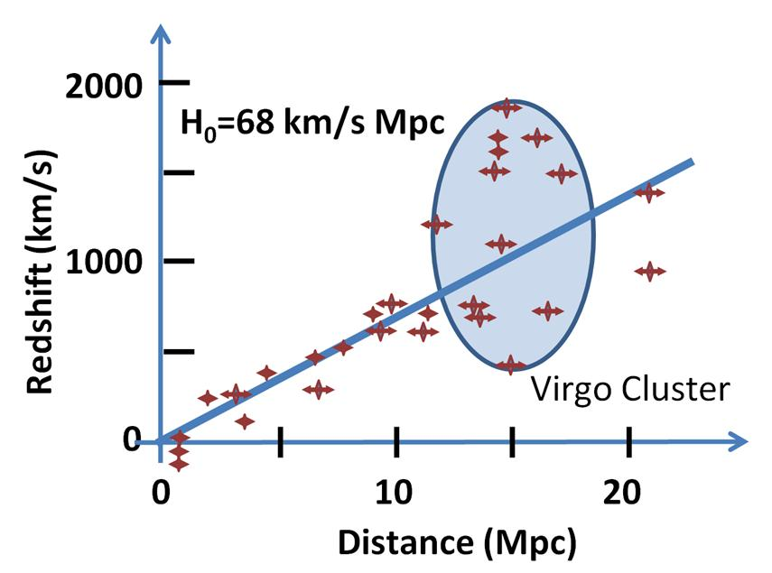

## Закон Габбла. Розширення Всесвіту

**Закон Габбла** — це фундаментальний космологічний закон, який описує загальне розширення Всесвіту. У 1929 році американський астроном Едвін Габбл, аналізуючи спектри далеких галактик, виявив, що всі вони віддаляються від нашої Галактики, причому швидкість їхнього віддалення прямо пропорційна відстані до них.

Цей закон є головним спостережним доказом того, що Всесвіт не є статичним, а безперервно розширюється, що стало фундаментом для створення **Теорії Великого вибуху**.

### 1. Математичний вираз закону Габбла

В емпіричному вигляді закон Габбла записується як просте лінійне рівняння:

$$v = H_0 \cdot D$$

_Де:_

- $v$ — швидкість віддалення галактики від спостерігача (променева швидкість), вимірюється в км/с.
- $D$ — відстань до галактики, вимірюється в мегапарсеках (Мпк).
- $H_0$ — **стала Габбла** (коефіцієнт пропорційності). Вона показує, на скільки кілометрів за секунду зростає швидкість віддалення на кожен додатковий мегапарсек відстані. За сучасними оцінками, $H_0 \approx 68 - 73 \text{ (км/с)/Мпк}$.

### 2. Фізична природа розширення (Важливо для екзамену)

Головна концептуальна складність закону Габбла полягає в розумінні того, _що саме_ рухається.

- Галактики **не розлітаються** крізь порожній статичний простір, як осколки від вибуху гранати. Якби це було так, то наша Галактика мала б знаходитися в центрі цього вибуху, що суперечить космологічному принципу (Всесвіт однорідний і не має центру).
- Натомість **розширюється сам метричний простір** між галактиками. Усі точки простору віддаляються одна від одної. Класична двовимірна аналогія — це поверхня гумової кульки, яку надувають: жодна намальована на ній крапка не є центром, але відстань між будь-якими двома крапками неухильно зростає, і чим далі вони одна від одної, тим швидше збільшується ця відстань.

### 3. Космологічне червоне зміщення

Безпосередньо швидкість віддалення галактик ($v$) вимірюється за допомогою спектрального аналізу. Світло від галактик, що віддаляються, зміщується у червону (довгохвильову) частину спектра.

Часто це явище спрощено пояснюють класичним ефектом Доплера. Але сувора фізика (Загальна теорія відносності) пояснює його інакше: це **космологічне червоне зміщення**. Поки фотон світла мільярди років летить від далекої галактики до Землі, сам простір, у якому він летить, розтягується. Разом із простором розтягується і довжина хвилі фотона ($\lambda$), стаючи довшою (тобто «червонішою»).

Величина червоного зміщення позначається літерою $z$:

$$z = \frac{\lambda_{спост} - \lambda_0}{\lambda_0} = \frac{\Delta \lambda}{\lambda_0}$$

_Де $\lambda_0$ — лабораторна довжина хвилі, $\lambda_{спост}$ — виміряна довжина хвилі.\_

Для відносно близьких галактик (швидкість яких значно менша за швидкість світла, $v \ll c$), швидкість віддалення безпосередньо пов'язана із червоним зміщенням формулою:

$$v \approx c \cdot z$$

_(де $c$ — швидкість світла у вакуумі)._

### 4. Наслідки закону Габбла (Еволюційний аспект)

- **Підтвердження Великого вибуху:** Якщо сьогодні всі галактики розлітаються одна від одної, то за законами логіки в минулому вони знаходилися ближче. Якщо «відмотати» час назад, ми дійдемо до моменту, коли вся матерія Всесвіту була зосереджена в стані нескінченної густини та температури (сингулярності).
- **Вік Всесвіту (Час Габбла):** Зворотна величина до сталої Габбла ($t = \frac{1}{H_0}$) має розмірність часу і називається часом Габбла. Вона дає грубу, але надійну оцінку віку Всесвіту за умови, що він розширювався з постійною швидкістю. Розрахунки дають вік близько **13.8 мільярдів років**.
- **Прискорене розширення:** У 1998 році, спостерігаючи за далекими надновими зорями, астрофізики виявили, що стала Габбла не є сталою в часі — розширення Всесвіту прискорюється. Це відкриття призвело до введення поняття **«темної енергії»**, яка становить близько 68% маси-енергії Всесвіту і діє як антигравітація, розштовхуючи простір.

**Закон Габбла** (1929):

\[ v = H_0 \cdot d \]

або через червоне зміщення (для невеликих \( z \)):

\[ cz \approx H_0 \cdot d \]

де:

- \( v \) — швидкість віддалення галактики,
- \( d \) — відстань до неї,
- \( H_0 \) — стала Габбла (сучасні значення ≈ 67–74 км/с/Мпк),
- \( c \) — швидкість світла,
- \( z \) — червоне зміщення.

**Висновок**: Всесвіт розширюється. Чим далі галактика — тим швидше вона віддаляється від нас.

---

**Фізичний зміст**:
Простір сам розширюється. Галактики «пливуть» разом із простором, а не розлітаються в уже існуючому просторі.  
Світло, подорожуючи через розширюваний простір, розтягується → червоне зміщення.

Закон Габбла — одне з головних доказів моделі Великого Вибуху.
