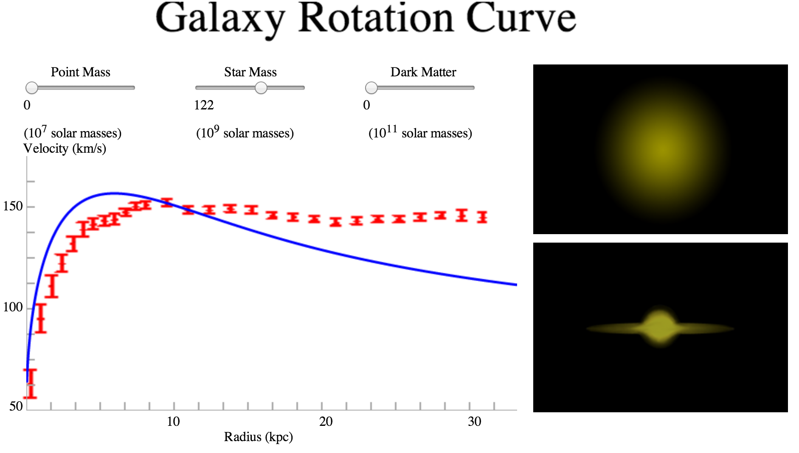
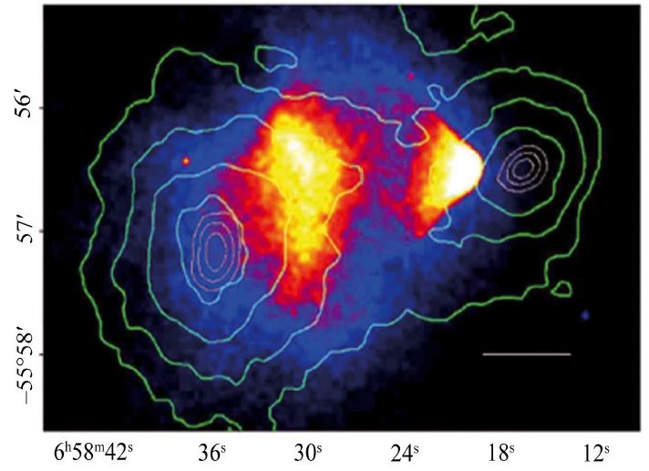

## Основи космології. Темна матерія. Темна енергія

**Космологія** — це фундаментальний розділ астрофізики, який вивчає будову, походження, еволюцію та подальшу долю Всесвіту як єдиного цілого. Сучасна космологія базується на Загальній теорії відносності Альберта Айнштейна та спостережних даних, які лягли в основу стандартної космологічної моделі **$\Lambda$CDM** (Лямбда-CDM).

Згідно з цією моделлю, звичайна речовина (з якої складаються зорі, планети і ми) становить лише мізерну частку Всесвіту. Його еволюцією і динамікою керують дві загадкові сутності: темна матерія та темна енергія.

### 1. Темна матерія (Dark Matter)

**Темна матерія** — це невидима форма матерії, яка не випромінює, не поглинає і не відбиває електромагнітне випромінювання (світло), а тому не може бути зафіксована жодними оптичними чи радіотелескопами. Вона проявляє себе виключно через **гравітаційний вплив** на звичайну матерію та викривлення простору-часу.

**Спостережні докази існування:**

1. **Криві обертання галактик:** У 1970-х роках астроном Віра Рубін виявила, що зорі на краях спіральних галактик обертаються з аномально високими швидкостями. Згідно із законами Кеплера, швидкість мала б падати з віддаленням від центру, але вона залишалася постійною. Це беззаперечно доводить, що галактики занурені у велетенське невидиме гало масивної речовини.
2. **Гравітаційне лінзування:** Скупчення галактик викривляють світло від об'єктів, що знаходяться далеко за ними, діючи як гігантські лінзи. Розрахунки кута викривлення показують, що маса цих скупчень у десятки разів перевищує масу всіх видимих у них зір і газу.
3. **Утворення великомасштабної структури:** Без додаткової маси темної матерії звичайний газ після Великого вибуху просто не встиг би зібратися в галактики через розширення Всесвіту. Темна матерія відіграла роль гравітаційного "скелета", на який згодом осіла звичайна (баріонна) речовина.

**Природа темної матерії:** За сучасними уявленнями (модель CDM — Cold Dark Matter), вона складається з масивних, повільно рухомих частинок невідомої природи, які не беруть участі у сильній та електромагнітній взаємодіях (найімовірніші кандидати — гіпотетичні частинки вімпи (WIMPs) або аксіони).

### 2. Темна енергія (Dark Energy)

**Темна енергія** — це гіпотетична форма енергії, яка рівномірно заповнює весь простір Всесвіту і проявляє себе як **антигравітація**. Її головна фізична властивість — наявність колосального від'ємного тиску, який змушує Всесвіт розширюватися з прискоренням.

**Відкриття:**
У 1998 році дві незалежні групи астрофізиків досліджували спалахи далеких наднових зір типу **Ia** (які є стандартними свічками для вимірювання великих відстаней). Вони виявили шокуючий факт: віддалені галактики розлітаються не з постійною швидкістю і не з уповільненням (як очікувалося через взаємне гравітаційне тяжіння маси Всесвіту), а з **постійним прискоренням**. За це відкриття у 2011 році було присуджено Нобелівську премію з фізики.

**Природа темної енергії:**

1. **Космологічна стала ($\Lambda$):** Найбільш визнана теорія стверджує, що темна енергія — це властивість самого вакууму простору. Ще Альберт Айнштейн ввів у свої рівняння $\Lambda$-член (космологічну сталу), щоб збалансувати гравітацію. Сьогодні вважається, що ця стала є енергією фізичного вакууму, яка не змінюється під час розширення простору. Оскільки простору стає більше, загальна кількість цієї енергії-відштовхування зростає, прискорюючи розширення.
2. **Квінтесенція:** Альтернативна гіпотеза, що описує темну енергію як динамічне скалярне поле, яке змінюється у просторі та часі (на відміну від абсолютно статичної енергії вакууму).

### 3. Баланс маси-енергії Всесвіту

Згідно із формулою еквівалентності маси та енергії Айнштейна ($E = mc^2$), астрофізики розрахували загальний "бюджет" сучасного Всесвіту. Він має такий вигляд:

- **Звичайна (баріонна) матерія:** $\approx 4.9\%$. Це все те, що ми бачимо (зорі, планети, газ, пил, міжгалактична плазма і ми самі).
- **Темна матерія:** $\approx 26.8\%$. Створює гравітаційні колодязі, утримуючи галактики від розпаду.
- **Темна енергія:** $\approx 68.3\%$. Домінує у Всесвіті на великих масштабах і розриває його на частини.

**Еволюційний висновок для екзамену:** Динаміка Всесвіту — це арена боротьби між темною матерією (яка намагається зупинити розширення і стягнути все назад) та темною енергією (яка намагається розширити простір). Оскільки густина темної матерії падає в міру розширення простору, а густина темної енергії (енергії вакууму) залишається постійною, близько 5 мільярдів років тому **темна енергія остаточно перемогла**. Якщо її властивості не зміняться, Всесвіт приречений на нескінченне, прискорене розширення, яке завершиться "Тепловою смертю" або "Великим розривом".

---

**Сучасний склад Всесвіту** (за даними Planck та інших місій):

- **Звичайна (баріонна) матерія** — **5%**
- **Темна матерія** — **27%**
- **Темна енергія** — **68%**

### Темна матерія

Не випромінює й не поглинає світло. Про її існування свідчать:

**Криві обертання галактик** — на великих відстанях швидкість обертання не падає (як очікувалося б за видимою масою), а залишається сталою → потрібна невидима маса в гало.

**Кулясте скупчення (Bullet Cluster)** — одне з найсильніших доказів:  
гравітаційне лінзування (зелений контур) показує масу, а рентгенівське випромінювання гарячого газу (рожевий/червоний) — баріонну матерію. Вони розділені → темна матерія існує окремо від звичайної матерії.

### Темна енергія

Відповідає за **прискорене розширення Всесвіту** (відкрито 1998 р. за допомогою наднових типу Ia).  
Найпростіша модель — **космологічна стала Λ** у моделі **ΛCDM**.
