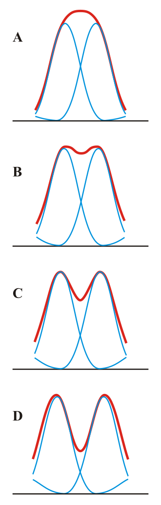
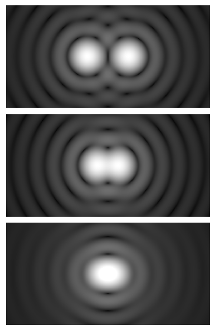

# Телескопи. Дифракційна роздільна здатність

**Телескоп** — це оптичний прилад, головним завданням якого є збирання світла від слабких космічних об'єктів та збільшення кута, під яким ми їх бачимо. Проте навіть ідеальний телескоп не створює абсолютно чіткого зображення зорі (у вигляді геометричної крапки) через хвильову природу світла: явище дифракції розмиває зображення. Здатність телескопа розрізняти дві близькі зорі як окремі об'єкти обмежується саме цим явищем і називається дифракційною роздільною здатністю.

## Типи оптичних телескопів

Залежно від конструкції головного світлозбирального елемента (об'єктива), телескопи поділяють на два основні типи (також існують комбіновані дзеркально-лінзові системи):

| Характеристика | Рефрактори (лінзові)                                                                                                          | Рефлектори (дзеркальні)                                                                                                                         |
| -------------- | ----------------------------------------------------------------------------------------------------------------------------- | ----------------------------------------------------------------------------------------------------------------------------------------------- |
| **Об'єктив**   | Система лінз                                                                                                                  | Увігнуте дзеркало                                                                                                                               |
| **Переваги**   | Високий контраст зображення, закрита труба (відсутність внутрішніх потоків повітря та пилу)                                   | Відсутність хроматичної аберації (кольорових ореолів), здатність підтримувати великі розміри, нижча вартість виробництва гігантських об'єктивів |
| **Недоліки**   | Наявність хроматичної аберації, масивні лінзи деформуються під власною вагою, складно виготовити лінзу діаметром понад 1 метр | Відкрита труба схильна до забруднення та турбулентності, необхідність періодичного налаштування (юстирування) дзеркал                           |

## Дифракційна межа та критерій Релея

Через дифракцію світла на круглому отворі об'єктива зображення зорі виглядає як яскрава центральна пляма (диск Ері), оточена тьмянішими кільцями. Якщо дві зорі розташовані дуже близько на небі, їхні дифракційні диски накладаються один на одного.

**Критерій Релея** встановлює математичну межу: два точкових джерела світла можна побачити роздільно, якщо центр дифракційного диска однієї зорі збігається з першим темним кільцем дифракційного диска іншої. Якщо вони ближче — вони зливаються у єдину овальну пляму.

Головна формула теоретичної дифракційної роздільної здатності (кутовий радіус диска Ері):

$$\theta = 1.22 \frac{\lambda}{D}$$

_Де:_

- $\theta$ — мінімальний кутова відстань між двома об'єктами в радіанах, за якої їх ще можна розрізнити.
- $\lambda$ — довжина хвилі світла, що спостерігається (у метрах).
- $D$ — діаметр об'єктива телескопа (у метрах).

Для візуальних оптичних спостережень (видиме світло, де середня $\lambda \approx 550$ нм), цю формулу переводять у кутові секунди ($''$), а діаметр — у міліметри ($D_{mm}$). Так отримують зручне практичне рівняння:

$$\alpha'' \approx \frac{140}{D_{mm}}$$

_Де $\alpha''$ — гранична роздільна здатність телескопа у кутових секундах, $D_{mm}$ — діаметр його об'єктива в міліметрах.\_

## Підсумок

Головною характеристикою телескопа є не його "збільшення", а діаметр об'єктива. Чим більший об'єктив, тим більше світла збирає інструмент (щоб бачити тьмяні об'єкти) і тим вища його дифракційна роздільна здатність (менше значення $\theta$, що дозволяє бачити дрібні деталі). Через невідворотні закони дифракції жоден телескоп не може перевищити свою межу Релея, що змушує астрономів будувати інструменти з дедалі більшими дзеркалами.

