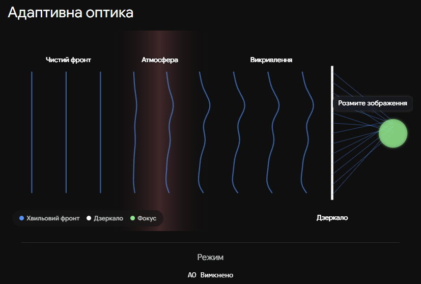
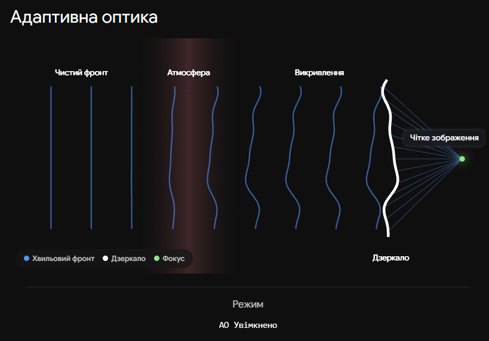

# Телескопи, обмеження внаслідок атмосферної турбулентності. Адаптивна оптика

**Атмосферна турбулентність** — це хаотичний рух повітряних мас із різною температурою та щільністю в земній атмосфері, який постійно змінює напрямок світлових променів. Через це навіть у найбільших наземних телескопів зображення зір виглядають не як ідеальні точки, а як розмиті плями, що постійно тремтять та "мерехтять". Щоб подолати цю перешкоду, астрономи використовують **адаптивну оптику** — комп'ютеризовану систему, яка в реальному часі деформує дзеркало телескопа, компенсуючи викривлення світла.

## Атмосферна турбулентність (Астроклімат)

Атмосфера діє як безліч маленьких лінз, що швидко рухаються. Внаслідок цього плоский хвильовий фронт світла від далекої зорі, проходячи крізь атмосферу, мнеться і спотворюється.

- **Диск гіршої видимості (Seeing disk):** Розмита пляма, в яку перетворюється зображення зорі через атмосферу. Для більшості рівнинних обсерваторій її розмір становить $1'' - 2''$, що повністю нівелює переваги великих дзеркал (роздільна здатність яких мала б складати соті частки секунди).
- **Параметр Фріда ($r_0$):** Характеристика якості астроклімату. Це діаметр гіпотетичного ідеального телескопа, який дав би таке ж розмиття, як і атмосфера в даний момент (зазвичай $r_0$ становить від $10$ до $20$ см).

## Принцип дії адаптивної оптики (АО)

Система адаптивної оптики вимірює атмосферні спотворення та миттєво їх виправляє, повертаючи хвильовому фронту ідеальну форму.

- **Датчик хвильового фронту:** Спеціальна камера (часто датчик Шака-Гартмана), яка аналізує, наскільки викривлене світло прийшло від зорі. Робить це до $1000$ разів на секунду.
- **Деформівне дзеркало:** Тонке, гнучке дзеркало з сотнями магнітних або п'єзоелектричних поршнів (актуаторів) із заднього боку. Комп'ютер згинає його так, щоб форма дзеркала була точно оберненою до форми спотвореної хвилі.
- **Лазерна опорна зоря (LGS):** Якщо поруч із досліджуваним об'єктом немає яскравої зорі для калібрування датчика, телескоп випромінює потужний лазер у небо, змушуючи світитися атоми натрію на висоті 90 км. Ця штучна точка слугує ідеальним еталоном для вимірювання турбулентності.

## Порівняння методів подолання турбулентності

| Характеристика                 | Наземний телескоп (без АО)                       | Наземний телескоп (з АО)                                                     | Космічний телескоп (напр., Hubble)           |
| ------------------------------ | ------------------------------------------------ | ---------------------------------------------------------------------------- | -------------------------------------------- |
| **Вплив атмосфери**            | Повний (роздільна здатність обмежена $\sim 1''$) | Компенсується на $70-90\%$ (чіткість наближається до дифракційної)           | Відсутній (повний вакуум)                    |
| **Вартість та обслуговування** | Помірна вартість, легкий ремонт                  | Висока вартість системи, вимагає потужних комп'ютерів                        | Колосальна вартість, ремонт майже неможливий |
| **Поле зору чіткості**         | Широке, але все розмите                          | Дуже вузьке (АО працює лише для невеликої ділянки неба навколо опорної зорі) | Широке і рівномірно чітке по всьому кадру    |

## Головні формули

**1. Реальна роздільна здатність телескопа (з урахуванням атмосфери):**
Якщо діаметр телескопа $D$ більший за параметр Фріда $r_0$, роздільна здатність ($\theta_{atm}$) більше не залежить від розміру дзеркала, а визначається лише станом атмосфери:

$$\theta_{atm} \approx 1.22 \frac{\lambda}{r_0}$$

_Де $\lambda$ — довжина хвилі світла, $r_0$ — параметр Фріда._

**2. Число Штреля ($S$):**
Головний критерій якості роботи системи адаптивної оптики. Це відношення реальної максимальної інтенсивності світла в центрі зображення зорі ($I$) до ідеальної теоретичної інтенсивності ($I_0$), якби не було жодних спотворень:

$$S = \frac{I}{I_0}$$

_Якщо $S = 1$, телескоп працює ідеально на межі дифракції. Наземні системи з АО зазвичай досягають $S \approx 0.5 - 0.8$ в інфрачервоному діапазоні._

## Підсумок

Атмосферна турбулентність є головним ворогом астрономів на Землі, перетворюючи гігантські телескопи на інструменти з посередньою чіткістю. Адаптивна оптика здійснила революцію, дозволивши за допомогою деформівних дзеркал і лазерів математично "скасувати" атмосферу і отримувати з Землі знімки, які за якістю конкурують із зображеннями космічних телескопів.

